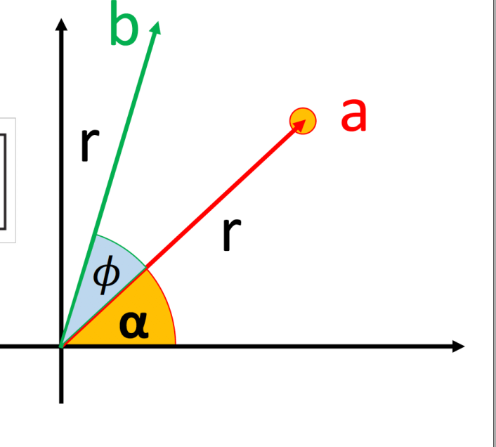
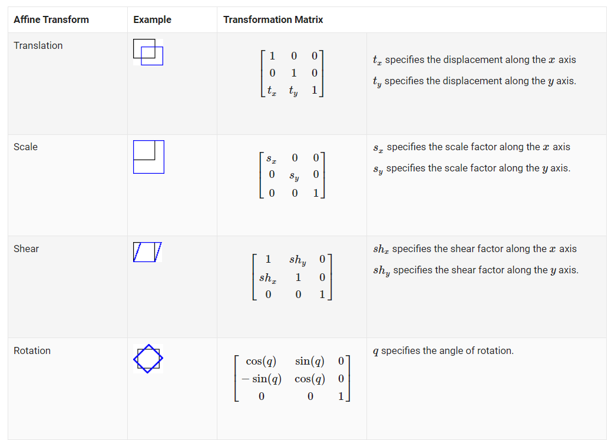

# Week2

Background:

> Rendering means to take a set of objects as inputs and output an array of pixels. There are 2 ways to achieve this:
>
> - object-order rendering: for each object, find all the pixels that the object influences and update them
> - image-order rendering: for each pixel, find all the objects that influences it and compute pixel value
>
> Ray tracing is an image-ordering algorithm for rendering, while rasterization is object-order rendering


## 1. Ray, camera defn

**What is Ray:**

>
>
>The 3d parametric line from the eye e to a point s on the image plane is given by:
>
><center>p(t) = e + t(s-e)</center>
>
>This should intepret "we advance from e along the vector (s - e) a fractional distance t to find the point p".So given t , the point e is the ray’s origin, and s - e is the ray’s direction  


camera:


## *. Hue, saturation, value

https://learn.leighcotnoir.com/artspeak/elements-color/hue-value-saturation/


# Week 3

- Intersection Testing for Groups of Objects
- Point and Directional Lights
- Shadows
- Lambertian Shading Model
- Blinn-Phong Shading Model
- Reflection 
- Transparency and Refraction


## 0. Variable and notation

let 

- v: the vector from the intersection point to the eye(reflection),
- n: the surface normal vector, 
- l:  the vector from the intersection point to the light source, then directional light and point light:
- r: reflection vector


## 1. Light type

- directional light: Direction of light does not depend on the position of the object. Light is very far away
- point light: Direction of light depends on position of object relative to light


## 2 Reflection, Refraction

### 2.1 Reflection


formula:

- r = -l +2* n ($n^T \cdot l$)


### 2.2 Refraction

## 3. Shading

### 3.1 Diffuse shading

textbook: p234

- n：is the unit surface normal vector
- l: unit vector from the intersection point to the light source
- v: unit vector from the intersection point to the eye(ray.origin or camera.view)
- $I$: intensity vector of the light source
- $k_d$: diffuse coefficient

>  Lambert’s cosine law  states that the color of a surface is proportional to the cosine of the angle between the surface normal and the direction to the light source. Since the dot product of l and n is |n| * |l| * cos($\theta$)

Thus L = $k_d$ $I$max(0, $n^T$ l), where $k_d$ is an RGB vector and L represents the color of the surface


### 3.2 Bling-phong shading


The formula composes of ambient, diffuse and specular:

- $\theta_h^n$: the angle between n and h, its cosine value is computed by the dot product of n and h, where n and h are unit vectors
- $h$: the half angle between v and l
- $k_s*I$ max$(0, cos(\theta_h^n))^p$: specular reflection term of following formula, he cosine value is compute from     the dot product of unit vector $n$ and $h$, $I$ is a light intensity vector, $k_s$ is specular coefficient vector, $k_s * I$ is component wise multiplication
- $k_a$: ambient vector
- diffuse term


formula:

- h = $\frac{v + l}{||v + l||}$
- cos($\theta_h^n$): $n^T \cdot h$
- L = $k_a*I_a$+$k_d * I$ max(0, $n^T \cdot l$) + $k_s * I$ max$(0, cos(\theta_h^n))^p$ ,where $k_a, k_d, k_s \in \R^3$


Another formula model:

- $c_r$: RGB color vector with all components in [0, 1]
- $c_l$: RGB intensity in [0, 1]
- $c_a$: average color of all surfaces in the scene, then $c_a + c_l \leq (1, 1, 1)$
- $c_p$: can be same as $c_r$ if the material is metal; or $c_p = 1 - M$, where $M$ is the max component $c_r$
- c: color of the pixel derived from Blinn-phong model

c = $c_r (c_a + c_l max(0, n \cdot l)) + c_l c_p(h \cdot n)^p$


## 4. Ray tracing program

- simple ray tracing program:

  > for each pixel do
  >
  > ​	compute viewing ray
  >
  > ​	if (ray hits an object with t $\in$ [0, $\infty$]) then
  >
  > ​		compute surface normal n
  >
  > ​		Evaluate Shading model and set pixel to that color
  >
  > ​	else
  >
  > ​		set pixel color to background color

- ray tracing program(shading + recursive):

  > `hit(Ray r, double min_t, vector<Object> objects, double &t, Vector3d &n)`:
  >
  > > Return true if the `r` can intersect with any of the object in `objects`.  
  > >
  > > If the `r` can intersect, 
  > >
  > > - locate the closest object in `objects` that has parametric distance greater than `min_t`can intersect with `r`  and return that object
  > > - find the vector that is normal to the intersection point on the surface of the object and make n points to that normal vector
  > > - find the parametric distance from the ray origin to the intersection point along ray direction and make t be the parametric distance
  >
  > `rayTrace(Ray r, double min_t, vector<Object> objects, vector<Light> lights, int num_recursive_calls)`:
  >
  > > 1.  hit_by_sth, hit_object = hit(ray, min_t, objects, t, n)
  > >
  > > 2.  if hit_by_sth:
  > >
  > >    ​	acc = hit_object.material.ka * Ia
  > >
  > >    
  > >
  > >       // step 2: construct shadow ray for each light and calculate their shadow effect
  > >
  > >    ​	for light in lights:
  > >
  > >    ​		Ray shadow_ray
  > >
  > >    ​		construct shadow ray as a ray with intersection point as ray origin and opposite direction from light direction
  > >
  > >    ​		calculate light distance from light origin to inersection point
  > >
  > >    ​		hit_by_shadow_ray = first_hit(shadow_ray, epsilon, objects, t2, n2)
  > >
  > >    ​		if !hit_by_shadow_ray or ( hit_by_shadow_ray and t2 > light_distance):
  > >
  > >    ​			acc += hit_object.kd * light.intensity  + hit_
  > >
  > >    
  > >
  > >    ​	// step 3: 
  > >
  > >    ​	if num_recursive_calls ==  0:
  > >
  > >    ​		return acc
  > >
  > >    ​	else:
  > >
  > >    ​		Ray reflection_light;
  > >
  > >    ​		// construct reflection light
  > >
  > >    ​		return acc + hit_object.material.km * rayTrace(reflection_light, min_t, objects, light, num_recursive_calls - 1)
  > >
  > > 3. else:
  > >
  > >       return background color
  > >
  > > 
  
  ```pseudocode
  function hit(ray e+td, real t0, real t1, hit-record rec):
  	# find the intersection between the ray and object in the scene,
  	# if found, set rec.t to be the parametric distance and rec.n be the surface 
  	# normal on the intersection point and return true, the rec.t must be between t0 and t1
  
  
  function raycolor(ray e + td, real t0, real 1)
  	hit-record rec, srec
  	if(hit(e+td, t0, t1, rec)) then
  		p = e + (rec.t)d
  		color c = rec.ka * Ia
  		if(hit(p+sl, epsilon, infinity, srec))	then
  			c = c + shading()
  		c = c + km * raycolor(p+sr, epsilon, infinity)
  		return c
  	else
  		return background.color
  ```
  
  


# Week 4

## 0. Bounding volume


## 1. HBV

What is HBV:

> Since we can group objects in a BV, we thus create a tree data structure with each node holding a BV. For each node, we have left and right child node. The BV inside each child node is contained in the BV inside parent node


Key characteristic of hbv:

- a box is guaranteed to bound all objects that are below it in the hierarchy 
- For each BV, we can either:
  - Each BV contains same number of object. Then each object can only belong to one BV, but the BV may overlap in space
  - Each BV contains same amount of space. Then each objet may belong to multiple BVs, but the BV cannot overlap in space(axis aligned binary space partition tre, BSP)


# Week 5

## 1. Cube map


A cube map is a mapping from (x, y, z) to (u, v). We map an object's coordinate in 3d to a coordinate in 2d surface on cubes. Steps of mapping (x, y, z) to (u, v) includes 2 steps:

1. Determine which face the coordinate belongs to:

   we look at the coordinate with the largest absolute value. For example, |x| > |y| and |y| > |z|, we project onto +x or -x face(-x means x = 1, +x means x = 0). We then determine +x or -x based on x's sign

2. Determine u, v based on the face of step 1:

   


# Week 6

## 0. Type of surface

implicit surface:

> equation of f(x, y, z) = 0


Parametric surface:

> x = f(i, j, k), y = g(i, j, k), z = h(i, j, k)
>
> ex:
>
> x = rcos$\phi$ sin$\theta$, y = rsin$\phi$cos$\theta$, z = rcos$\theta$

## 1. Triangle

> - Although the vertex cordinate of triangle is fixed, the order of the triangle(clockwise or counterclockwise) can determine the direction of normal vector to the triangle surface
>
>   (Ex: the above vertex direction is p0 -> p1 -> p2 is a counterclockwise)
>
>   
>
>   


Barycentric cordinate:

> p($\alpha, \beta$) = $\alpha p_1$ + $\beta p_2$ + ($1 - \alpha - \beta$)$p_0$  , ($\alpha, \beta$) is the cordinate of the triangle, where $\alpha \geq 0, \beta \geq 0$


tiangle soup vs triangle mesh

> - triangle soup is a list of triangles which do not necessarily connect to each other
> - triangle mesh  is a network of triangles that connect to one another through shared vertices and edges to form a single continuous surface  


watertight:

> meshes have no holes


what is mesh:

> Geometrically, a mesh is a piecewise planar surface almost everywhere, it is planar exceptions are at the edges where triangles join


### 1.1 How to determine orientation

orientation:

> For a single triangle, we define orientation based on the order in which the vertices are listed: 
>
> - the front is the side from which the triangle’s three vertices are arranged in counterclockwise order  
> - the back is counter-clockwise
>
> 
>
> A connected mesh is consistently oriented if its triangles all agree on which side is the front  

### 1.2 How to dertermine mesh is manifold

Why do we need to determine manifold:

> Many algorithms assume that meshes are manifold, and it’s always a good idea to verify this property to prevent crashes or infinite loops if you are handed a malformed mesh as input  


How to determine:

1. Every edge of the mesh is used by either one or two triangles  

   

2. Every vertex is the vertex of **exactly one** set of triangles and these triangles are connected by 1 edge

   

   

   

   


## 2. Data structure of mesh

(textbook: Chapter 12.1)

### 2.1 Separate triangle

How data structure is implemented

> We have a matrix with 3 columns, with each row representing a triangle from the mesh and each column represents the j^th^ vertex of the triangle. The (i, j) entry is a 3d vector that represents the location of the  j^th^ vertex of the i^th^ triangle


### 2.2 Indexed triangle set

How data structure is stored

> We have 2 arrays. The first array `arr1`stores the (x, y, z) of all vertices in the mesh. The element of the second array `arr2` , say `arr2[m]` = (i, j, k), is a 3d vector of integer. The i is an integer that represents the first vertex of the m^th^ triangle in `arr2` and the vertex cordinate of i is `arr1[m]`. Same process for j, k


### 2.3 Triangle-Neighbour Data Structure

We want to additionally find these problems given this kind of mesh data structure:

- Given a triangle, what are the three neighbour triangles (neighbour triangle refers to the triangles that share the same edge as the given triangle)?
- Given a vertex, which triangles share it?
- Given a vertex, which edges share it?  


How data is stored:

> On the basis of Indexed triangle set, we have 2 additional arrays: one that stores the 3 neighbour triangle index of each triangle and the other that stores the triangle index of any triangle that shares the i^th^ vertex


Implementation 1:

```c++
int nt; // total number of triangles in mesh
int nv; // total number of vertices in mesh

typedef struct Mesh {
    double vertices[nv][3]; 
    // vertices[i] stores the i^th vertex's (x, y, z) coordinate
    int tInd[nt][3];
    // the vertex index
    int tNbr[nt][3];
    // stores the 3 neighbour triangle index of each triangle
    int vTri[nv];
    // vTri[i] stores the triangle index of any triangle that shares the i^th vertex  
}

// Runtime: O(1)
vector<int> TrianglesOfVertex(int v){
    vector<int> acc;
    int triangleIndex = vTri[v];
    acc.push_back(triangleIndex)
    do{
        find i such that (tInd[triangleIndex][i] == v);
        triangleIndex = tNbr[triangleIndex][i];
        acc.push_back(triangleIndex);
    } while(triangleIndex != vTri[v])
    return acc;
}
```


### 2.4 Winged-Edge Data Structure

How data is stored:

> It stores some information of each edge of the mesh in a table. For each edge, it stores the two vertices it connects (the head and tail vertices), the two faces it is part of (the left and right
> faces), and, most importantly, the next and previous edges in the counterclockwise traversal of its left and right faces  


```c++
int nv; // number of vertices in the mesh
int nf; // number of faces in the mesh
int ne; // number of edges in the mesh

typedef struct mesh{
    int edge[ne][8];
    int vertexToEdge[nv];
    // vertexToEdge[i] stores any edge index that connect to the i^th vertex in the mesh
    int faceToEdge[nf];
    // faceToEdge[i] stores any edge index that is part of the i^th face in the mesh  
}
```


### 2.5 Half-edge data structure


## 3. Surface normal

### 3.1 Per-vertex normal


### 3.2 Per-corner normal


## 4. texture

textbook: chapter 11.1, 11.2


## 5. Transformation of normal

see textbook p127

let x$\in \R^3$ be a point on a surface, let n be the normal vector at x;

let M be the transformation matrix of x,

let N be the transformation matrix of n

then N = $(M^{-1})^T$


# Week 7

## 0. Affine transformation

textbook: 6.3(p128)

What is an affine transformation:

> an **affine transformation** or **affinity** (from the Latin, *affinis*, "connected with") is a geometric transformation that preserves lines and parallelism, but not necessarily Euclidean distances and angles.
>
> let u, v be basis vector, let t be origin
>
> we call u, v, t (basis and origin) a frame for affine space.
>
> We represent a change of frame as: p' = x $\cdot$ u + y $\cdot$ v + t, this change of frame is known as affine transformation


2d:

- scale:

  $\begin{vmatrix}s_x&0\\0&s_y \end{vmatrix} \begin{vmatrix}x\\y \end{vmatrix}$ = $\begin{vmatrix}s_xx\\s_yy\end{vmatrix}$

- rotate:

  rotate($\phi$) = $\begin{vmatrix}cos(\phi)&-sin(\phi)\\sin(\phi)& cos(\phi)\end{vmatrix} \begin{vmatrix}x\\y\end{vmatrix}$

  

- shear:

  shear(s) = $\begin{vmatrix}1&s\\0&1\end{vmatrix}\begin{vmatrix}x\\y\end{vmatrix}$

  

- translation:

  translation($t_x$, $t_y$) = $\begin{vmatrix}x+t_x\\y+t_y \end{vmatrix}$


3d:




## 1 translation matrix

### 1.1 2d affine ransformation:

let (x, y) be a point, let T(x, y) = ($m_{11}x + m_{12}y +x_t$, $m_{21}x + m_{22}y + y_t$) be the translation transformation

To represent this as matrix transformation,

let (x, y) be represented by (x, y, 1)

let M be represented by


The fixed third row serves to copy the 1 into the transformed vector, so that all vectors have a 1 in the last place. This matrix is called affine transformation


An affine transformation can transform either a point's position or direction:

- to transform position, we set the homogeneous coordinate as 1 and take vector (x, y, 1)
- to transform direction, we set the homogeneous coodinate as 0 and take vector (x, y, 0)


### 1.2 Window transformation

What we want: Often in graphics we need to create a transform matrix that takes points in the rectangle [x~l~, x~h~] × [y~l~, y~h~] to the rectangle [x~l'~, x~h'~] × [y~l'~, y~h'~ ]


Thus,


Thus,


  

## 2. Viewing transformation

Object Space $\rightarrow$ Modeling transformation $\rightarrow$ World Space $\rightarrow$ camera transformation $\rightarrow$ Camera Space $\rightarrow$ Projection transformation $\rightarrow$ Canonical space $\rightarrow$ Viewport transformation $\rightarrow$ screen space

OpenGL combines Modeling transformation and Camera transformation into Modelview matrix   

### 2.2 Viewport transformation

transformation from [-1, 1]^2^ to [-0.5, n~x~ - 0.5]x[-0.5, n~y~ - 0.5], where nx and ny are the width and length of picture in pixels


### 2.3 Orthographic Projection


transformation from camera space into [l, r] x [b, t] x [f, n]:


### 2.4 Camera transformation

gaze direction is the vector direction of the viewer, view-up direction is any vector in the plane that both bisects the viewer’s head into right and left halves and points “to the sky” for a person standing on the ground  


Camera basis:

- w = $\frac{-g}{||g||}$
- u = $\frac{t \times w}{|| t \times w ||}$
- v = $w \times u$

Camera transformation matrix:


# Week 8

## Bone

how to specify motion:

> By chaning the position of bone to change the psoition of vertices of meshes.


Transformation of bone:

Let canonical space$\{x\}$  be the basis where the origin lies on the tail of each bone as above screenshot,

Let rest space $\{\hat x\}$ be the basis where the origin is a global space that contains all skeletons

We have 2 transformation matrices:

- $\hat x = \hat T (x)$: transform bone's tip and tail position from canonical space to rest space
- $x = T(\hat x)$: transform bone's tip and tail position from rest space to canonical space

$\hat T$ = ($\hat R$ $\hat t$) $\in \R^{3x4}$


Transformation of bone i:

Assume we compute transformation T~p~, $\Delta R_i$ be the rotation of bone i relative to its parent


How to move the vertex of meshes along with bone:

1. **Rigid "skinning":** Attach each vertex to the closest bone

2. **Linear blend skinning:** 

   let $\hat v_j$ be the vertex position of the j^th^ mesh in rest space, let $w_{ij}$ be the input weight, for the i^th^ bone,

   

   

   

## Catmull-Rom spline

textbook: p383

This is 

# Week 9

## 1. mass-spring

what is mass-spring:

> A system that is composed of particle and spring. Each pair of particle is connected by spring
>
> 
>
> $r_{ix}$ = the rest length of the spring when u first load the object
>
> $\frac{x - y_i}{||x - y_i||}$ = the direction of the force, this is a normalized vector because we only use it to denote the direction


Mass matrix:


Steps of solving y^t+1^ in mass-spring system(y~1~, .. y~i~ is the vertex position of the meshes):

1. We approximate a(t) using below formula:

   

3. 

4. 

5. Formula for E2:

   

   

   
