# 1. CPU, Memory & Proc

## 1. Big & Little Endian

**Before Endian:**

least sigificant byte: the 8 bits on the right hand side


**Endian:**

+ **Big Endian**: For a piece of data of size 4 bytes, the least significant byte is stored in the low address of the memory
+ **Small Endian:**: The least significant byte is stored in the high address of the memory 


# 2. Buffer Overflow

## 1. How to prevent bufferoverflow

+ address space layout randomization(ASLP)
+ non-executable pages(NX)
+ stack canaries
+ 内存地址随机化（PIE): https://blog.csdn.net/force_eagle/article/details/8024502

## 2. Why dangerous

Because regular users can exploit this vulnerability to open a root shell


# 3. Privilege Escalation

1. find setuid program: `find / -perm 4000 -perm -o 2>/dev/null`(Some programs are internally setuid, such as sudo, passwd, shadow)
2. find capability of executable: `getcap -r /`


# 4. Format String

**what is a format string:**

> Consider the code snippet:
>
> ```c
> printf("%s", buffer);
> ```
>
> Here `"%s"` is the format string

**What is format string vulnerability**:

+ 1 way: Expose memmory

  Consider the code snippet below:

  ```c
  snprintf(buf, 256,”AB,%08x,%08x,%08x,%08x,%08x,%08x,%08x,%08x\n”, 5);
  ```

  Here, there are more `"%"` than the arguments. Then the argument pointers will keep moving up the stack(it will move up 4 bytes at a time because of `%08x`) and print out what stores before the first arguments. Then the memmory stack is exposed to the user. This is format string vulnerability.

+ second way: Inject code

  https://blog.csdn.net/qq_43394612/article/details/84900668


# 5. Cryptography

## 1. Concept

+ **cipher:**  an algorithm that obfuscates  information so that it seems random to anyone who does not possess special information called a key
+ **One way func**: good candidates:
  + **factoring**: suppose z = x*y, given z, find x and y
  + **Discrete log:** suppose $y=(x^y$ mod m), given z, x, m, find y


## 2. Block Cipher

### 1. Algorithms

One-way function for cipher:

+ factoring: Suppose z=x*y, given z, find x and y
+ Discrete log: 

> Each message consists of several blocks. These algorithms takes a block of the message as input and encrypts it

#### 1. Caesar cipher

1. Take each letter, and replace it with the letter  shifted 3 letters to the right in the alphabet
2. If there are no more letters, wrap around to the beginning of the alphabet

#### 2. Substitution cipher

>  Each plaintext letter is replaced with exactly one ciphertext letter

#### 3. Polyalphabetic cipher

> Instead of having one mapping for each plain text character, have a set of n mappings

E.g:

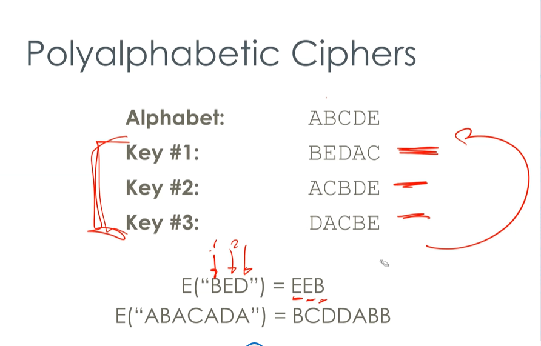

For plain text, "ABCDE" we prepare 3 mappings of each character. For an input string, we switch the mapping for each character of the input string. After the third mapping, we then switch to the first mapping

Conclusion:

Instead of having one mapping in encryption, we have several mappings. We alternate the mapping periodically:

```pseudocode
def polyalphabetic(s: string):
	mapping1 = {'a': 'b', 'b': 'c', 'c': 'd', ...}
	mapping2 = {'a': 'c', 'b': 'd', ...}
	mapping3 = {'a': 'd', 'b': 'e', ...}
	mappings = [mapping1, mapping2, mapping3]
	acc = ""
	i = 0
	for character in s:
		a = i % 3
		acc = encryption(character, mappings[a])
		i += 1
```


#### 4. One-time pad(Vernam)

>  OTP means to use a unique random mapping for each chracter of input text string.
>
>  The cyphertext is created by computing XOR of each chracter of the plain text and the key

disadvantage:

+ malleability: Given an encryption of a plaintext m, it is possible to generate another ciphertext which decrypts to f(m), for a known function , without necessarily knowing or learning m. This is due to OTP does not change the position of data in cyphertext, so the  i^th^ character of the cyphertext of OTP corresponds to the i^th^ character of the plain text. Therefore, it does not protect integrity of data well.

  In common words, the target knows what part of the plain text can be changed if he changes some part of the cyphertext, even though he doesn't know what the change is going to be but he knows the part will be changed. Therefore, we need permutation cipher from block cipher to diffuse and confuse

#### 5. Iterated Block Cipher(SPN)

> Given the following:
>
> + **Substitution cipher:** It replaces characters in the plaintext with other characters in the 
>
>   plaintext with other characters from the same  alphabet, with a one-to-one mapping 
>
> + **permutation cipher:** mix the order of the plaintext character
>
> **Iterated block cipher(SPN): ** repeatedly apply the two ciphers in different combinations, like 

+ **Confusion:**

  To obscure the relationship between plaintext and cyphertext so that $E_k(M_1 + M_2) \neq E_k(M_1) + E_k(M_2)$. This is done to prevent attacker from encoding what they want and send to the target. To making encoding difficult to attacker

steps:

1. XOR the input text x with a distinct round key K(the initial x should be the plain text)
2. Apply substitution cipher with distinct mappings(mapping from block to block) on block of plain text
3. Align the result from distinct substitution cuphers together into a string and apply permutation cipher
4. Repeat step 1 ~ 3 and feed the output of the last step as x to step 1
5. The thing needs to remain secret is the distinct keys, the number of keys and the algorithm of permuation cipher and substitution cipher can be exposed

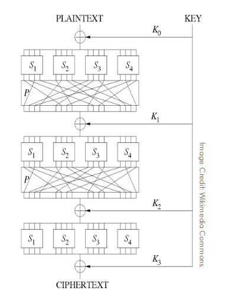

#### 6. DES

>  DES structure is known as **Feistel network**, the network consists of 16 rounds:
>
> ​	for the $n^{th}$ round :
>
>  1. the input is split into left harf $L_{n-1}$ and right half $R_{n-1}$
>
>  2. $R_{n-1}$ is switched to the position of $L_{n-1}$ and $L_{n-1}$ is replaced by a output of function 
>
>     f($R_{n-1}$, $L_{n-1}, K_n$) where $K_n$ is the $n^{th}$ key(key size: 56bits) and the output is put at the position of $L_{n-1}$
>
> 3. Each f($R_{n-1}$, $L_{n-1}, K_n$) consists of following:
>
>    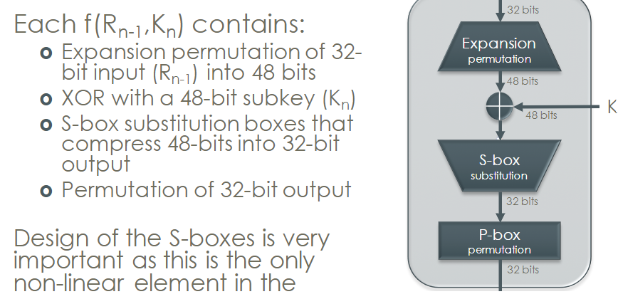
>
> 4. The new output combined with $L_n$ and $R_n$ becomes the input to the next round
>
>    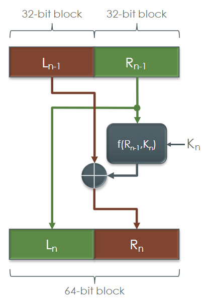


#### 7. 3DES

We use 156-bit key. We divide the three 56 bit subkeys from the 156-bit key

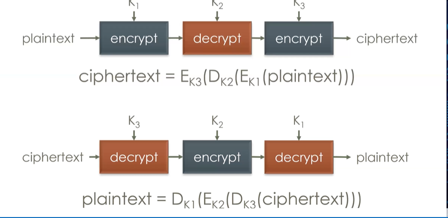


### 2. Ways to attack cipher algo

#### 1. Frequency analysis


### 3. Block cipher mode

What is mode?

> mode deals with what happens between the blocks. A message can be divided into a few blocks. Block cipher algoritm deals with each single block, while cipher mode algorithm defines what we do after we encrypts each block using block cipher algorithm

Criteria for mode:

> + Security: 
> + Performance
> + Error Propagation: What is the effect of bit error during transmission of cipher text
> + Error Recovery: Can we recover from a transmission error


Common mode algorithms:

#### 1. ECB:

> 1. after the message is broken into blocks, what ECB does is to add padding to the last block to make the last block length consistent with the previous block lengths
> 2. Then we apply block cipher algorithm independently on each block
>
> Conclusion:
>
> What ECB does is just to add padding to the last block

#### 2. CBC(Most common):

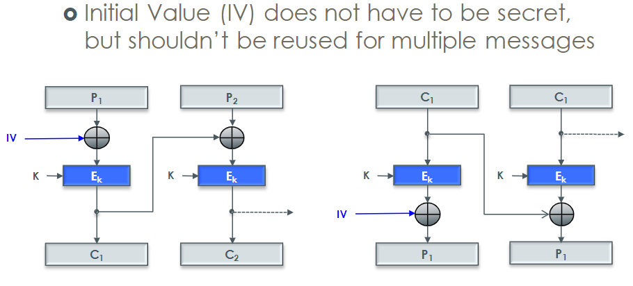

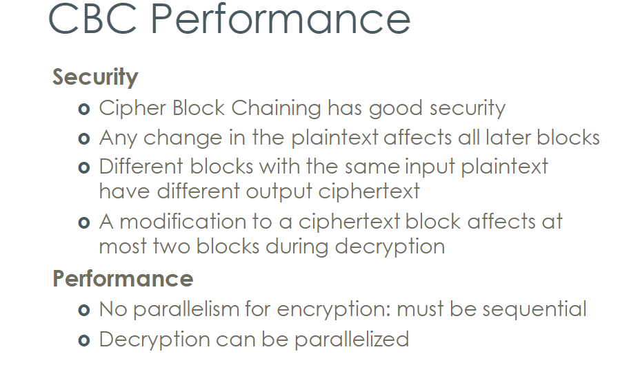

#### 3. CFB:

#### 4. OFB:


## 3. Stream Cipher

> Even though we have block cipher, we still need stream cipher because block cipher takes large computation to encrypt and decrypt long messages. Long messages are often encrypted and decrypted by stream cipher, since steam cipher does not have mode

### 1. Types:

> + Synchronous stream ciphers
> + Self-synchronous stream ciphers
> + RC4
> + SEAL

+ Synchronous stream ciphers:

  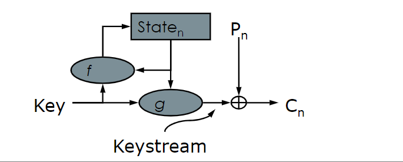

  $P_n$: refers to the n^th^ plain text character

  g: a function that takes the n^th^ state and key to produce the n^th^one time pad to serve as a sessional key

  f: takes the key and the (n-1)^th^ state to update the n^th^ state

  IV: initial state $State_0$

  > Inefficient for long message

+ self-synchronizing stream cipher:

  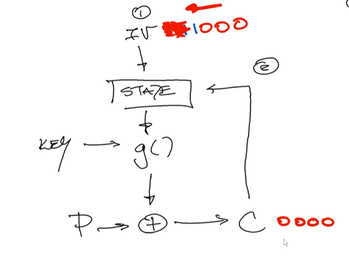

  Advantage over synchronous stream cipher: Even though we might miss some cryptotext during transmission, we can still recover. It looks back from

**Criteria:**

+ **Security**: They are generally malleable
+ **Performance:** The key stream can be pre-computed before the message arrives


## 4. Key Exchange


## 5. Authentication and Integrity

detects if the message you send has been changed or not.

### 1. MDC

+ provided Confidentiality, Integrity and autentication

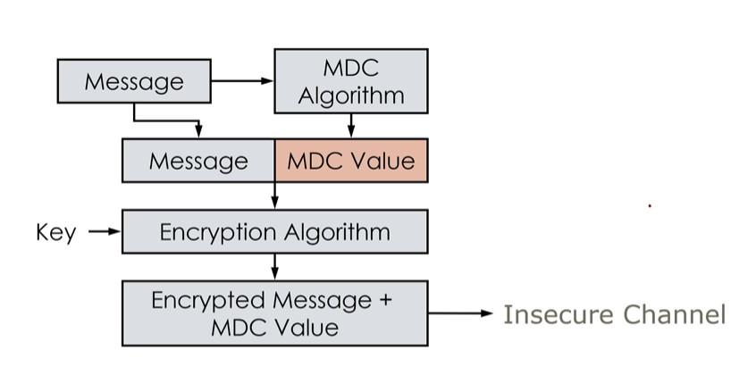


### 2. MAC

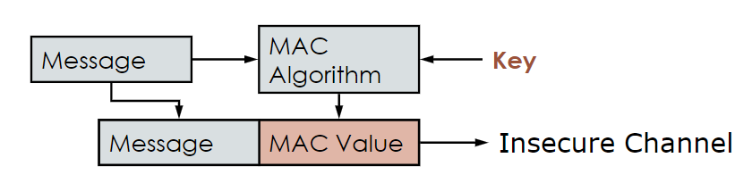

steps:

1. the user A sends the user B plain text message and the MAC value
2. The MAC value is computed by hash h(k, M). Since h takes key k, then only user A and user B could compute hash value
3. After user B receives message M and MAC value, user B computes h(k, M) and compare MAC value with what he computes. If same, then integrity remains. If not the same, then there are someone in the middle who changes the messages

(Also notice that mac key is different from encryption key)

## 6. Cryptography algorithm and security concept

**Confidentiality**:

+ Does anyone beside the target user can read the data
+ Provided by **ciphers**

**Integrity:**

+ Is the sending data changed or now? How to tell if this data is changed
+ To ensure Integrity, the receiver must be able to detect:
  + if a random data is inserted at the start/end of the message
  + if the entire message is replaced with random data
  + if this message is a replay of some previous message the sender has sent
  + if the blocks are reoredered by attacker suppose the mode is ECB
  + if the bits are flipped by attackers suppose stream cipher
+ Provided by 
  + **hashes**(part of MAC), MAC(Modification Authentication code)
  + **hashes**(part of MDC), MDC(Modification Detection code)
  + Digital signature

**Authentication:**

+ How do we ensure the data we are sending to has the correct recipient
+ Provided by 
  + **signatures and Mac**, 
  + key exchange,
  + trusted third party in key exchange(before Diffie Hellman), 
  + **public key authentication**
  + PKI in public key exchange & digital signature

**Non-repudiation:**

+ prove somebody signs sth & how to prevent a user from denying their actions
+ Provided by 
+ **trusted third party**, digital signature
+ **public key authentication**


## 7. Certificate pinning

https://carvesystems.com/news/cert_pin/

# 6. Defenses

+ Stackshield:
  + Put return addresses on a separate stack with no other data buffers there
  + prevent return address from being overwritten
+ Stackguard:
  + On a function call, a random canary value is placed just before the return address
  + Just before the function returns, the code checks the canary value and if the value changes, the program is halted
  + Some languages automatically have stackguard
  + still vulnerable to format string attack
+ Run Time Checking: Libsafe
+ ASLR(address-space layout randomization):
  + Each time the program is restarted, the stack of the process is selected at a random address
+ Non-executable(NX):
  + If a stack is made non-executable, then shellcode on the stack will not execute
  + non-injection attacks still possible(e.g: return-into-libc-attack)
+ Static analysis: analyze code for common vulnerable
  + LDTM
  + Flawfinder


# 7. Hardware

> Context:
>
> For a processor, we repeatedly fetch the i^th^ instruction and execute the i^th^ instruction. Each action either fetch or execute has two clock cycles.


## 1. Fault Injection Attack

### 1. Clock glitching

> Clock glitching is **one of the oldest and most widely used methods of fault injection**. It requires inserting short glitches into the device clock. Then we are shortening time for each action to take. It does not have time to finish the time to fetch the instruction, but at the same time, the program counter increases(which means we are going to fetch the next instruction)
>
> If the glitch duration(clock cycle) is:
>
> + Longer than the time to increment the Program Counter ; and,
> +  Shorter than the instruction fetch time
>
> then we can start to see a special case: 
>
> + either **instruction skipping**
> + **instruction corruption**
>
> To conclude,
>
> What clock glitching does is to insert short gliches to make clock cycle shorter and adjust the clock cycle interval to be longer than the time to increment program counter and shorter than the instruction fetch time so that we can change the instruction to execute


# *. Review

## 1. Block Cipher


## 2. Stream Cipher

### 1. General algorithm

### 2.  RC4

## 3. Key Exchange

### 1. Trusted third party

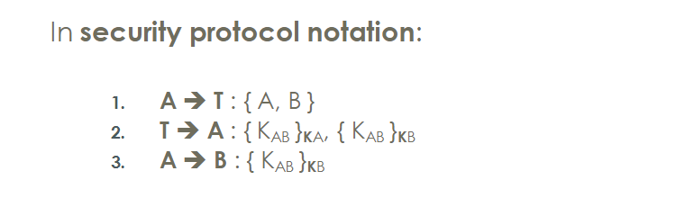


### 2. Needham-Schroeder Protocol

To establish a connection between A and B, we can give the encryption and decryption key of A and B to a trusted server T. T will know both peoples' key, but it it trusted and it will generates the random key for the communication between A and B

1. If client  A wants to communicate  with B, then  A sends a request message to server T. The message will comprise A(unencrypted) and B. Only A is unencrypted, then T knows who is talking, even T has $K_A$
2. T generates a random session key ($K_{AB}$). It encrypts it twice  (once  with KA and once 
   with  $K_B$), and sends both versions back to A
3. A will  decrypt its copy of $K_{AB}$ from the version  that was encrypted with  $K_A$
4. A will  send the other portion  to B; it was encrypted with  $K_B$, so B can decode  $K_{AB}$
5. A and B now share the same symmetric secret ($K_{AB}$) for encryption and decryption

Weakness(Man in the middle Attack):

Assume the attacker is called C:

1. C will stand between the communication between A and T. It will block the message from A and sends message comprising A and C, which originally comprises A and B. Then A gets the $K_{AC}$
2. C will also sends request message to T which comprises C and B. Then T will send $K_{BC}$
3. Then C can communicate with A using $K_{AC}$ and communicate with B using $K_{BC}$


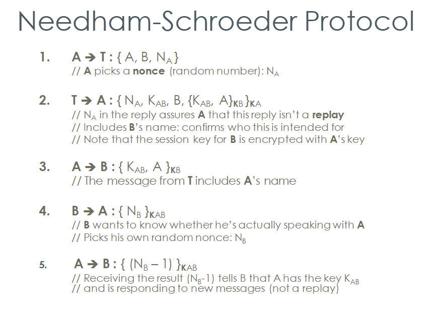

+ $N_A$ assures the message from T to A is not a replay because without $N_A$ in message from T to A, the middle man C may use the previous replay message A receives from T. This results $K_{AB}$ be consistent with a previous $K_{AB}$, where $K_{AB}$ should be different each time.
+ $B$ in message from T to A confirms C will be detected if C is the middle man
+ $\{N_B\}_{K_{AB}}, \{N_B - 1\}_{K_{AB}}\}$ helps B ensures he is talking to A.

### 3. Diffie-Hellman

Suppose A wants to talk to B:

1. A selects a random big integer x and then computes P = g^x^ mod n
2. A sends P, g and n to B; x is kept secret in A
3. B also selects a random big integer y and computes Q = g^y^ mod n
4. B sends Q to A; y is kept secret in B
5. A computes Q^x^ mod n(This value is equal to  g^xy^ mod n)  and B computes P^y^ mod n (This value is equal to g^xy^ mod n)
6. Then A and B shares the secret: g^xy^ mod n

Principle:

> Goal: Ensures confidentiality of the key
>
> Performance: Does not ensure integrity and authentication during key exchange

### 4. Public/Private key

RSA:

1. We randomly generate two large prime numbers `p` and `q`, we also computes `n = p * q`
2. **Public key:** We compute `x = (p - 1) * (q - 1)` and pick a random number `e` that is coprime to `x`
3. **Encryption:** Given plain text `M`, the cryptotext `C = M^e mod n` (where `e` is public key and `M < n`, `e`, `n`, `c` are public)
4. **Private Key:** (e * d) = 1 mod x , d is the private key
5. **decryption:** M = C^d^ mod n

(Notice, since M < n, we usually combine Public/private key with hash)

After generating the RSA public key:

1. the user A sends his public  key to CA
2. CA will create a certificate for the user's public key, sign with its own private key(so that no one forges it) and send to the user A
3. the user A then sends his public key along with his certificate to the user B
4. The user B uses CA's public key to decrypyt the certificate an verify B's public key


**Criteria:**

+ **Secuity:** Because RSA has property: $E(K \cdot M) = E(K) \cdot E(M)$, the attacker can pick a random number K and get E(K) and E(KM) from the vctim. Then the attacker can get E(M), an encrypted message from victim and sends E(M) to the other user


### 5. Public key Infrastructure

+ CA
+ certificate


### 6. PGP

weakness

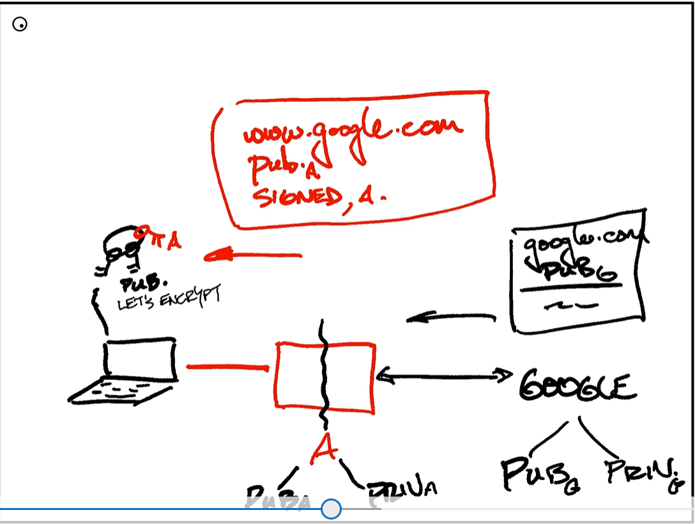


## 4. Hashes

### 1. MDC

### 2. MAC


# 8. Malwares

**Concept:**

+ **Malware:** a set of mallicious softwares, some types are the following:
  + **Virus and Worms**: Both goals are to replicate and consume system resources
    + Virus: The goal is to Spread secretly,make effort to avoid detection
    + Worm: The goal is to spread quickly
  + RootKit
  + Trojan
  + Backdoor
  + Spyware

+ signature for virus
+ PLC

+ command-and-control infrastructure


# 9. Content-type attack


# 10. Cloud computing


# 11. DNS

## 1. Process of DNS lookup

https://www.catchpoint.com/blog/domain-name-to-ip-address

https://www.computerhope.com/jargon/d/dns-resolver.htm


# 12. Oauth

https://www.digitalocean.com/community/tutorials/an-introduction-to-oauth-2

https://frontegg.com/blog/oauth-flows
