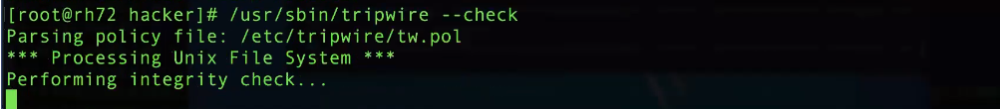

# 1. Setup

## 1. Install VMWare

| software           | version         |
| ------------------ | --------------- |
| windows10          | 10.0.19042.1165 |
| VMWare workstation | 15.X Pro        |


1.  enable windows hypervisor platform:

   

   

   

   2. Install VMWare with the licence provided by school email

      

      

   3. Configure for VMWare network:

      1. Open VMWare, edit > Virtual Network editor

      2. change Setting

      3. add network: VMnet3 and change its subnet IP to 192.168.10.0:

         

      4. add network: VMnet4 and change its subnet IP to 10.10.10.0

      5. Make sure "use local DHCP..." is chosen and apply:

         

         

## 2. Install RedHat on VM

1. Make sure you have 2GB on your computer

2. open terminal, navigate to the desired folder and use following command:

   ```shell
   scp UTORID@dh2020pcXX.utm.utoronto.ca:/virtual/csc347/RH72BufferOverruns.zip
   ```

   {XX} is in {01,... 30}

3. Extract the zip

4. File -&gt; Open A Virtual Machine -&gt; Navigate to RH72BufferOverruns folder location -&gt; Select Red Hat Linux.vmx

5. choose Power and choose "I copied it"

   

6. Click the screen and enter hack and password. If you want your mouse move out of VM, use ctrl + alt

   

7. After you enter, here is the interface

   

8. To exit, pause > shutdown guest or suspend guest

## 3. Install yum on Redhat

https://www.cnblogs.com/hx1998/p/10888886.html

1. `rpm –ivh python-iniparse-0.4-9.el7.noarch.rpm`

   

2. 

## 4. VS Code connect to VM

https://blog.csdn.net/weixin_44363614/article/details/110558250

1. First open your VM and use `/sbin/ifconfig` to find your VM IPaddress

   

2. Go to your hostmachine and find the config file under the .ssh directory, include this configuration

   ```yaml
   Host 10.10.10.12
     HostName 10.10.10.12
     User hacker
     IdentityFile C:/Users/yezhou/.ssh/id_rsa
     KexAlgorithms +diffie-hellman-group1-sha1
     Ciphers 3des-cbc
   ```


## 4. Mount linux file system

https://blog.csdn.net/weixin_39606244/article/details/111142846

https://zhidao.baidu.com/question/1381992746274170620.html

# 2. Course Note

## 1.  Memory and buffer overrun

### 1. Concept:

+ **memory**:

> It's a string of 1's and 0's. Since various things like words, numbers are stored, they need to have alignment, which is to be aligned on word boundaries

+ **CPU**:

  > execute commands, and has register to keep track

+ **instruction**:

  > chose any programs compiled from gcc, enter the gdb interface of that program and enter command `disassemble main`. You will see the instructions

+ Endianness

+ **units conversion**:

  > 1 byte = 8 bit binary(a 2-bit hexadecimal)
  >
  > 1 word = 2 byte
  >
  > one integer is represented by 4 bytes in 32 bit system
  >
  > ....                                                  8 bytes in 64 bit system

+ **buffer overrun**:

+ **gdb special register**:

  > eip: instruction pointer
  >
  > esp:stores the pointer of stack  top
  >
  > ebp: The address stored in ebp marks the bottoms of a new stack. This address obtained by plus 4 to the above address stores where the function will return. Before this address, stores the value of function arguments

+ **Assembly instructions**:

  https://www.allaboutcircuits.com/technical-articles/how-to-write-assembly-basic-assembly-instructions-ARM-instruction-set/

### 2. Class Demo

1. Run the demo c file, from the code you can see the sumNums does not call hacked, but when you run it, the hacked function is called and you get segmentation fault.
2. **Behind mechanism**: the assignment to c[44] actually changes the return address before ebp address to hacked  funtion address. Therefore, when sumNums return, it returns to the hacked function

### 3. Useful knowledge

when using gdb to execute each line of the above demo, these commands are useful:

> (gdb) display/i $pc  #see the next instruction to be execute
>
> 
>
> (gdb) si                     # execute next instruction, not line
>
> (gdb) p/x {variable_name} # print the value of variable in hexdecimal
>
> (gdb) x/32w $esp  # see what is stored 32 words after the stack
>
> (gdb) disassemble main   # give all the instructions of main body


## 2. Smashing the stack

### 2. Class Demo

> For this demo, we demonstrate why strcpy() is unsafe and how to use it to do some other system calls, like executing a command or opening a shell as this demo does

1. Open VM, `cd ./notes/smashStack/notes`
2. We want to open an sh shell within program of target1.c. We open shellcodeasm.c. The assembly code in this file is the same as shellcode.c

3. We compile shellcodeasm.c and `gdb shellcodeasm`. 

   Within the gdb, we `disassemble main`

   (here <main+23> represents execve call, other system call refer [this](https://github.com/torvalds/linux/blob/v3.13/arch/x86/syscalls/syscall_32.tbl))

   

   `x/bx main+3` until `main + 62`, obtain the machine code for these instructions

   ```c
   "\xeb\x2a\x5e\x89\x76\x08\xc6\x46\x07\x00\xc7\x46\x0c\x00\x00\x00""\x00\xb8\x0b\x00\x00\x00\x89\xf3\x8d\x4e\x08\x8d\x56\x0c\xcd\x80""\xb8\x01\x00\x00\x00\xbb\x00\x00\x00\x00\xcd\x80\xe8\xd1\xff\xff""\xff\x2f\x62\x69\x6e\x2f\x73\x68\x00\x89\xec\x5d\xc3";
   ```

   

4. We are going to copy the machine code to the shellcode variable of target1.c. However, the string contains 0x0. When strcpy reads this, it will abort and stop copying the rest of string to the location. Therefore, we do some changes to the step3 assembly code to obtain a new machine code with equivalent function but no 0x0
5. We do some change to the new machine code. We find the position of return address relative to the address of shellcode. And append the address of shellcode at the end of new machine code to overwrite the return address to address of shellcode. So that when program finishes copying and return, it executes the shellcode content.

## 3. W3

### 1. Concept

### 2. Class Demo


# 4. W4

## 1. Concept

**Primary Defenses against SQL Injection**:

+ Prepared Statements (with Parameterized Queries)
+ Stored Procedures
+ Allow-list Input Validation (white listing)
+ Escaping All User Supplied Input (input sanitization)
+ **Additional**: Enforcing Least Privilege
+ **Additional**: Performing Allow-list Input Validation as a SecondaryDefense

**Vulnerability**: A weakness can be exploited, [common Vulnerability enumeration](https://cwe.mitre.org/top25/archive/2021/2021_cwe_top25.html)

**Exploit**: Using the weakness

**Impact**: The effect on the system or users

**CIA Principles**: Hacker's attack can violate one or more of the below principles

+ **Confidentiality** (make sure that data & information is not disclosed to an unauthorized party)
+ **Integrity** (make sure that data & information cannot be modified/destroyed by an unauthorized party)
+ **Availability** (make sure you have timely access to your information)
+ **Accountability** (make sure you can see who performed a certain action)

## 2. Class Demo


# 5. W5

## 1. Concept

**XSS(Cross Site Scripting)**

> Cross site scripting is a web application vulnerability which allows an attacker to inject Javascript into web pages which are viewed by other users. 
>
> Typically, the goal is to have the targeted user visit an attackers website, or send secure user information, like browser cookies, to the attacker.

## 2. Class demo

### 1. XSS

1. Open VM of Ubuntu804Server_xsssi and browse "192.168.10.128/xss/" in browser

2. `bash` and  `cat /var/www/xss/xssEcho.php`

   

   [Notice:] The `<xmp` will tell browser not to intepret the content inside as html, instead as string. For example, try  replacing`<strong>Hello</strong>` and see what the browser will display.

3. Open `192.168.10.128/xss/xss1.txt` in browser and copy any one you like.

   

4. paste what you copy in step3:

   

4. After submitting, you get a result as this:

   

5. Conclusion: Because we provide an input to enclose the `xmp` tag. We can thereby insert any html code to attain desired behaviour, such as obtaining static file in this case. This is called **XSS**.

### 2. Intro to Telnet

1. Go to your vm an `cd /var/www/xss`
2. `telnet localhost 80`
3. `GET /xss/index.html HTTP/1.0`
4. What we want to show: The above steps are basically how you access a site

### 3.  Intro to Cookie

**Setup**:

1. Open the xsssi VM and navigate to `192.168.10.126/xss` in browser

2. `cd /var/www/xss` to find the `index.html` which corresponds to the html in browser, open it and notice two input forms below maps to the input forms in browser

   

3. From last step, we need to know about these php files located in the current directory:

+ xssEcho.php

+ xssAddString.php
+ xssShowStrings.php
+ sess/sess_{cook_id}

3. Know about Role of each above file:

+ xssEcho.php： prints what the user sends to the browser

+ xssShowStrings.php: It displays public and private input  according to each session

+ xssAddString.php: It writes public input to `xssStrings.txt` and private inputs to session cookie files

  

**Demo**:

1.  `cd /var/www/xss` , peek the content of index.html and find the following

   

2. Go to the xssi VM and `cd /var/www/xss && telnet 192.168.10.128 80`

3. In the telnet, `GET /xss/xssAddString.php?arg=telnetpublic1&private_arg=telnetprivate HTTP/1.0`

4. Identify the cookie ID in the response and then navigate to the next step for that cookie

   

5. Now, go to the session directory: `cd sess && ls` and you can check the content of cookies using root.


### 4. Cookie attack by XSS

1. On the teacher's lab, the code below  is running on port 8089:

   

2. On the Chrome browser in teacher's lab, input following in the second form to access the code above and press submit（below is to link the address of the server in step 1)

   

3. Then go to the backend of the server of step1, copy the cookie id of chrome step2 creates:

   

4. Navigate to the address below in safari browser. Paste the cookie id from the last step to the place below and enter

   

5. You should now see private string sent by chrome browser on a safari browser. That's the weird thing.

   

**Conclusion:**

**How to prevent it**:

+ **Method1**: On the server side, Sanitize the  inputs and filter out special characters such as `<`, `>`, `/`, `<!-- -->` in xssAddstring.php before storing users' input

+ **Method2**: On the browser side, enforce same origin policy

  

### 5. Crack password by John

**Summary of this problem**:

> In linux, password of each user are hashed to a specific value and linux compare the hashed value of password to the hashed value of a user's input to conclude if password matches. Suppose 2 users with 2 different passwords has same hash value, that causes a problem of hash collision and two users almost have password can unlock each other's account

**1.Demo of getting hashvalue of a password**:

Suppose I know a password is `abc123`, the password can be hashed to different values using different algorithms. 

Here there are 3 **common hashing algorithm**:

+ **md5sum**: ssh school teaching lab and use following command `md5sum <<< abc123`

  

+ **sha256sum**:

  

+ **sha512sum**:

  

**Application of hashing algorithm**: You can even use the above hashing algorithm to hash a file(e.g: `md5sum <<< {filename}`). If 1 character of this file is changed, you can tell from the resulting hashing value

**2.Demo of how to use hash value to get password:**

1. Open the Bufferoverruns VM,  `cat /etc/shadow`

   

2. Now we start our demo. Suppose the password of hacker is just `password` and the hash algorithm and salt of this password, open a terminal and get the hash value of the password using `openssl` so that we will use this hash: 

   `openssl passwd -1 -salt S1v5ngNe password`

   

3. Go to the Kali Vm, create a file called `f` and paste the above hash value in the picture  to the file

   

4. Use the command `john f` and you get the password :

   

5. Conclusion: This demo tells us how to use John to obtain a password once you get the hash value

*Behind mechanism of John: John stores a word list of common pattern of hash values. In each password file, there stores a common password. Each password acts as a key in a dictionary. If your password appears in these wordlist files or has a similar pattern as these, John will find the key in the password list dictionary according to the hash value you gave.


### 6. TripWire

> What is tripwire:
>
> It takes hash values of all files in your system and put them into a database. Then you can move that database off your system

1. On Kali, use tripwire to detect changes of all files on your system

   

2. Here you can see the changes from the output:

   


*.Use of tripwire:

+ tripwire configuration: `/etc/tripwire/twcfg.txt`
+ tripwire DB location: variable `DBFILE` in `/etc/tripwire/twcfg.txt`
+ 


# W6: suggestion on protecting

## 1. Overall Suggestions:

+ Encrypt data communication(can help avoid firesheep):
  + use openssh-server
  + ApacheSSL
  + openVPN

+ Avoid using FTP(use SFTP instead), avoid Telnet(use Wget instead), Rlogin/Rsh service
+ Update software pack
  + use `dpkg --list` to check version and architecture of software installed on Linux system
  + `apt-get update` updates the package sources list to get the latest list of available packages in the repositories
  + `apt-get upgrade` updates all the packages presently installed in our Linux system to their latest versions
  + `apt-get remove` remove packages


## 2. Useful linux commands

```shell
passwd -l {username}     # lock a user from logging to the system
chage                   	           #Set up the valid period of a username password
awk -F: '($2 == "") {print}' /etc/shadow   # Verify No Accounts Have Empty Passwords
awk -F: '($3 == "0") {print}' /etc/passwd #Make Sure No Non-Root Accounts Have UID Set To 0
systemctl list-dependencies graphical.target
netstat -tulpn
ss -tulpn
nmap
```


## 3.  Log files

**Concept:**

+ **log rotation**: Notice the file of dmesg. If the file of dmesg grows too large, then some of the content will rotate to dmesg.0. If dmesg.0 grows too large, it goes to dmesg.1.gz and so on.


## 4. Find the trace of other users

### 1. Use last command

last command tells you who the users last log in and where is their IP Address.

When is the last timestamp the system is started up(See the line of systemboot).

The information of last command returns is stored in wtmp


### 2. Use log

**auth.log**: tells which sessions are closed, how did the user log in, how long and what time are these sessions

**apache.log**: tells info about every connection to the server

**limits.conf**:

### 3. Useful detect app

+ install logwatch
+ System Accounting with auditd(https://www.redhat.com/sysadmin/configure-linux-auditing-auditd)
+ tripwire
+ chkrootkit
+ fail2ban/denyhost(IDS, intrusion detection system)

### 4.  Cron

see the back-up at the `/etc/cron.hourly`

### 5. bash history

see the hidden file of `.bash_history` at user's directory in home

## 5. Back-up

ways to back up:

+ deja-up
+ rsync
+ git

## 6. Cron

crontab automates the process daily, weekly and so on.

You can find what cron does in directory `/etc/`, there you can see:


let's say we enter the directory of cron.daily, we see the following: (it means the cron has these processes daily)


If we further look at the file of apache2 of the above picture, we can see what cron does with apache2 service


# 7. W7: Ways to encrypt and decrypt

## 0. Defn

> 1. Message Space

the plain text of the content that is going to be encrypted

> 2. cyphertext space

the string of that is encrypted from plain text

> 3. keyspace

the algorithm or function that maps message space to cyphertext and maps cyphertext to plain message and both directions must be bijetion

> 4. key

A cryptographic key is a string of bits used by a cryptographic algorithm to transform plain text into cipher text or vice versa. This key remains private and ensures secure communication.

## 1. Class Demo

### 1. One Time Pad(secure)

1. Suppose you have a message `m=[1, 0, 0]` and you want to send it to someone
2. To encrypt it, first randomly create a mask, say `r = [0, 1, 0]` and you send the result of`t=m XOR r`
3. Then you tell the receiver the mask `r = [0, 1, 0]` and use `t XOR r` to get m back
4. Since this process uses random mask, the hacker could not decrypt the message easily

#### Pseudo Random number generator


### 2. substitute cyph(insecure)

a **substitution cipher** is a method of encrypting in which units of plaintext are replaced with the ciphertext, in a defined manner, with the help of a key; the "units" may be single letters (the most common), pairs of letters, triplets of letters, mixtures of the above, and so forth. The receiver deciphers the text by performing the inverse substitution process to extract the original message.

#### Caesar cypher

A type of substitution cipher with the following rule on each character on the plain text:

 $D_k$(x)=$E_k$(x)=[(x-'A')+k mod 26]+'A'.

#### Problem of substitution cypher

vulnerable to frequency analysis(how to perform frequence analysis: see lab 7)


### 3. Block Ciphers

A block cipher is **an encryption method** that applies a deterministic algorithm along with a symmetric key to encrypt a block of text, rather than encrypting one bit at a time as in stream ciphers as we do in substitution cyph

#### ECB

The simplest of the encryption modes is the **electronic codebook** (ECB) mode. The message is divided into blocks, and each block is encrypted separately.

The disadvantage of this method is a lack of diffusion. Because ECB encrypts identical plaintext blocks into identical ciphertext blocks, it does not hide data patterns well.


#### CBC

 In CBC mode enryption, each block of plaintext is [XORed](https://en.wikipedia.org/wiki/XOR) with the previous ciphertext block before being encrypted


#### CTR(counter mode)

#### AES


### 4. How to get key across: Diffie Hellman

#### 1. step of Diffie Hellman

Assume you know number g and large prime p. I have x in {1,...,p-1} If I give you gx mod p can you find x? This problem (under certain assumptions about g,x and p) is believed to be computationally difficult to solve


#### 2. Problem of this mtd

**Man in the middle:** Suppose a man called Mallory sits between Alice and Bob. 

1. He receives g and p from Alice and send them to Bob. 
2. He also recives g^a mod p from Alice and sends g^c mod p to Alice. 
3. Then he sends g^d mod p to Bob and receives g^b mod p from Bob. 
4. As a result, he then can decrypt Alice's message and encrypt for Bob and decrypt Bob's message and encrypt for Alice in the middle and know all the information

### 5. existent encryption tools

+ gpg:

  ```bash
  gpg --symmetric {filename}.txt
  #Output: it will then pop up a window to prompt you to input passphrase, after that, {filename}.txt.gpg is produced. This is the encryption process
  gpg -d {filename}.txt.gpg
  ```

  


# 8. W8:

## 1. Private key Cryptography

Suppose Alice and Bob wants to communicates, they have stored same private keys e and d

E and D are encryption algorithm and decryption algorithm:


## 2. Public key cryptography

Suppose Bob(user) has never met Alice(bank) and when Bob wants to talk to Alice and receive something from Alice,

d is the public decryption key


To gurantee Bob is talking to real Alice(not the Mallory in the middel):

1. Before Bob sends banking info, Alice first send a message to Bob called m1 and an ecrypted version of m using Alice's private key called m2
2. Then Bob checks if D(m2) = m1; if true, then Bob can guarantee it's real Alice because only Alice has the encrypted key and nobody else can encrypt m1 to obtain m2 so that D(m2) = m1

## 3. RSA

### Application of RSA

Safe website connection are encrypted using public key cryptography:

1. Open a safe website, click the certificate information:

   

2. public key:

   

3. The plain hashed message after decrypting with public key sent at first:

   

4. encrypted Algorithm:

   


## 4. Digital Certificate

### 1. How to create certificate

1. use command `openssl req -x509 -newkey rsa:4096 -keyout key.pem -out cert.pem -sha256 -days 365`

2.  After the above command, we will get two files: `key.pem` and `cert.pem`

3.  To read the `cert.pem` we created from step 1 command, we use command 

   `openssl x509 -inform pem -in  cert.pem -noout -text `

### 2. Chain of trust

### 3. Where to find trusted certificate

In the browser, there has already been some built-in trusted digital certificate in its source code. To see these digital certificates, here is the link of instructions:

https://jingyan.baidu.com/article/4dc40848667b1ac8d846f16d.html


## 5.  network


# 9. W9


## 1. iptables

1. use command `iptables -L` to list all rules for data packets

   

2. Use `iptables -t {tablename} -v -L -n --line-number` to display specific table rules

### 0. Setup

see lab 10 instructions

### 1. Add rules to block

1. On the network constructed from lab 9, go to the FC4(ip: `10.10.10.10`) and add a firewall rule using below:

   `iptables -A INPUT -s 10.10.10.17 -j DROP`

2. Check the rule using `iptables -L --line-number` and see a rule added:

   

3. This rule means to reject any packets from `10.10.10.17`. We test the rule by `ping 10.10.10.10` on ip address of `10.10.10.17`. This demonstrates our rule block packet from `10.10.10.17`

   (*Notice: if we `ping 10.10.10.17` on `10.10.10.10`, we also won't receive response because the rule blocks the response of ping from `10.10.10.17`)

4. This rule does not block packet to pass through this ip. Therefore, if we `ping 192.168.10.17` on `10.10.10.17`, we can still ping. If we want to block pass through, we add drop rule to forward rule using `iptables -A FORWARD -s 10.10.10.17 -j DROP`

### 2. Deleting rules

use command `iptables -D {chainname} {rule#}`

### 3. Editing rules

use command `iptables -P {chainname} {policyname}`, ex:

```bash
iptables -P forward DROP  
# means to change the default policy of forward table to from ACCEPT to DROP
```


### 4. Restrict to rules to ports

use command 

`iptables -A FORWARD -p tcp -s 10.10.10.17 -d 192.168.10.100 --dport 80 -j ACCEPT` 

`iptables -A FORWARD -p tcp -d 10.10.10.17 -s 192.168.10.100 --sport 80 -j ACCEPT`

to restrict source, destination and protocol

### 5. stateless vs stateful


+ Stateless Protocol is a network protocol in which Client send request to the server and server response back as per the given state.
+ Stateful Protocol is a network protocol in which if client send a request to the server then it expects some kind of response, in case of no response then it resend the request.

**stateful**: use command `iptables -A FORWARD -m state --state ESTABLISHED,RELATED -j ACCEPT`


## 2. Map tool on Kali

nmap command is used to scan available port on an IP address

```bash
nmap -sT 192.168.10.100
```


# *. Useful sites

+ virusTotal
+ https://www.greatlearning.edu.hk/ourcourse/
+ https://us-cert.cisa.gov/
+ llvm buildbot
+ OWASP
+ cwe.mitre.org

