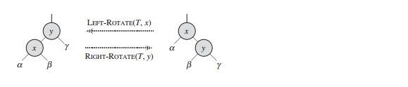

# 1. Complexity

## 1. Definition

### Problem type

+ **Problem and Problem Input:** 

  > Treat the problem as a predicate and the subject of the sentences of the problem as the input to the predicate

+ **Instance of a problem** I: 

  > Suppose we assemble each subject or input of the problem into a tuple:
  >
  > $\Rightarrow$ each tuple of the problem corresponds to an instance of the problem.

+ **Abstract problem** Q:

  > Q is a binary relation on a set **I** of **problem instances** and a set **S** of **problem solutions**

+ **Decision problem:**

  >  an abstract decision problem as a function that maps the instance set I to the solution set $\{0, 1\}$

+ **optimization problem:**

  > Each feasible (i.e., “legal”) solution for the problem has an associated value, and we wish to find a feasible solution with the best value

+ **encoding**:

  > An encoding e: $I \rightarrow \{0, 1\}^*$ is a mapping e(i) from I to the set of binary strings.
  >
  > e(Q) denotes a concrete problem from an abstract decision problem

### Formalizing problem as Language

+ **Concrete problem** $L$: A problem whose instance set is set of binary strings

+ language L **accepted/reject** by algorithm A:

  > accept: $L = \{x \in \{0, 1\}^*: A(x) = 1\}$
  >
  > reject: $L = \{x \in \{0, 1\}^*: A(x) = 0\}$

+ language  L **decided** by algorithm A:

  > every binary string in L is accepted by A and every binary string not in L is rejected by A

+ language L **verified** by algorithm A:

  > Let A be a two-argument algorithm(A is called verification algorithm), 
  >
  > Let x be the concrete problem instance
  >
  > L = {x $\in $ {0, 1}^*^ : $\exists$ y $\in$ {0, 1}^*^,  A(x, y) = 1}

### Polynomial-reduction

+ **polynomial-time computable**: 

  > An algorithm $f: \{0, 1\}^* \rightarrow \{0, 1\}^*$ that has polynomial runtime wrt length of the input string

+ **Polynomial-time reduction**:

  > defn from 34.1:
  >
  > Let A and B be two decision problems, algorithm C($\alpha$) is a **reduction Algorithm** iff:
  >
  > + $\forall \alpha \in$ A, $\beta$ = C($\alpha$) where $\beta$ is an instance of B $\wedge$ (answer for $\alpha$ is yes $\Leftrightarrow$ answer for $\beta$ is yes) 
  > + $\forall \alpha \in$ A,  procedure of C($\alpha$) takes polynomial runtime
  >
  > 
  >
  > defn from 34.3:
  >
  > Let $L_1, L_2 \subseteq \sum^*$ be two problem instances set
  >
  > $\exists$  function $f: \{0, 1\}^* \rightarrow \{0, 1\}^*$ and a polynomial-time algorithm $F$ that computes $f$, $L_2 = f(L_1)$
  >
  > (i.e$\forall x \in \sum ^*, x \in L_1 \Leftrightarrow f(x) \in L_2$)
  >
  > $\Leftrightarrow$ $L_1$ is **polynomial reducible** to $L_2$($L_1 \underline < _p L_2$), 
  >
  > ​	 $f$ is **reduction function**, 
  >
  > ​	 $F$ is a **reduction algorithm**

### Complexity:

+ **Complexity class**:

  > **P** = $\{L \subseteq \sum ^* : \exists$ algorithm A  that decides L in polynomial time$\}$
  >
  > Let A be a polynomial algorithm:
  >
  > + L is the problem instance set, a certificate is sth that you pick to prove sth exists
  > + A(x, y) = 1means an algorithm: given A a problem instance with yes answer and the certificate that proves the yes answer, A returns 1; Otherwise, 0
  >
  > + **NP** =  $\{ L \subseteq \sum^*: \forall x \in L, \exists$  certificate y, $|y| = O(|x|^c) \wedge A(x, y) = 1$$\}$,
  >
  > **co-NP** = $\{L \subseteq \sum^* : \overline L \in NP\}$
  >
  > **NPC(NP-Complete)** = $\{L \subseteq \sum^* : L \in NP \wedge (\forall L' \in NP, L' \leq _p L)\}$
  >
  > **NP-hard** = $\{L \subseteq \sum^* :$ satisfies second condition of NPC $\}$

+ **Notation**:

  > + standard encoding: <A>,  i.e: <G> represents standard encoding of a graph
  > + L: any subset from $\sum ^*$,  used to denote the concrete problem instances set

## 2. Theorem and Algorithm

1. **Theorem**:

   >  Let A, B be decision problems, 
   >
   > assume $\exists$ a reduction algorithm between A and B:
   >
   > No polynomial Algorithm exists for A $\Rightarrow$ No polynomial Algorithm exists for B  

   **Application**: 

   + This theorem illustrates how we prove a problem is hard(NP-Complete),
   + Abstraction of lemma 34.3

   **Proof**: Contradiction(p1052)

   

2. **lemma 34.1**:

   > + **polynomial-related**: 
   >
   >   two encodings $e_1$ and $e_2$ are polynomial related 
   >
   >   $\Leftrightarrow$ $\exists$ two polynomial-time computable algorithms $f_{12}, f_{21}, \forall i \in I$, $f_{12}(e_1(i))=e_2(i) \wedge f_{21}(e_2(i))$ 
   >
   > + **lemma**:
   >
   >   Let Q be **abstract decision problem** on **instance set** I,
   >
   >   Let $e_1$ and $e_2$ be **polynomial-related** encodings on I
   >
   >   $e_1(Q) \in P \Leftrightarrow e_2(Q) \in P$

   **Application**: reduction algorithm in 34.3

   **Proof**: p1057

   

3. **Theorem 34.2**:

   > Let P be the complexity class P
   >
   > P = $\{ L: L$ is **accepted** by a polynomial-time algorithm $\}$

   **Application**: None

   **Proof**: p1059

   

4. **Theorem:** P $\sub$ NP

   > Let $L$ be a concrete problem
   >
   > $L \in P \Rightarrow L \in NP$

   **Application**: None

   **Proof**:


5. **Theorem**: $P \subseteq$ NP $\cap$ co-NP

   **Application**: None

   **Proof**: excercise 34.2-9


6. **lemma 34.3**:

   > Let $L_1, L_2 \subseteq \sum ^*$, assume $L_1 \underline <_p L_2$
   >
   > $L_2 \in P \Rightarrow L_1 \in P$

   **Application**: proof of Theorem 34.3

   **Proof**


7. **Theorem 34.3(core theorem)**:

   > ($\exists L \in NPC, L \in P$) $\Leftrightarrow$ (P = NP)
   
   **Application**: what this chapter wants to prove
   
   **Proof**:


8. **Lemma 34.8**

   > Let $L \subseteq \sum^*$ be a language
   >
   > ($\exists L' \in NPC, L' \leq _p L$) $\Rightarrow L$ is NP-hard

   **Application**: used to prove a problem is NP-hard for the following problem type

## 3. Problem types

### Proving a problem is NP:

+ Step(p1073):

1. Formalize the problem instance by defining as a set:

2. $\{x \in \sum^*:$ yes answer for the decision problem $\}$
3. Indicate what's the problem instance and what certificate proves the yes answer for problem
4. Give the algorithm A: state how the algorithm returns 1 given its the problem instance with yes answer and the correct certificate? How it returns 0?
5. Prove the problem instance size is polynomial to the size of certificate
6. Prove the algorithm A is polynomial wrt problem instance size

+ Example

  

### Proving a problem is NP-hard:

+ Direct Proof(CIRCUIT-SAT)
+ lemma 34.8:

1. Prove $L \in NP$
2. Select a known NP-complete language $L'$
3. Describe an algorithm that computes a function $f$ mapping every instance $x \in  \sum^*$ of $L'$ to an instance $f(x)$ of $L$
4. Prove that the function $f$ satisfies $\forall x \in \sum^*, x \in L' \Leftrightarrow f(x) \in L$
5. Prove algorithm computing $f$ runs in polynomial w.r.t ?


Proving a problem is NP-Complete

## 4. Important Example 

1. Ham-Cycle:

+ **Problem**:

  > Given a graph G, does there exist an algorithm that determine whether G has a ham-cycle?
  >
  > Is this problem NP or P?

+ **Answer(34.5)**:(p1064)


2. circuit-satisfiability problem

+ **Problem**: CIRCUIT-SAT = $\{\lang C \rang \in \sum^*: C$ is a satisfiableboolean combinational circuit$\}$

  > Given a boolean combinational circuit composed of AND, OR and NOT, is there a truth input combination to this circuit that can cause the output of the circuit to be 1?
  
+ **Answer**:


3. Satisfiability boolean formula problem(SAT)


4. boolean formula in 3-CNF problem(3-CNF-SAT)


# 2. Approximation

## 1.Definition

+ **Approximation**:

  > Let A be an optimization problem with different costs
  >
  > Let B be one of the algorithm that solves A but may noy yield optimal solution with optimal cost
  >
  > Let C be the cost of B and C^*^  be cost of the optimal solution, n be the size of the input
  >
  > **approximation ratio** = $\rho (n) \geq max(\frac{C}{C^*}, \frac{C^*}{C}) \geq 1$ 
  >
  > **The larger the approximation ratio, the worse the algorithm is**

+ **Approximation scheme**:

  > It's an approximation algorithm for an optimization problem that takes two inputs: problem instance and any fixed values $\epsilon > 0$ where $1 + \epsilon$ is the maximum approximation ratio among all problem instances


## 2. Theorem and Algorithm


## 3. Problem types


## 4. Important Examples


# 3. Linear Programing

## 1. Definition

+ **linear-programing problem:** the problem of either minimizing or maximizing a linear function subject to a finite set of linear constraints
+ **linear program in standard form**: maximization of a linear function subject to linear **inequalities**
+ **linear program in slack form**: maximization of a linear function subject to linear **equalities**
+ **Notation**:


# 4. Data structure


## 1. tree

### 1. avl tree

### 2. Heap

### 3. Red Black Tree

**data structure:**

```python
class RedBlackTree:
    def __init__(self, content: Object):
        self.color = "black"
        self.content = None
        self.parent = None
        self.left = self.right = None
```


**Rotation(O(1)):**



```python
def left_rotate(self, x):
    y = x.right
    x.right = y.left
    if y.left is not None:
        y.left.parent = x
    y.parent = x.parent
    
    // change parents' descendants to point to the new node 
    if x.parent is not None:
        // if the old node x is its parents 
        if x is x.parent.left:
            x.parent.left = y
        else:
            x.parent.right = y
     
    y.left = x
    x.parent = x

def right_rotate(self, y):
    x = y.left
    y.left = x.right
    if x.right is not None:
        x.right.parent = y
    x.parent = y.parent
    
    if y.parent is not None:
        if y is y.parent.left
        	y.parent.left = y
        else:
            
        
```


### 4. B tree


## 2. Dictionary

### hashtable open addressing

**Application**: 

+ Python dictionary
+ 


# 5. Graph

## 1. Graph basic

### 1. Definition

+ **adjacency-list representation of graph**:

  > Let G = (V, E) be a graph
  >
  > **adjacency-list representation of G**  is a dictionary with each key a vertex u of G and each value the list of vertices $v_i$'s where $(u, v_i) \in E$ and the value of each key is not empty.

+ **adjacency-matrix representation of graph**:

  > Let G = (V, E) be a graph, let the vertices are numbered 1, 2, ...|V| in some arbitrary manner
  >
  > **adjacency-matrix representation of G** is a $|V| \times|V|$ matrix A = ($a_{ij}$) where $a_{ij} = I ((i, j) \in E)$

### 2. Theorem and algorithm


### 3. Problem Type


### 4. Important Examples


## 2. MST


## 3. Shortest-path

### 1. Definition

+ **Shortest path**:

  > Let p be a path from u to v in G, let w(p) be the weight of p
  >
  > p is a **shortest path** 
  >
  > $\Leftrightarrow$ w(p) = min$\{w(p): u \stackrel{p}{\rightarrow} v\}$ if $\exists$ path p from u to v
  >
  > ​			  = 0  O. W

+ **shortest-paths problem**:

  > Given a graph G = (V, E) and a source vertex $u \in V$
  >
  > we want to find the shortest path from u to any $v \in V$

+ **shortest-path tree**:

  > A **shortest-path tree** rooted at s is a directed subgraph G' = (V', E'), where $V' \subseteq V \wedge E' \subseteq E$ :
  >
  > + V' is the set of vertices reachable from s in G
  > + G' forms a rooted tree with root s
  > + $\forall u \in V'$, the unique simple path from s to v in G' is a shortest path from s to v in G

  

### 2. Theorem and Algorithm

#### 1. Condition of existence of shortest path:

> Let G = (V, E) be a graph and u, v be given two vertices
>
> $\exists$ path p from u to v, p contains a vertex s that has a negative-weight cycle from s $\Leftrightarrow$ we can always find a path from u to v with lower weight and **no shortest path exist**
>
> $\forall$ path p from u to v, p does not contain a negative weight cycle $\Leftrightarrow$ a shortest path exist

**Application**:

**Proof**:


#### 2. Correctness of Bellman-Ford Algorithm:

> Let G = (V, E) be a graph, let v.d be an upper bound on the weight of a shortest path from s to v at any moment of the execution of Bellman Algorithm, let $\delta (s, v)$ be the shortest path weight from s to v
>
> **Triangular Inequality**(lemma 24.10):
>
> $\forall (u, v) \in E, \delta (s, v) \leq \delta(s, u) + \delta(u, v)$
>
> **Upper-bound property**:
>
> We always have $\forall v \in V$, v.d $\geq \delta(s, v)$ ; if v.d = $\delta(s, v)$ then v.d will never change
>
> **Convergence Property**:
>
> $\nexists$ path from s to v, then v.d = $\delta(s, v) = \infty$
>
> **Path-relaxation property**:
>
> Let p = $\lang v_0, v_1, \cdots, v_k \rang$ be a shortest path from $v_0$ to $v_k$
>
> if we relax the edges of p in the order $(v_0, v_1), (v_1, v_2), \cdots, (v_{k-1}, v_k)$, then $v_k$.d = $\delta(s, v_k)$
>
> **Predecessor-subgraph property**:
>
> Once $\forall v \in V$, v.d = $\delta (s, v)$ $\Rightarrow$ the predecessor subgraph is a shortest-paths tree rooted at s


#### 4. Lemma 24.2

**Application**: prove the next corollary


#### 5. Corollary 24.3

> Let G = (V, E) be a weighted, directed graph with source v and weight function $w: E \rightarrow \R$
>
> Assume G contains no negative cycles that are reachable from vertices are path from s to each vertex
>
> ($\forall v \in V, \exists$ shortest path from s to v) $\Leftrightarrow$ Bellman-ford terminates with $v.d < \infty$

**Application**:

**Proof**:

> $\Rightarrow$: Assume the LHS,
>
> ​	then, $\forall v \in V, \delta(s, v) < \infty$ exists and is well defined
>
> ​	by lemma 24.2, after |V| -1 iterations, $\forall v \in V, v.d = \delta(s, v)$
>
> ​	by triangular inequality, v.d <= u.d + w(u, v), therefore, it will always return true
>
> ​	thus, Bellman-Ford terminates normally with true and $v.d = \delta(s, v) < \infty$
>
> $\Leftarrow$: Assume RHS,
>
> ​	by lemma 24.2, after |V| -1 iterations, $\forall v \in V, v.d = \delta(s, v)$
>
> ​	Since the algorithm terminates with true and $v.d = \delta(s, v) < \infty$
>
> ​	thus, $\forall v \in V, \delta(s, v) < \infty$
>
> ​	therefore, $\forall v \in V, \exists$ shortest path from s to v


#### 6. Initialize-Single-Source:

```pseudocode
Initialize-Single-Source(G, s):
	for each vertex in G.V:
		v.d = INFTY
		v.predecendent = NIL
    s.d = 0
```


#### 7. Relax:

```pseudocode
RELAX(u, v, w):
	if v.d > u.d + w(u, v):
		v.d = u.d + w(u, v)
		v.predecendent = u
```


#### 8. Bellman-Ford:

```pseudocode


```

#### 9. DIJKSTRA:

```pseudocode
 DIJKSTRA(G, w, s):
 	Initialize-Single-Source(G, s)
 	S = []
 	Insert G.V into a priority queue sorted by v.d Q
 	while Q is not empty:
 		u = Q.root
 		S.append(u)
 		Q.root = Q's rightmost bottom node t and bubleup(G, t)
 		for each vertex v in u.adjacent(or G[u]):
 			relax(G, u, v)
 			bubleup(G, v)
```


## 4. Flow Network

### 1. Definition:

#### Basic Concept of flow

+ **flow network**:

  > Let G = (V, E) be a directed graph which each (u, v)$\in$ E has a nonegative c(u, v) > 0:
  >
  > + $\forall $(u, v)$\in$ E, (v, u)$\notin$E
  > + self-loop is disallowed
  > + (u, v)$\notin E \Rightarrow c(u, v) = 0$
  > + $\exists s, t \in V, \forall v \in V, \exists$ path $s \rightarrow v \rightarrow t$ (Here s is called **source**, t is called **sink**) 

+ **flow**:

  > Let G = (V, E)  be a connected network
  >
  > $f: V \times V \rightarrow \R$ is a **flow** iff:
  >
  > + **Capacity Constraint**: $\forall u, v \in V, 0 \leq f(u, v) \leq c(u, v)$
  >
  > + **Flow Conservation**: 
  >
  >   $\forall u \in V - \{s, t\}, \sum_{v \in V}f(v, u) = \sum_{v \in V}f(u, v)$ 
  >
  >   $(f(u, v) = 0 \Leftrightarrow (u, v) \notin E)$

+ **value** $f$ of a flow: $|f| = \sum_{v \in V} f(s, v) - \sum_{v \in V}f(v,s)$

+ **Maximum-flow problem**:

  > Given a flow network G with source s and sink t, and we wish to find a flow of maximum value


#### Fork-Fulkerson method

+ **Residual network**:

  > Let G = (V, E) be a flow network with source s and sink t:
  >
  > Let $f$ be a flow in G, let $(u, v ) \in E$
  >
  > | Residual Capacity: $c_f(u, v)$ | $c_f(v,u)$        | condition      |
  > | ------------------------------ | ----------------- | -------------- |
  > | c(u, v) - f(u, v)              | f(u, v)           | $(u, v) \in E$ |
  > | f(v, u)                        | c(v, u) - f(v, u) | $(v, u) \in E$ |
  > | 0                              | 0                 | O.W            |
  >
  > **residual network**: a network flow $G_f = (V, E_f)$ with $c_f$  as capacity, where: $E_f = \{(u, v)\in V \times V: c_f(u, v) > 0\}$  
  >
  > (**residual network** may have antiparallel edges)         

+ **augmentation of f by f'**: $f \uparrow f': V \times V \rightarrow \R$

  > Let $f'$ be a flow in the residual network
  >
  > $(f \uparrow f')(u, v) = f(u, v) + f'(u, v) - f'(v, u)$   $(u,v) \in E$
  >
  > ​                          =   0                                                 O.W

+ **Augmenting path p**:

  > A simple path from s to t in the residual network $G_f$

+ **residual capacity of augmenting path**:

  > the maximum amount by which we can increase the flow on each edge in an augmenting path p:
  >
  > $c_f(p) = min \{c_f(u, v): (u, v) \in p\}$

+ **cut(S, T)**:

  >  A cut (s, T) of flow network G = (V, E) is a partition of V into S and T= V - S, s.t $s \in S \wedge t \in T$

+ **net flow f(S, T)**:

  > Let f be a flow in G, let (S, T) be a cut in G
  >
  > **net flow** f(S, T) across cut(S, T) is $f(S, T) = \sum_{u \in S} \sum_{v \in T} f(u, v) - \sum_{u \in S} \sum_{v \in T} f(v, u)$

+ **capacity** of cut(S, T):

  > c(S, T) = $\sum_{u \in S} \sum_{v \in T} c(u, v)$

+ **minimum cut**: a cut in network G whose capacity is minimum over all cuts of G

### 2. Theorem and Algorithm:

1. **Convert to equivalent network flow**:

   **Theorem 1**:

   > Given a network flow G with a pair of antiparallel edges (u, v) and (v, u), 
   >
   > Let G' be new network flow by adding vertex v' and replacing (u, v) with (u, v') and (v', v)
   >
   > $\Rightarrow$ G is equivalent to G'

   **Application**

   **Proof**: exercise 26.1-1
   
   
   
   **Theorem 2**:
   
   > Given a network flow G with set of source and sinks $\{s_1, s_2, \cdots, s_m \}, \{t_1, t_2, \cdots, t_n\}$
   >
   > Let G' be a new network flow by adding supersource s with $c(s, s_i) = \infty$ $\forall i=1, \cdots, m$ and supersink t with $c(t, t_i) = \infty$ $\forall i=1, \cdots, m$
   >
   > $\Rightarrow$ G' is equivalent to G
   
   **Application**:
   
   **Proof**

2. **lemma 26.1(Augmentation)**:

   > Let G = (V, E) be a flow network with source s and sink t, let f be a flow in G
   >
   > Let $G_f$ be a residual network of G induced by f, let f' be a flow in $G_f$
   >
   > $\Rightarrow |f \uparrow f'| = \sum_{v \in V} (f \uparrow f'(s, v) - f \uparrow f'(v, s)) = |f| + |f'|$

   **Application**:

   **Proof**:


3. **lemma 26.2 and corollary 26.3**:

   > Let G = (V, E) be a flow network, let $f$ be a flow in G, 
   >
   > let p be an augmenting path in $G_f$, let $c_f(p)$ be residual capacity of path p
   >
   > let $f_p: V \times V \rightarrow \R$ be defined as $f_p(u, v) =$
   >
   > + $c_f(p)$    $(u, v) \in p$
   > + 0            O.W
   >
   > $\Rightarrow$ 
   >
   > + $f_p$ is a flow is a flow in $G_f \wedge |f_p| = c_f(p) > 0$ 
   > + $f \uparrow f_p$ is a  flow in G $\wedge |f \uparrow f_p| = |f| + |f_p| > |f|$
   
   **Application**:
   
   **Proof(exercise 26.2-7)**:
   
   > WTS^1^: $f_p$ is a flow, i.e: ==$\forall (u, v) \in E, 0 \leq f_p(u, v) \leq c_f(u, v) \wedge \forall u \in V - \{s, t\}, \sum_{v \in V}f_p(v, u) = \sum_{v \in V}f_p(u, v)$==
   >
   > Since $0 \leq f_p(u, v) \leq c_f(u, v) = min\{c_f(u, v): (u, v) \in p\}$
   >
   > then,  $0 \leq f_p(u, v) \leq c_f(u, v) $
   >
   > let $u \in V - \{s, t\}$
   >
   > we divide into two cases: (1). $u \in p$  (2). $u \notin p$
   >
   > case (1):  $u \in p$
   >
   > Since p is a path, then only one edge comes out from each vertex on the path(order of sequence)
   >
   > thus, $\sum_{v \in V} f_p(u, v) = c_p$
   >
   > Since p is simple, then only one vertex comes into each vertex on the path,
   >
   > thus, $\sum_{v \in V} f_p(v, u)=\sum_{v \in V} f_p(u, v) = c_p$
   >
   > case (2): $u \notin p$
   >
   > then,  $\sum_{v \in V} f_p(v, u)=\sum_{v \in V} f_p(u, v) = 0$
   >
   > thus, $f_p$ is a flow
   >
   > 
   >
   > WTS^2^: $|f_p| = c_f(p)$
   >
   > Since p is a simple path from s to t
   >
   > then only one edge comes out from s and only one edge comes into s
   >
   > $\Rightarrow \exist u \in V, \forall v \in V, u \neq v \Rightarrow f_p(s, v) \neq (f_p(s, u) = c_p)$
   >
   > let $v \in V \Rightarrow (v, s) \notin p$
   >
   > thus, $|f_p|  = c_f(p)$


4. **lemma 26.4**:

   > let $f$ be a flow in flow network G with source s and sink t
   >
   > let (S, T) be any cut of G
   >
   > $\Rightarrow$ the net flow across (S, T) is $f(S, T) = |f|$

   **Application**:

   **Proof**:(p722)


5. **Corollary 26.5**:

   > The value of any flow f in a flow network G is bounded from above by the capacity of any cut of G

   **Application**:

   **Proof**:(p723)


6. **Max-flow min-cut theorem**:

   > Let $f$ be a flow in flow network G = (V, E) with source s and sink t, following are equivalent:
   >
   > + $f$ is a maximum flow in G
   > + The residual network $G_f$ contains no augmenting path
   > + $|f|$ = c(S, T) for some cut (S, T) of G

   **Application**: basis of following algorithm

   

7. **Ford-Fulkerson Algorithm**:

   ```pseudocode
   FORD-FULKERSON(G, s, t):
    for each edge (u, v) in G.E:
    		(u, v).f = 0
    while exists a path p from s to t in residual network G_f:
    	c_f(p) = min(c_f(p): (u, v) in p)
    	for each (u, v) in p:
    		if (u, v) in E:
    			(u,v).f = augmentation((u, v).f, c_f(p), 0)
   		else:
   			(v, u).f = augmentation((v, u).f, 0, c_f(p))
   
   augmentation(f_u_v, f_p_u_v, f_p_v_u):
   	return f_u_v + f_p_u_v - f_p_v_u
   
   ```

   


### 3. Problem type

#### Proving equivalency of two network flows

- theorem: theorem 1
- steps:

1. Show the maximum flow value in G = the maximum flow value in G'


# 6. Dynamic Programming

**Context**: Dynamic programming is for optmization problem

## 1. Definition

+ **optimal problem**:

  > Let a problem be defined on a set or a sequence $S$
  >
  > Assume the solution to that problem is a sequence $I \subseteq$ S which results the optimzed cost value
  >
  > $\Rightarrow$ the problem is an **optimization problem** and the **subproblem** of it is the problem defined on  subset or subsequence of $S$

+ **optimal substructure**: optimal solutions to a problem incorporate optimal solutions to related subproblems, which we may solve independently

+ **independent among subproblem**:

  > Let s1, s2 be the solution sequence of two subproblems of same length
  >
  > two subproblems are independent $\Leftrightarrow$ s1 and s2 does not contain common node

+ **overlapping problem**:

  >  When a recursive algorithm revisits the same problem repeatedly, we say that the optimization problem has overlapping subproblems.

+ **subproblem graph**:

  > state machine graph with vertex label the size of the problem and arrow pointing to the subproblem vertex each vertex problem is depending on

## 2.Theorem


## 3. Problem Type

### Dynamic Algorithm

1. Determine the value Y you want to optimize and the solution that optimizes Y is a sequence of what.

   what composes the sequence is the decision.

2. Determine the set or the sequence where you pick decision from.

   Pick out a decision and determine the resulting set or sequence. Assume an optimization value from the resulting set/sequence is given, then the optimized value of this problem = (optimization value of resulting set/sequence + cost of the decision), the decision has various combinations


### Show optimal substructure

**Prove**:

1. Determine the solution sequence to the problem
2. Assume an unknown solution sequence is given and shrink the sequence by picking out nodes from sequence
3. Determine the sequence which has been picked out a choice is a solution to what subproblem
4. Prove suppose the complete sequence is optimal solution to the problem, then the sequence in step3 is a solution to that problem
5. "cut and paste": assume negation of then of step 4 and contradict the assumption of step 4
6. You show that the solutions to the subproblems used within an optimal solution to the problem must themselves be optimal by using a “cut-and-paste” technique. You do so by supposing that each of the subproblem solutions is not optimal and then deriving a contradiction. In particular, by “cutting out” the nonoptimal solution to each subproblem and “pasting in” the optimal one, you show that you can get a better solution to the original problem, thus contradicting your supposition that you already had an optimal solution. If an optimal solution gives rise to more than one subproblem, they are typically so similar that you can modify the cut-and-paste argument for one to apply to the others with little effort.

**Disprove**:

## 4. Important Examples

### 1. Rod-cutting

#### Problem:

> Given a rod of length n inches and a table of prices, determine the max revenue obtained by cutting the rod. Then determine the solution that gives the max revenue
>
> | length i   | 1    | 2    | 3    | 4    | 5    | 6    | 7    | 8    | 9    | 10   |
> | ---------- | ---- | ---- | ---- | ---- | ---- | ---- | ---- | ---- | ---- | ---- |
> | price p~i~ | 1    | 5    | 8    | 9    | 10   | 17   | 17   | 20   | 24   | 30   |


#### Soluion:

1. Define the length of the rod n as problem size, determine the value we want to maximize as revenue r~n~

2. Define the equation of r~n~: r~n~ = $max_{1 \leq i \leq n} (p_i + r_{n-i})$

3.  Find a rough algorithm to find the solution based on above:

   ```pseudocode
   CUT-ROD(p, n):
   	if n == 0:
   		return 0
   	q = - infty
   	for q = 1 to n:
   		q = max(q, p[i] + CUT-ROD(p, n-i))
   	return q
   ```

4. Refine the algorithm by dynamic programming:

   + **top-down memoization**:

     ```pseudocode
     Memoized-cut-Rod(p, n):
     	let r[0..n] be a new array
     	for i = 0 to n:
     		r[i] =  - INFTY
     	return MEMOIZED-CUT-ROD-AUX(p, n, r)
     
     MEMOIZED-CUT-ROD-AUX(p, n, r):
     	if r[n] >= 0:
     		return r[n]
     	if n == 0:
     		q = 0
     	else:
     		q = -INFTY
     		for i = 1 to n:
     			q = max(q, p[i] + MEMOIZED-CUT-ROD-AUX(p, n-i, r))
     	r[n] = q
     	return q
     ```

   + **bottom-up**:

     ```pseudocode
     BOTTOM-UP-CUT-ROD:
     	let r[0.. n] be a new array
     	r[0] = 0
     	
     ```

     

### 2. Matrix-multiplication

#### Problem:

> ```pseudocode
> MATRIX-MULTIPLY(A, B):
> 	if A.columns != B.rows:
> 		error "incompatible dimensions"
> 	else:
> 		let C be a new A.row x B.columns matrix
> 		for i = 1 to A.rows:
> 			for j = 1 to B.columns:
> 				C[i, j] = 0
>                 for k = 1 to A.columns:
>                 	C[i, j] += A[i, k] * B[k, j]
>         return C
> ```
>
> Given a chain $\lang A_1, A_2, \cdots, A_n \rang$ of n matrices and the code above, different parenthesizations of matrices results different runtimes. Find the DP algor that returns the paranthesization that results least number of computations in line 10 given the chain with n matrices

#### Solution:

1.  The i^th^ choice we make is the i^th^ parenthesization, the target value we want to minimize is the number of computations at line 10, let n be the size of matrix chain where $n \geq 2$

2.  Let P(i) be the i^th^ parenthesization cost, let P'(i + 1) be the (i+1)^th^ min cost

   Let $A_j$ be the (i+1)^th^ choice, t(A~j~) be the cost of parenthesization of $A_j$ :

   P'(i + 1) = $min_{1 \leq j \leq n}$ (P(i) + t(A~j~)) , where $i \geq 1$

   Now Assume P(i) is the min cost at the i^th^ parenthesization, then recursive is as above

3. Rough Algorithm:

   ```python
   def Solution(p):    
       # p is a chain of matrix A's, returns the min cost of p and dim of result matrix from p
       acc = INFTY
       dim = null
       for i in range(len(p)):
           tmp1 = Solution(p - p[i])
           tmp2 = tmp1[0] + tmp1[1][0] * tmp1[1][1] * p[i].columns
           if tmp2 < acc:
               acc = tmp2
               dim = tmp1[1][0], p[i].columns
       return acc, dim
   ```

4. Dynamic program:

   + **top-down memoization**(discard: sth wrong here)

   ```python
   def Solution(p):
       a = [None for i in range(len(p))]
       return helper(p, a)[0]
   
   def helper(p, arr):
       if arr[len(p) - 1] != None:
           return arr[len(p) - 1]
       else:
           acc = INFTY
           dim = null
           for i in range(len(p)):
               tmp1 = Solution(p - p[i])
               tmp2 = tmp1[0] + tmp1[1][0] * tmp1[1][1] * p[i].columns
               if tmp2 < acc:
                   acc = tmp2
                   dim = tmp1[1][0], p[i].columns
                   arr[len(p) - 1] = acc, dim
           return acc, dim
   ```

5. Construct the optimal solution:


#### Textbook Solution:

1. **Determine the solution sequence and the cost:**

   The value we want to minimize is the number of computations, 

   We determine that the solution is composed of a sequence of matrix, each decision we make is $A_k$

   Let $A_{i \cdots j}$ be the product of $A_i \cdot A_{i+1} \cdots A_j$, Let $A_i$ dimension be $p_{i-1} \times p_i$ 

   Let m[i, j] be the minimum cost to compute $A_{i \cdots j}$ 

2. **Determine the recurrence relationship**:

   m[i, j] = 

   + 0 																			   if  i = j
   + $min_{i \leq k < j}\{m[i, k] + m[k+1,j] + p_{i-1}p_kp_j\}$    if i < j

3. Rough Optimization Algo:

   ```python
   def solution(p):
       return helper(p, 0, len(p))
   
   def helper(p, start, end):
       acc = 0
       for k in range(start, end):
           tmp = helper(p, start, k + 1) + helper(p, k+1, end) + p[start].row * p[k].col * p[j].col
   ```

   

# 7. Greedy Algorithm

## Definition:


## Theorem and Algorithm

1. **Greedy choice**:

   > Let c be the greedy choice of a problem
   >
   > $\Rightarrow$ The problem has only one subproblem to solve

## Problem Type

### Design greedy algorithm

+ **Problem**:

  Design a greedy algorithm and prove its correctness

+ **Solution**:


### Prove optimal substructure

+ **Problem**:

  Prove a problem has greedy-choice property

+ **Solution**:
  1.  Specify problem instance
  2. Give the greedy algorithm
  3. prove the greedy algorithm is correct

+ **Example**(16.2-1)


### Approximate for a problem using greedy algorithm and app ratio


### Prove correctness of greedy

## Important Examples


# 8. Divide and Conquer

## 1. Definition


## 2. Theorem

### 1. Master theorem

> Let T(n) = aT(n/b) + f(n) for some a, b $\geq$ 1and function f(n), where $\frac{n}{b}$ is intepreted as $\lfloor \frac{n}{b} \rfloor$ or $\lceil \frac{n}{b} \rceil$
>
> Then:
>
> + f(n) = O($n^{log_ba - \epsilon}$) for $\epsilon > 0 \Rightarrow T(n) = \Theta (n^{log_ba})$
> + $f(n) = \Theta(n^{log_ba}) \Rightarrow T(n) = \Theta(n^{log_ba}lgn)$
> + $f(n) = \Omega(n^{log_ba + \epsilon})$ for some $\epsilon > 0 \wedge af(\frac{n}{b}) = O(f(n)) \Rightarrow T(n) = \Theta(f(n))$


## 3. Problem Type

#### 1. Come up algorithm

**step**:

1. break the problem into few smaller subproblems of same type
2. solve each problem recursively and independently
3. combine the solutions from the two sub-problem to form the solution of the original problem


# 9. Sort Algorithm

## 1. QuickSort

## 2. MergeSort

Iterative implementation:

```python
def mergeSort(a):
    # start with least partition size of 2^0 = 1
    width = 1   
    n = len(a)                                         
    # subarray size grows by powers of 2
    # since growth of loop condition is exponential,
    # time consumed is logarithmic (log2n)
    while (width < n):
        # always start from leftmost
        l=0;
        while (l < n):
            m = min(l+width-1,n-1)
            r = min(l+(width*2-1), n-1)        
            # final merge should consider
            # unmerged sublist if input arr
            # size is not power of 2             
            merge(a, l, m, r)
            l += width*2
        # Increasing sub array size by powers of 2
        width *= 2
    return a
   
# Merge Function
def merge(a, l, m, r):
    n1 = m - l + 1
    n2 = r - m
    L = [0] * n1
    R = [0] * n2
    for i in range(0, n1):
        L[i] = a[l + i]
    for i in range(0, n2):
        R[i] = a[m + i + 1]
 
    i, j, k = 0, 0, l
    while i < n1 and j < n2:
        if L[i] <= R[j]:
            a[k] = L[i]
            i += 1
        else:
            a[k] = R[j]
            j += 1
        k += 1
 
    while i < n1:
        a[k] = L[i]
        i += 1
        k += 1
 
    while j < n2:
        a[k] = R[j]
        j += 1
        k += 1
```


## 3. HeapSort

## 4. Bucket Sort

## 5. Couting Sort

## 6. Radix Sort


# 10. Multi-thread Algo

## 1. Keyword

+ spawn: create a child process to run the line
+ Sync
+ spawn


## 2. Computation dag

What is Computation dag:

> It is a directed acyclic graph, where the each vertex represent an instruction and each edge represents the sequence from one instruction to another instruction

Basic Concept:

+ predecessor:  If v is reachable from u, then u is a predecessor of v
+ successor:  If v is reachable from u, v is a successor of u
+ **strand:** a subgraph of G, where each node in the subgraph has either one or 0 successor(inituitively, a chain). It represents a group of instructions that are executed in a thread
+ dag: directed acyclic graph

The following are concepts of nodes are related to figure 27.2 on p778:

+ black node: strand that represents the group of instructions from the start of the thread to before the spawn statement in the code
+ grey node: strand that represents the group of instructions after the spawn statement and before the sync statemnet
+ white node: strand that represents the group of instructions after the sync statement to the end of the thread
+ initial strand: the start of the program(i.e: the node that does not have predecessor in the graph). It's a black node
+ Final strand: the end of the program(i.e: the node that does not  have successor in the graph). It's a white node

The following are concepts of edges of a computation dag:

+ continuation edge: the edge that connects from black node to grey node in a computation dag
+ spawn edge: the edge that connects from black node to black node
+ call edge:
+ return edge

**Performance:**

+ work: the total time to execute the entire computation on one processor (i.e: total number of vertices in a dag)
+ span: the longest time to execute the strands along any path in the dag(i.e: number of vertices along the critical path of a dag)
+ critical path: the longest path through the dag

## 3. Notation

$T_P$: denotes the runtime of a multithreaded program on P processors

$T_1$: denotes the work as the defn states

$T_{\infty}$: denotes the span of a program because as the number of processors approaches infinity, he runtime will be always bounded by the span value. The runtime cannot overceed span as the number of processors increase


## 4. Concepts for analyzing performance

**Speedup of a comutation:** $\frac{T_1}{T_P}$

**Speed up theorem**: $\frac{T_1}{T_P} \leq P$  (derived from work lay: $T_P \geq \frac{T_1}{T_P}$)

Speed up derivation: 

+ linear speed up: $\frac{T_1}{T_P} \in \Theta(P) \Leftrightarrow$ the program has linear speedup

+ **parallelism:** $\frac{T_1}{T_{\infty}}$, one of the upper bounds of $\frac{T_1}{T_P}$, another upper bound is P from speed up threorem,

  ​                        so the smallest upper bound for speed up is min($\frac{T_1}{T_{\infty}}$, P)

+ **parallel slackness:**  defined by $\frac{T_1}{T_P}$ / P,

  + if $\frac{T_1}{T_{\infty}}$ < P, the speed up will be relatively small and there is no chance to achieve linear speed up as we increase our processors o run the algorithm
  + else, there exists good scheduler that can achieve linear speed up(even perfect)


## 5. Multi-thread matrix mult

```pseudocode
MAT-VEC(A, x):
	n = A.rows
	let y be a new vector of length n
	parallel for i = 1 to n:
		y[i] = 0
	MAT-VEC-MAIN-LOOP(A, x, y, n, 1, n)
	
MAT-VEC-MAIN-LOOP(A, x, y, i, i2):
	if i == i2:
		for j = 1 to n:
			y[i] = y[i] + A[i, j] * x[j]
	else:
		mid = floor((i + i2) / 2)
		spawn MAT-VEC-MAIN-LOOP(A, x, y, n, mid+1)
		sync
	
```


## 6. Concepts for race condition

+ **determinancy race:** two logically parallel instructions access the same memory

# *. Course Site

https://mcs.utm.utoronto.ca/~zingarod/373/index.shtml

https://www.cs.toronto.edu/~nisarg/teaching/373f21/info.html


# Leetcode Overview

Overview:

+ DP
+ Greedy
