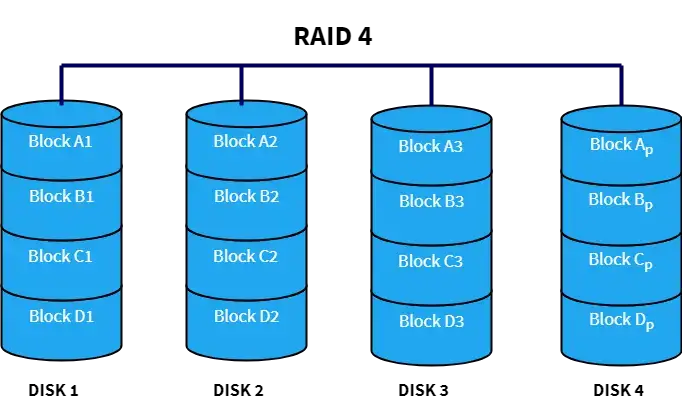
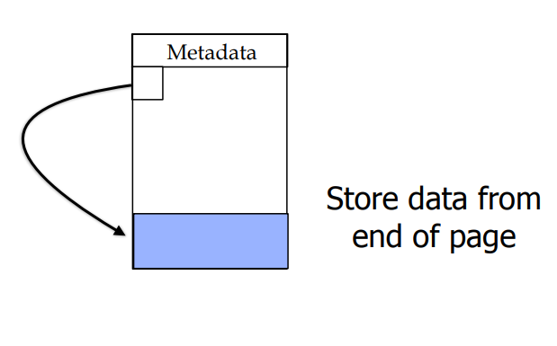
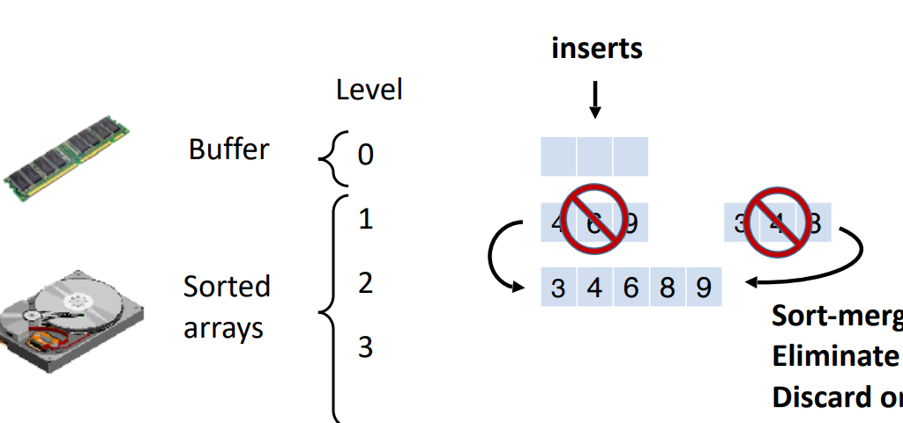
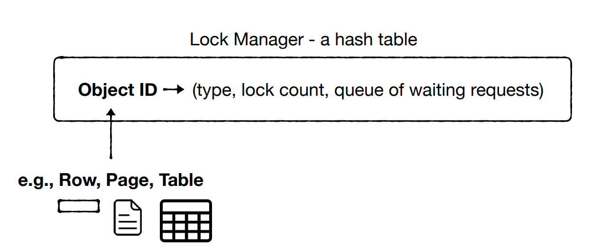
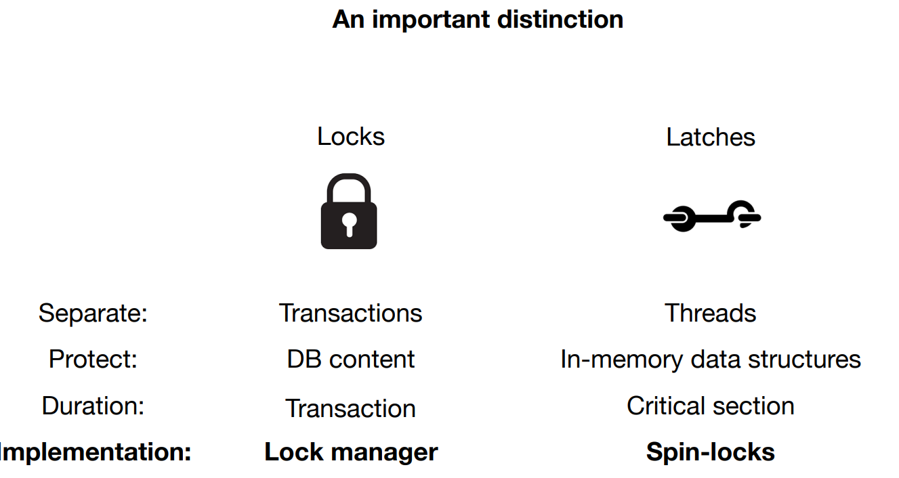

## week 2

- volatility: data stay when power is off


- bytes addresable: 64-128 B
- block addressable: 4-16 KB

### 1. disk


seek time - Move arms to position head on track (1-10 ms)

rotational delay - wait for sector to rotate under head (0-5 ms)

transfer time - moving data to/from disk surface (> 0.01 ms)

seek/rotational delays dominate


disk layout principle(how to be fast):

- Large sequential reads/writes of adjacent sectors and tracks are fast


soln to be large sequential reads/write:

- defragmentation

### 2. SSD


SSD is divided into erase units(block), each erase unit is divided into page as screenshot above

- A page is the minimum read/write unit with typically 4kB, erase units typically 128kB or 256kB
- Pages must be written sequentially in an erase unit
- All data in an erase unit is erased at the same time
- Each erase unit has a lifetime (1-10K erases)
- within the erase unit, pages are written sequentially


How pages are written and update in SSD:

> As the above screenshot shows, each erasing unit has multiple pages. Each page has 3 states: invalid, valid and free. The change of state of page requires different basic operations. Initially, the page is invalid and cannot be written. It can only be changed to free state through erase operation, then the page can be written. However, erase operation cannot erase one single page and must erase one entire erase unit. After the page becomes free, data can be written to the page and page state becomes valid. If we want to udate the data on that page, SSD will write new data on new page and the data on old page becomes stale. SSD will mark the old page from valid state to invalid state. Overall,  the meaning of page state:
>
> - free: this page is empty and ready to write
> - invalid: the data on the page is stale and is ready to be freed in GC
> - valid: the data on the page is up to date and cannot be written


Garbage Collection:

> As updates take place, more physical pages within the SSD get marked as invalid. Eventually, as the SSD runs out of free space, we must reclaim space taken up by invalid pages. The garbage collector picks the erase unit with the highest number of invalid pages. It migrates any remaining valid pages into an erase unit with free space, and it then erases the target erase unit


Over-provisioning:

> Overprovisioning means any SSD is assigned more physical space than the logical capacity it exposes to the user. In this way, when encountering a scenario where the SSD is filled to full capacity with invalid pages, we can use this extra space as a temporary workspace to manage scheduled valid page merges and then put it back to user space after we reclaim blocks filled with invalid pages. Over-provisioning also allows  more invalid pages in user space to accumulate before free space runs out. In this way,  for each erase unit, there is a higher proportion on average of invalid pages and we could migrate fewer valid pages and thus reduces write amplification


#### 2.1 Write amplcation

Intuition:

> Since SSD has garbage collection at behind scene, for every page the application writes, we not only physically write that page and in addition migrate some pages to a new page to reclaim the page we are writing. To measure this extra work, we use WA. The formula of wa:
>
> WA = 1 + (# of valid page within the target erase unit) / (# of invalid page)


**General formula:**

let x be the fraction of valid page in the target erase unit GC selects and y be the total page number

WA = 1 + $\frac{xy}{(1-x)y}$ = 1 + $\frac{x}{1-x}$


**write-amp from the user’s perspective**:

suppose that B data items fit into each page and that the user updates one random entry in each request,

WA = B * (1 + $\frac{x}{1-x}$)


**Worst-Case Write-Amplification:**

e worst-case write-amplification occurs when every full erase unit in the SSD has the same number of invalid pages. In this case, the SSD is unable to pick an erase unit with especially few live pages left to migrate and can only copy to over-provisioning

WA = B * (1 + $\frac{\frac{L}{P}}{1 - \frac{L}{P}}$)

WA Under Uniformly Random Writes:

Uniformly randomly distributed write-amplification = B * (1 + $\frac{\frac{L}{P}}{2*(1 - \frac{L}{P})}$)


#### 2.2 7 principles how to make most of the SSD

1.  avoid small updates: because small Updates are terrible - they force reading a whole page and rewriting it.
2. Avoid Random Updates: as they lead to garbage-collection overheads
   - Instead write sequentially, and update data written at the same time all at once
   - data die in different order, causing differen patterns of unavailable pages in SSD and might cause random updates
3. Prioritize Reads over Writes
4. Reads/Writes should be page aligned:
   - why: for ex, Reading a misaligned page triggers 2 flash reads Updating a misaligned page triggers 2 flash reads and 2 flash writes
5. Asynchronous I/Os for the win
6. Defragmentation on SSDs is a Bad Idea
   - Random read I/Os are fast, so relocating parts of a file to be close does not significantly improve read speed. On the other hand, it contributes to write-amplification and consumes the device’s lifetime.
7. Artificial Over-Provisioning: The less data you store, the more space the SSD will have for performing efficient garbagecollection
   - Over-Provisioning: the logical capacity of ssd is significantly smaller than the whole physical capacity


### 3. RAID

PROBLEM RAID addresses:

- Our database size exceeds one drive and we need more storage
- A drive fails, and we need to recover its data
- We want to overcome the limits of one storage device speed


**technical terms:**

- data striping: If we want to store a piece of data in data striping, this piece of data is segmented into equal-size partitions distributed over multiple disks, assuming the partition size is a page size(4096 bytes)
- data mirroring: Clone the piece of data on multiple disks
- parity block: It is a piece of block that is obtained by computing the XOR product of the aligned block row. It can be used to recover a block on failed disk, more can be seen in RAID 4

#### 3.1 RAID 0

What is RAID 0:

> RAID 0 is based on data striping, which is to divide each piece of data into multiple stripes and distribute over many disks. As the screenshot displays, if a piece of data size is 4 page size, then the data is split into block1, block2, block3 and block4 on 2 disks in pic. Then when the system wants to read or write that data, it can read or write block1 and block3 from disk1 and block2 and block4 on disk2 simultaneously from all the disks and join them together to reconstruct the entire data stream. However, if one of the disks fails, the entire data becomes corrupt and worthless since it cannot be recreated anymore
>
> 


benefits:

1. Much faster sequential writes and reads

2. Also improvement for random writes and reads due to load balancing


drawback(reason not practical):

No redundancy. If one disk fails, we lose data

#### 3.2 RAID 1

What is RAID 1:

> RAID 1 uses the concept of data mirroring. Suppose the data size is 2 blocks in size, then the data is split into block1 and block2 and stored on both drives in pic. A multi-threaded process can access Block 1 from Disk 1 and Block 2 from Disk 2 at once as RAID 0. However, when it writes the data, it must write the 2 blocks on disk1 and also on disk2
>
> 


benefits:

1. Slower writes as they must make 2 copies 
2. Faster reads as we have a choice to read from a non-busy drive


drawback:

1. Allows recovery of a disk but costs 50% of storage capacity

#### 3.3 RAID 0+1(RAID10)

What is RAID 0+1

> In this setup, multiple RAID 1 blocks are connected with each other to make it like RAID 0.
>
> 


#### 3.4 RAID 4

**Goal:** exploiting more than 50% if the storage capacity while allowing recovery

**What is RAID 4:**

> RAID 4 stripes the data across multiple disks. Say we have 1 piece of data 1 with 6 pages in size. The first 3 blocks of the data 1 is split into block A1, A2 and A3 and and the last 3 blocks are stored in block B1, B2 and B3 in the 3 disks as the screenshot. In addition, we also have dedicated disk 4 to store parity block Ap, which is computed as Ap = A1 $\oplus$ A2 $\oplus$ A3 and Bp = B1 $\oplus$ B2 $\oplus$ B3 after writes to A1, A2, A3 and B1, B2, B3 happen. When one disk fails, say disk 2 fails, we lose A2 and B2 block of the data 1. We recover these two blocks by computing A2 = A1 $\oplus$A3 $\oplus$ Ap and B2 = B1 $\oplus$ B3 $\oplus$ Bp. When data 2 is stored on block C and D of the 4 disks, similarly process goes as data 1. In this way, we avoid data cloning. However, because all the parity information is written on a single disk and disk 4 bears most load which is a bottleneck, the write performance is low
>
> 


- how RAID 4 recover data: the input is the data stripe


- limits: 
  - parity can only recover 1 input(not multiple inputs). When a disk fails, we know which disk fail, we use the parity and other good inputs to recover corrupted input 
  - the parity drive becomes bottle neck for random write


**how it handles Random Write:** 

say we have a data with 3 pages in size and is splitted as block A1, A2 and A3, we want to update page A2:

1. **Simple soln:**We updates page A2 to be A2', read other aligned pages(A1 & A3), then we update Ap' = A1 $\oplus$ A2' $\oplus$ A3

   **cost:** Say we have N drives, the above process takes N-1 reads & 2 write

2. **Real soln:** We read A2 and Ap, updates A2 to be A2', then update Ap' = A2 $\oplus$ A2' $\oplus$ Ap

   **costs**: Say we have N drives, the above process takes 2 reads and 2 writes


**how it handles sequential write:**

> 


#### 3.5 RAID 5

What is RAID 5:

> RAID 5 is very similar to RAID 4, but the parity info is distributed over all disks as Ap, Bp, Cp, Dp in screenshot. This has two benefits — First, there is no more a bottleneck as the parity stress evens out by using all the disks to store parity information. Second, there is no possibility of losing data redundancy since one disk does not store all the parity information.
>
> 

**how it handles sequential writes:**

- sequential writes only have N/(N-1) overhead


**how it handles random writes:**

- A random write requires 2 reads and 2 writes
- Random writes load is evenly distributed on all drives


**sequential read:**

- Sequential Reads are as fast as possible


**random read:**

- Random Reads have less flexibility than with mirroring


**limit:**

- can only recover one disk


Week 3

### 4. table

#### 4.1 how to store tables in storage:

Problem:

- Reading/writing from storage at units of less than ≈4KB is not possible(reason: because within a disk or an SSD the minimum unit of reading or write is 4kB, disk takes time to rotate)
- Reading/writing at very large units consumes memory and is less flexible for applications(this is a problem in memory)


Soln:

To balance, we introduce page and I/O. An I/O (input/output) is one read or write request of one database page. Each table is composed of one or more pages(page size is at least 4kB or mutiples or 4kB)


#### 4.2 How table keeps track of each page:

##### 4.2.1 linked list


This is the simplest soln, but there are **limits**:

- entails synchronous I/Os, which do not exploit SSD parallelism(parallelism due to multiple chips)
- small I/Os. because linked list does not gurantee pages allocated sequentially 


##### 4.2.2 Directory

**soln** to 1st limit: (Employ directory to allow reading many pages asynchronously.)

>  


soln to 2nd limit: (Store multiple database pages contiguously along “extents” (8-64 pages))

> In a file system, an "extent" refers to a contiguous block of storage space used to store a file's data. Extents are an alternative to the traditional method of storing file data, which involves dividing it into smaller blocks or clusters scattered across the storage medium


How to keep track of directories:

- use cataglog

  > 


How to keep track of free pages/extent:

- linked list(slow soln)

  > 

- bitmap(takes space)

  > 

  


#### 4.3 DAM model:

The DAM model helps us analze the cost of 4 db operations. It applies to disk storage


- B is a parameter variable(vary from 1 to page size)
- assume within a schema, B is constant size


Limits of DAM model:

- Ignores that sequential disk reads are more economical
- Ignores that SSD asynchronous I/O are faster
- Ignores SSD garbagecollection due to random writes


#### 4.4 how operations implement

N is number of entries in a table and B is number of entries stored in a page.

##### 4.4.1 Scan

- Inefficient way to store pages of db:

  

  This leads to N access of pages for each table, since each of the N entry is stored in a page

- Optimized way of storing pages of db:

  

  The scan cost is O(N/B), the above inefficient soln is O(N)


##### 4.4.2 Delete

- soln: Scan of the table. Delete the row and creates a “hole” in that page

  

  - Cost: O(1) write and O(N/B) reads


##### 4.4.3 Updates

- soln: Scan and update. If newer version is too large, delete & reinsert
  - Cost: O(1) write and O(N/B) reads

##### 4.4.4 Insert

Insert a row in the table

- soln #1: Scan & find space
  - cost: O(N/B) reads and O(1) write
- soln #2: We use a separate linked list to keep track of non-full pages and insert
  - cost: 
    - O(1) reads & O(1) write for **fixed-sized entries**(No scan cost)
    - O(N/B) reads & O(1) write for **variable-sized entries**
- soln #3: buffer insertions in memory until buffer full. Then a page fills up & append to extent
  - cost: No reads and O(1/B) of write

#### 4.5 How rows are stored in one page

- assume row is fixed length: 

  a db page can contain N rows and the page has the following 2 layouts( or solns):

  

  

  

-  assume each row is variable length in a page:

  place the bitmap at the start of page and real row at the end of the page:

  

  

### 5. Buffer

Why do we need buffer:

> To reduce read/write operations

#### 5.0 Buffer management

buffer pool data structure:

> Buffer pool Keep copies of hot pages in memory. Buffer pool is a hashtable. Consist of frames, each containing one page of data(e.g., 4 KB). Eventually it fills up. Must evict pages to clear space.
>
> 
>
> Each frame must keep some metadata :
>
> - Pin count - How many users are currently using this page
>
> -  Dirty flag - indicates whether the page has been updated


What does buffer pool do:

- initially:

  > Initialize all frames pin_count and dirty bit to be 0

- When a page is requested by a new user:

  > 1. Checks the buffer pool to see if some frame contains the requested page and, if so, increments the pin_count of that frame. If the page is not in the pool, the buffer manager brings it in as follows:  
  >    1. Hash the page to the location frame in the buffer pool. If the frame is free, choose that frame as the final location. If not, under the hash collision, find the final free frame slot. If there is no free frame in buffer pool:
  >       1. Chooses a frame with pin_count = 0
  >       2. If there are many frames with pin_count = 0, use eviction policy to choose the page. If no page has 0 pin_count,  wait until some page is released before responding to the page request  
  >       3. After the page is selected, use the hash collision policy to hash the page to the selected page.
  >    2. Increments the new page's pin_count  
  >    3. If the dirty bit for the replacement frame is on, writes the page it contains to disk (that is, the disk copy of the page is overwritten with the contents of the frame) . Otherwise, just evict the page and it is to drop that page without writing to the disk
  >    4. Reads the requested page into the replacement frame  
  > 2. Returns the (main memory) address of the frame containing the requested page to the requestor  

- After the page is requested by old user and the page is requested to release:

  > 1. decrement the pin_count to unpin

- After the page is requested and the page is requested to modify:

  > 1. decrement the pin_count to unpin
  > 2. set the dirty bit on


#### 5.1 Evicton policy

##### 5.1.1 Random

Evict whichever page collides in the hash table with a new page

- pro: No additional metadata needed
- con: May evict a frequently used page


##### 5.1.2 FIFO

Evict Page that was inserted the longest time ago.

Implementation from the slide: queue(or actually ring buffer):


Cons:

- pages we evict have different frames than pages we insert

  - soln:

    - need a hash collision algorithm

    - need  10%-20% capacity

-  Oldest page may still be frequently used. We’ll try to do better


##### 5.1.3 LRU

Evict page that was used last the longest time ago

Implementation: Doubly-linked list


Cons:

- 


##### 5.1.4 Clock

Traverse hash table circularly as a clock. Set the page with 0 flag to be 1. Find the page with the first 0 flag and evict it.

Pro:

1.  lower overheads as there is no queue
2.  bitmap takes little extra space


Con:

1. can evict “hotter” pages than LRU, But still better than FIFO


## Week 4

### 6. Index

Index is a way to efficiently optimized:

```sql
SELECT * FROM table t WHERE A = 'v';
```

To measure the performance, we introduce I/O cost and CPU cost:

- I/O cost: number of times to read/write a data page in order to find the target data page
- CPU cost: number of comparison to find the target data page and number of comparison to find the target key within the target data page

#### 6.1 Naive way

How data are stored and how search occurs:

> The db keeps track of the page of each table. When db wants to find a key, db just access each page of the table


Operation:

- insert:
- searchSingleEntry
- delete
- update:


cost: 

- worst case: O(N/B) I/Os


#### 6.2 Zone map

How data is stored and how search occurs:

> The db keeps track of the page of each table. Each page stores two extra information: the max and min key within this page. This saves time when db wants to find a key within the page, but does not save time when db tries to find the target page. When db wants to find a key, db just access each page of the table


Operation:

- insert:
- searchSingleEntry
- delete
- update:

Pro:

- may be g

cost: 

- worst case: O(N/B) I/Os


#### 6.3 sorted file

How data is stored and how search occurs:

> We can view one column A of table as a continuous array when we join the rows of the pages of the table. For this method, we ensure the A column stored on each page of the table is sorted. Then when we want to find the data page where the target key lies in, we look at the first key of each page $k_1, k_2, ... k_N$ and perform binary search. Ultimately, we find the target key k between $k_i$ and $k_{i+1}$ We can conclude the target key may potentially be at the page of $k_i$ . Then we do binary search at the page of $k_i$ to find k


Operation:

- insert:

  > Binary search to find proper location, and then push rest of elements up by one slot

- searchSingleEntry

  > we do binary search on the first key of each page to determine where is the data page. Then in that page, we do binary search to find the target key.

- delete

- update:


Performance:

| operation     | worst case CPU                  | worst case I/O  |
| ------------- | ------------------------------- | --------------- |
| insert/update |                                 | O(N/B)          |
| search        | O($log_2(N/B)$) + O($log_2(B)$) | O($log_2(N/B)$) |


Pro:

- searchSingleENtry is fast

Con:

- limit: Can only sort based on one column, but what if we want to search across other columns


#### 6.4 Binary tree

How is data stored and how search occurs:

> 1. We first use an augmented binary tree to store each key of the column A of the table at each node of the tree. Each node stores the key and its associated page number of the table in storage
>
>    
>
> 2. We store each tree node in an array of tree nodes. The array needs to be written to the store. The content of the array may be in different page number of the sorage. Inside each element of the array, each element stores the key value, its associated data page number, its left child & the left child's page(since each element of the array may be in different page of the storage), its right child & the right child's page number. Now suppose each element of the tree array is in different page number and when we do tree traversal, we need to read $log_2(N)$ pages because the first page of the array can store B nodes from top level to below. Thus, we have fewer pages to read, which is $log_2(B)$. Therefore, the total I/O cost is $log_2(N) - log_2(B) = log_2(N/B)$ 


Operation:

- insert:
- searchSingleEntry
- delete
- update:


Performance:

| operation | worst case CPU | worst case I/O  |
| --------- | -------------- | --------------- |
| search    | O($log_2(N)$)  | O($log_2(N/B)$) |


#### 6.5 Hash table

- We store a hash table in storage

- We use hash function to map key to a bucket and each bucket contains B entries mapping a key to its data page(hash collision policy)
- We double number of buckets when hash table reaches capacity


read/write cost:

- O(1) per random query and no collision happens
- collision happens
- double expand hashtable:


downside:

- No support for range reads
- Expansion leads to performance slumps
- We waste 50% of capacity right after expansion


#### 6.6 Extendible hashing

how it works:

1. we first have a small directory that comrises of small hash prefix to the data pages
2. When we create data, we hash the data using the small directory. When collision happens, say we use chaining and we create one overflowing page
3. We can then double directory to allow more mapping to data pages and finally we copy the overflowing page to the new data page from the doubled directory. 


#### 6.7 B-tree

Goal: 

> we want to read at least B entries from storage at a time, let’s make each tree node have B entries to prune the search space by a factor of B


defn of B-tree:

> A B-tree T is a rooted tree(whose root is T.root) that has following property:
>
> 1. Each node x has the following attributes:
>    1. x.n, the number of keys in node x
>    2. the (x.n) keys in the list: x.key<sub>1</sub>, x.key<sub>2</sub>, ... x.key<sub>x.n</sub>,  stored in non-decreasing order
>    3. x.leaf, boolean value to indicate whether this node is leaf
> 2. Each internal node x has (x.n + 1) children node
> 3. Say x.c<sub>i</sub> is the pointer to the i<sup>th</sup> child node of node x. If k<sub>i</sub> is any key stored in the subtree with root x.c<sub>i</sub>, then k<sub>1</sub> $\leq$ x.key<sub>1</sub> $\leq$ k<sub>2</sub>  $\leq$  x.key<sub>2</sub> $\leq$ ... $\leq$ k.key<sub>x.n</sub> $\leq$ k<sub>x.n+1</sub>  
> 4. All leaves have the same depth  h
> 5. let $t \geq 2$ be the min degree of B-tree
>    1. Every node other than root has at least (t - 1) keys, at least t children pointer
>    2. Every node contains at most (2t - 1) keys, at most 2t children pointer


Notation:

- we use B= 2t-1 to represent the number of keys in a full leaf node in B-tree. Each leaf occupies a whole page size on the disk as default


**Example of structuring B - tree**:


1. Suppose we have a list of keys and we sort them. We group of the keys with each group size of 3. Each group is the tree node of B-tree. In the leaf node, there stores the mapping from the key to the page number in the diagram above
2. In the upper level, we store the max key of each node. In the left upper node, we store 7, 22 as the max key of the left 2 leaf node. In the right, we store the max key of the right 3 leaf nodes which are 35, 73, 90
3. The root node stores 31 which is the max key of the 3rd leaf node


**cost:**

let N be the number of keys in total, B be the max number of keys in a b-tree node:

- depth of b-tree: $log_B(N)$ ,

- search cost(I/O cost): O($log_B(N)$)

- CPU cost: O($log_B(N) * log_2B$): we searched log_b(B) and for each node, we searched among the B keys 


**how to insert(To be filled):**

> 1. find target node
> 2. if node is full(node key # == B):
>    1. split target node into 2 new half-full nodes
>    2. add key sto the new node
>    3. compare the new key with its parent node keys and propagate split upward potentially


## Week 5

### 7. LSM tree

type:

- Leveled LSM-tree
- Basic LSM-tree
- Tiered LSM-tree

#### 7.1 Basic LSM tree




Insert:

1. insert data at the buffer at level 0. Once filled, we sort the key at buffer & flush buffer and place buffer at level 1
2. We then insert data at buffer at level 0. Once buffer at level 0 filled up. We mergesort the old buffer at level 1 and current filled buffer at level 1, then place the new sorted buffer at level 2. 
3. We delete buffer at level 0 and level 1. 
4. We repreated this until level N

Get:(total runTime: O(log2 N/P) * O(log2 N/B))

1. searches the LSM-tree from smaller to larger levels  (O(log2 N/P), P is the length of SST at each level)
2. search each level                                                              (O(log2 N/B), the Nth level SST length is log2(N/B))
3. stop when they find the first matching entry


Scan: Return most recent version of each entry in the range across entire tree

(O(log2(N/B) * logB(N) + S/B))

> 1. Allocate an in-memory buffer (>1 page) for each level
> 2. Search for start of key range at each level 
> 3. Initialize counter to smallest key in range
> 4. Loop:
>    1.  Bring youngest matching entry to output 
>    2.  Increment counter


Since there are copies during compaction of write:

- number of times each entry is copied: O(log2 N/B)
- price of each copy: O(1/B) reads & writes
- total cost: O((log2 N/B)/B) read & write I/Os

#### 7.2 Leveled LSM tree

Different from basic LSM tree, the ratio between length of level(n+1) and level n is T instead of 2


Performance:

- Lookup cost(O($log_T(N/P)$))
- Insert cost: O(T/B * $log_T(N/P)$)

#### 7.3 Tier LSM tree


Performance:

- lookup cost: O(T * $log_T(N/P)$)
- insert cost: O(1/B * $log_T(N/P)$)


## Week 6

Recall:

> B-tree random write leads to large write aplication. Thus, we use LSM tree

level of LSM tree:

$L = log_T(N/P)$ , N is the number of entries, P is the size of memtable, T is the resize ratio


### 8. Bloom filter

>  Probility tool to tell whether the key is in the set. It's a bit vector with k hash functions.
>
>  operation:
>
>  - insert: hash the key and outcome is the index in the bitmap. We then set the bit on that index to be 1.
>  - query: If all bits are set to 1, it tells the key is probably in the set. If there exists bit that is 0, it tells the key is not in the set
>
>  However, there's a small probability of false positives, where the Bloom filter incorrectly suggests that an element is in the set when it's not. There are no false negatives; if the filter says the element is not in the set, it's definitely not.
>
>  - true positive: check if all bits are 1
>
>  - true negative: check if there exists bit that is 0
>
>  - false positive： bloom filter tells it is in but it is not in
>
>  - false negative: bloom filter tells it is not in but it is in
>
>    if it is in , then bloom filter returns positive


Key problem:

- how many hash functions to use?
- how to choose K
- Operation cost


#### 8.1 how many hash functions to use:

> too few hash functions lead to high false positive rate. But too many hash functions wind up increasing the FP
>
> 
>
> 
>
> Suppose insert N keys in bloom filter, we have bloom filter with K bits in length,
>
> M = K / N(K > N), how to choose K?
>
> Optimal # hash functions = ln(2) · M(M is the number of bits per entry, typically 10)
>
> assuming the optimal # hash functions, 2<sup>−M⋅ln(2)</sup> false positive rate
>
> In reality, we first have ideal false positive rate, then we deduct M, then we deduct Optimal # hash functions 


#### 8.2 Operation cost

| operation           | cost           |
| ------------------- | -------------- |
| Insert              | M * In(2)      |
| Positive query      | M * ln(2)      |
| Avg. Negative Query | 2              |
| false positive rate | $2^{−M⋅ln(2)}$ |
|                     |                |


Cost for bloom filter searching key in LSM - tree:

- worste case: O(M  * L)
- Avg worst case: O(M + L)

### 9. Monkey


### 10. DSTOESKV

design:

> At higher level, we use tier LSM tree mechanism. At the last level, we use level LSM tree mechanism.

reads co


## Week 7

### Quick sort

benefit:

- In-place algorithm: no need for x2 space like merge-sort
- Sequential memory access is fast

### B-tree sort

- If internal nodes are in memory: O(N) reads & writes
- If internal nodes are in storage:  O(N logB N) reads & O(N) writes


### Multi-way Merge-Sort

1. Sequentially read chunks that fit in memory, sort, and store back as temporary files
2. Allocate a buffer for each input file and merge into output stream


limit:

- lots of write amplications

- each sorted temporary file double the storage

- We have little memory as a buffer to store all of the sorted file. Thus, we merge at least 2 at a time

  


## Midterm review

### 1. B-tree


### 2. LSM tree


### *. Summary

Notation:

| Term                 | Description                                                | Unit    |
| -------------------- | ---------------------------------------------------------- | ------- |
| N                    | Total number of entries                                    | entries |
| L                    | Number of levels                                           | levels  |
| B                    | Number of (key, value) entries that fit into a disk page   | entries |
| K                    | Number of (key, pointer) entries that fit into a disk page | entries |
| E                    | Size of an entry                                           | bits    |
| P                    | Size of the buffer in disk pages                           | pages   |
| P<sub>1</sub>        | number of entries in a buffer, P<sub>1</sub> = P * B       | entries |
| S                    | number of entries in range scan                            | entries |
| T                    | Size ratio between adjacent levels                         |         |
| T<sub>lim</sub>      | Size ratio value at which point L converges to 1           |         |
| M                    | Total amount of main memory in system                      | bit     |
| M<sub>buffers</sub>  | Main memory allocated to the buffer                        | bit     |
| M<sub>filters</sub>  | Main memory allocated to the Bloom filters                 | bit     |
| M<sub>pointers</sub> | Main memory allocated to the fence pointers                | bit     |


RunTime summary:

| data structure                               | insert                                            | update | search                                                       | scan                              |
| -------------------------------------------- | ------------------------------------------------- | ------ | ------------------------------------------------------------ | --------------------------------- |
| B+tree(in storage, unclustered)              | I/O: O(log<sub>B</sub>N) +O(1)<br/>               |        | I/O: O(log<sub>B</sub>N)<br/>CPU: O(log<sub>B</sub>N * log<sub>2</sub>B) = O(log<sub>2</sub>N) | I/O: O(log<sub>B</sub>N + S)      |
| B+tree(internal in memory)                   | I/O: O(1) + O(1) + GC<br/>                        |        | I/O: O(1)                                                    |                                   |
| B+tree(clustered)                            |                                                   |        |                                                              | I/O: O(log<sub>B</sub>N + S/B)    |
| basicLSM tree(without B-tree)                |                                                   |        | I/O: O(log2(N/P<sub>1</sub>) * log2(N/B))                    |                                   |
| basic LSM(with B-tree in storage)            | I/O: <br/>O(log<sub>2</sub>N/P<sub>1</sub> * 1/B) |        | I/O: O(log2(N/P<sub>1</sub>) * logB(N))                      | I/O: O(log2(N/P) * logB(N) + S/B) |
| clustered basic LSM(with B-tree in memory)   |                                                   |        | I/O: O(log2(N/P<sub>1</sub>) )                               |                                   |
| unclustered basic LSM(with B-tree in memory) | I/O: O(1/B + L<sub>U</sub>/K)                     |        | I/O: L<sub>U</sub> + 1                                       | I/O: O(L<sub>U</sub> + S)         |
| level LSM tree                               | I/O: O(T/B logT (N/P))                            |        | I/O: O(logT(N/P))                                            |                                   |
| tier lsm tree                                | I/O: O(1/B logT (N/P))                            |        | I/O: O(T* logT(N/P))                                         |                                   |
| Append only table                            | I/O: O(1/B)                                       |        | I/O: O(N/B)                                                  |                                   |
| sorted table                                 |                                                   |        |                                                              |                                   |
| zone map                                     |                                                   |        | I/O: O(N/B) (worst) <br/>                                    |                                   |
| sorted file                                  | I/O: O(N/B)                                       |        | I/O: O(log<sub>2</sub>(N/B))(worst) <br/>CPU: O(log<sub>2</sub>(N/B) + log<sub>2</sub>B) = O(log<sub>2</sub>N) |                                   |
| binary tree                                  |                                                   |        | I/O: O(log<sub>2</sub>(N/B))<br/>CPU: O(log<sub>2</sub>(N))  |                                   |
| hashtable(in storage)                        |                                                   |        |                                                              |                                   |


I/O runtime: (L = log<sub>T</sub>(N/P<sub>1</sub>) )

| data structure                                           | operation | I/O   | Runtime                                                 |
| -------------------------------------------------------- | --------- | ----- | ------------------------------------------------------- |
| append-only table                                        | query     | read  | O(N/B)                                                  |
|                                                          | insert    | read  | 0                                                       |
|                                                          |           | write | O(1/B)                                                  |
| Basic LSM(with B-tree not in memory)                     | query     | read  | O(log<sub>2</sub>(N/P<sub>1</sub>) *log<sub>B</sub>(N)) |
|                                                          | insert    | read  | O(log<sub>2</sub>(N/P<sub>1</sub>) * 1/B)               |
|                                                          |           | write | O(log<sub>2</sub>(N/P<sub>1</sub>) * 1/B)               |
| Basic LSM(with B-tree in memory)                         | query     | read  | O(log<sub>2</sub> (N/P<sub>1</sub>))                    |
|                                                          | insert    | read  | O(log<sub>2</sub>(N/P<sub>1</sub>) * 1/B)               |
|                                                          |           | write | O(log<sub>2</sub>(N/P<sub>1</sub>) * 1/B)               |
| B-tree(not in memory)                                    | query     | read  | O(log<sub>B</sub>N)                                     |
|                                                          | insert    | read  | O(log<sub>B</sub>N)                                     |
|                                                          |           | write | O(1) + GC                                               |
| B-tree(in memory)                                        | query     | read  | O(1)                                                    |
|                                                          | insert    | read  | O(1)                                                    |
|                                                          |           | write | O(1) + GC                                               |
| Level LSM                                                | query     | read  | O(log<sub>T</sub>(N/P<sub>1</sub>))                     |
|                                                          | insert    | read  | O(log<sub>T</sub>(N/P<sub>1</sub>) * T * 1/B)           |
|                                                          |           | write | O(log<sub>T</sub>(N/P<sub>1</sub>) * T * 1/B)           |
| Tier LSM                                                 | query     | read  | O(O(log<sub>T</sub>(N/P<sub>1</sub>) * T )              |
|                                                          | insert    | read  | O(log<sub>T</sub>(N/P<sub>1</sub>) * 1/B)               |
|                                                          |           | write | O(log<sub>T</sub>(N/P<sub>1</sub>) * 1/B)               |
| LSM with bloom filter uniform FPR <br/>across each level |           |       |                                                         |
| Monkey                                                   |           |       |                                                         |
| Dotevski                                                 |           |       |                                                         |


B-tree:

- clustered vs unclustered
  - cluster height: log<sub>K</sub>(N / K), number of leaf node: N/K
  - unclustered height: log<sub>B</sub>(N/B), number of leaves: N/B

- internal node in buffer:
  - in buffer
  - in storage

- Each insert costs 1 read and 1 write I/O(because of split node) and each get costs 1 I/O
- in storage:
  - insert/search/update:   O(log<sub>B</sub>N) Read I/O  + O(1) Write I/O
- internal node in memory buffer:
  - O(N/B) keys are stored in memory


lsm tree:

- height: L = $\lceil log_T(\frac{NE}{M_{buffer}} \cdot \frac{T-1}{T}) \rceil$ = O(log<sub>T</sub> N/P<sub>1</sub>), T<sub>lim</sub> = $\frac{NE}{M_{buffer}}$= N/P<sub>1</sub> 
- Each insert costs 1/B read and 1/B write I/O and each get costs 1 I/O.
- operation worst case
  - get: find a key that does not exist in memtable and sst files(in this way, the )

- each file has B-tree
  - yes
    - B-tree in memory
    - B-tree is not in memory
  - no
- merge policy:
  - tier:
    - With tiering there are at most T − 1 runs at every level (when the T th run arrives from the previous level it triggers a merge operation and a push to the next level)
  - level

- clustered vs unclustered


Bloom filter:

- Let M be the number of bits per entry(common M value is 10, which gives 1 false positive rate)
- optimal #of hash func: ln(2) * M
- false positive rate: 2<sup>-M*ln(2)</sup>
- Operation cost(in memory):
  - Insertion: each insertion takes M * ln(2)
  - postive query: M * ln(2)
  - Avg negative query: 1 + 1/2 + 1/4 + ... = 2
  - get cost:
    - total worst case: O(M * L)  (the key is not in LSM tree and we get false positive query all the way to the L level of the tree)
    - Avg worst case: O(M + L)
- LSM tree integrated with bloom filter I/O cost:
  - tier:
    - get: O(2<sup>-M</sup> * L * T)
  - level:
    - get: O(2<sup>-M</sup> * L)


space amplication:

> let *unq* be the number of unique entries,
>
> SA = $\frac{N}{unq} - 1$
>
> worst case SA:
>
> - leveling:  With leveling, the worst-case space-amplification occurs when entries at Levels 1 to L − 1 are all updates to different entries at Level L thereby rendering at most a fraction of 1 T entries at level L obsolete. O($\frac{1}{T}$)
> - tiering:  the worst-case occurs when entries at Levels 1 to L − 1 are all updates to different entries at Level L, and where every run at Level L contains the same set of entries (O(T))


Monkey design:

- how does Monkey allocate memory optimally across Bloom filters to minimize lookup cost?

  > monkey  finds the optimal number of levels Lfiltered to which Bloom filters should be allocated and lets the optimal FPR at Level i is T times higher than the optimal FPR at Level i − 1. Thus, the lower level of lsm tree in monkey has more bits per entry in bloom filter and the deeper level has fewer bits till in some levels there is no bit. The intuition is that the amount of main memory needed for achieving a low FPR at deeper levels is significantly higher since they have exponentially more entries and the worst case runtime of false positive query is O(ML) and the average worst case is O(M + L), where M is the number of bits per entry and L is the number of levels in lsm tree.
  
- bloom filter worst case: O(M * L + L<sup>2</sup>), Avg worst case: O(M + L)

- I/O cost with monkey design:

  - level:

    - (2<sup>-M</sup> /T<sup>L-1</sup> +... +2<sup>-M</sup> / T<sup>2</sup> + 2<sup>-M</sup>/ T + 2<sup>-M</sup> /T<sup>0</sup>  +) = O(2<sup>-M</sup>), while get i/o cost for regular design is 

      O(2<sup>-M</sup> * L)


Dostoevski:

- What is lazy leveling:

  > : it applies leveling at the largest level and tiering at all other levels. As a result, the number of runs at the largest level is 1 and the number of runs at all other levels is at most T − 1 

- trade-off:

  >  improves the cost complexity of updates, (2) maintains the same complexity for point lookups, long range lookups, and space-amplification, and, even though it trades off the point lookup (3) provides competitive performance for short range lookups

- I/O cost:

  - get: O(2<sup>-M</sup>)
  - insert: O(1/B) + ... + O(1/B) + O(T/B) = O((L+T)/B)


multi-way merge sort algorithm:

| Notation | description                 | units   |
| -------- | --------------------------- | ------- |
| M        | number of entries in buffer | entries |


Let buffer size be M entries, data size be N entries, each page contains B entries. The algorithm uses the buffer to sort the data entries:

> step1: partition the N entries into (N/M) partitions with each partition's size M entries
>
> step2: Use the buffer to sort each partition so that each partition is sorted(sort each partition needs O(Mlog<sub>2</sub>M) and (N/M) partitions in total takes O(Nlog<sub>2</sub>M))
>
> step3: Since we have buffer size M entries and we have M/B buffer, then we select M/B partition from the N/M partitions and assign one buffer from the M/B buffer to each of the selected partition. For each partition, we copy one page from the partition to their corresponding buffer. Since each buffer contains the sorted page from the sorted partition, we choose the minimum element from the first key of each of the buffer, put it in the array which will be the merged partition of these partitions, and pop the key. The second key of that buffer will be compared with the rest of the buffer's first key. This process continues until there is no key in one of the buffer. Then we read the next page from the corresponding partition of that buffer. This continues until all partitions are read and we obtain this merged partition called P1
>
> step4:  We then select the next M/B partions from the N/M partition for the second pass and does the same process as step 3 and obtain another mered partition called P2
>
> step5: After some passes, we now select M/B partition from those merged partition and does the same process as step3 until there is only 1 merged partition. This takes log<sub>M/B</sub>(N/M) passes

- #iterations: 

  log<sub>M/B</sub>(N/M) + 1 = log<sub>M/B</sub>(N/B),   precisely $log_{M/B-1}(N/M) + 1$

  (if we cannot allocate a buffer for each of the (N/M) partition, then this is the number of passes to merge N/M partitions into one and each pass we merge M/B partitions)

- M = $\sqrt {N \cdot B}$ (number of entries in buffer if we can allocate one buffer for each (N/M) partition and the number of pass is 1)

- Given the above M, we have $\sqrt{\frac{N}{B}}$ partitions

- CPU & I/O cost:

| Operation                                       | CPU cost                                                     | I/O cost                              |
| ----------------------------------------------- | ------------------------------------------------------------ | ------------------------------------- |
| multi-way merge sort                            | O(N $\cdot$ log<sub>2</sub>N)                                | O(N/B * log<sub>M/B</sub>(N/B))       |
| (partition)                                     | O(M $\cdot$ log<sub>2</sub>M * N/M) = O(N$\cdot$ log<sub>2</sub>M) | O(N/B)                                |
| (merging: traverse buffer)                      | O($\sqrt{\frac{N}{B}} \cdot N$)                              | N/B * $\lceil log_{M/B} (N/M) \rceil$ |
| (merging: min heap)                             | O($log_2(\sqrt {\frac{N}{B}} \cdot N)$)                      | N/B * $\lceil log_{M/B} (N/M) \rceil$ |
| 2-pass merge sort(given M = $\sqrt{N \cdot B}$) | O(N$\cdot$ log<sub>2</sub>M)                                 | O(N/B)                                |


Buffer pool:

- random eviction:
  - Evict whichever page collides in the hash table with a new page
  - pro: Simple, CPU-efficient, no extra metadata
  - limit: May evict a frequently used page
- FIFO:
  - steps:
    1. Use a queue to maintain the order of the page that is inserted
    2. If a page is inserted, we add to the rear of the queue; if we want to evict, we pop the head
  - limit: Unlike the random policy, pages we evict now have different frames than pages we insert. We then need hash collision resolution algo and extra capcity
- LRU:
  - steps(Evict page that was used last the longest time ago)
    1. Use a queue to maintain the order of the page that is inserted
    2. when we insert a page, we add to the rear
    3. when we evict a page, we pop the head
    4. when we access a page, we move the page from its location in queue to rear
  - limit: CPU overhead


trade-off:

- get query
- scan
- insert
- memory cost


log rules:

- log<sub>a</sub>(b) = $\frac{log_c(b)}{log_c(a)}$
- log<sub>a</sub>b * log<sub>c</sub> a = log<sub>c</sub> b


## Week 9

### 1. Circular log

also known as "Index+Log", "Circular Log", "log-structured hash table", "log structured file system"

**Components:**

- buffer: an in-memory buffer used to buffer insertion and then flush to the disk
- Index: an in-memory hashtable that maps the key to the location in log(storage). Inside the index, the data is of the form <key, blockId>
- live bytes: an in-memory hashtable that maps the blockId to an integer counter that represents how many live bytes are in this block. The GC will use this data to determine which block to be recycle. The data inside live bytes is <blockId, counter>
- Log: consists a set of blocks(where block size >= buffer size) on the disk. Inside each block, the data is of the form <key, value>

**Soln 1:**

- insert:

  1. insert the <key, value> into the buffer
  2. if the buffer is full:
     1. flush the buffer to the end of the log
     2. add all keys from the buffer to the index and set their values as the pointers to the end of the log

- delete(version 1):

  1. read the entry from log on disk through its blockId in index to check the value's size
  2. subtract its size from the blockId's counter in live-bytes section
  3. delete the <key, blockId> from the index. That's all. The actual <key, value> pair will be deleted in gc

- delete(version 2):

  1. In order to get rid of the read I/O from the delete version 1. We can store an extra value of size that represents the size of the value associated with the key in index as the following screenshot. Then we can retrieve its size by just looking through its key in index

     

  2. same as version 1
  3. same as version 1

- get:

  1. Check if the buffer has the <key, value> pair
  2. if not, check the index for the block and read the data from the log through the block Id

- update:

  1. call delete
  2. call insert

- GC:

  1. Periodically check if the global threshold is reached(live data L /physical space P). If so, trigger the following steps for GC

  2. Pick the blockId with the least live data left from live-bytes section

  3. Read and scan the block through the blockId.

     For each key value pair entry in this block

     1. if the key is not in the hashtable in index section, it means the key is deleted and continue
     2. if the key is in index section but its blockId is not this blockId, continue
     3. if the key is in index section but its blockId is this blockId, migrate this key/value entry to the last block if the last block not full and update index blockId for these keys(O.W: just allocate a new block and point to the new block)


### 2. hot/cold separation

This is a problem

> We call the page entries that are frequently updated hot pages, while the page entries that are seldom updated cold pages. THE cold data gets mixed with more hot data within an erase unit. Since hot entries are invalidated quickly, by the time we garbage-collect, we only migrate cold data which does not actually need to be migrated and thus increase the WA. This may lead to the WA worst case


The soln to the above problem can be separate cold and hot data into 2 different areas. Here is 2 implementations:

**soln 2(hot and cold buffer):**

1. Prepare 2 buffers. One is to buffer garbage collected data that is generally cold in cold buffer and the other is to buffer user updates(generally hot) in hot buffer
1. Whenever the user updates or insert data, the data goes to the hot buffer. When the hot buffer is full, it flushes to a new block at the end of the log instead of the last unfull block.(In this system, every block will be full unlike the circular log in last section)
1. Whenever the GC migrates cold data, it does not directly migrate to the last unfull block at the end of the log. It goes to the cold buffer. When the cold buffer is full, it flushes to a new block. Then in this case, hot block and cold block are separate from each other.

write cost: O((1 + GC)/B)

**soln 3(more advanced, use data structure "count-min" to separate data with different temperatures):**

1. We prepare multiple buffers(more than 2). One is the really hot buffer that is used to buffer usr insert and the other are the buffers of different temperature  ranges indicated by count-min.
2. Whenever we update key/value pair, we insert the blockId where the kv lies in to the count-min. Then we query the temperature of that block. We then put that kv into the buffer associated with that buffer
3. Whenever we perform GC, we query the temperature of that selected block and put it in the buffer associated with that temperature.

- count-min: a data structure that estimates freqency of elements in a data stream. Consists of d arrays of w counters. Each counter is an integer type.

  - insert: when we insert an element, for each array of d arrays, we use a different hash function to get its position in each array and increment the counter at the hashed position in each array

  - query: when we query an element's frequency, we hash it to each array and get the minimum counter of each array as the frequency.

  - hyperparameter of count-min(w, d):

    - w = $\lceil e / \epsilon \rceil$

    - d = $\lceil ln (1 / \delta) \rceil$

  
    
  
  - decay(deal with situation past hot pages become cold at some time): every x insertion, we divide all counters by 2
  

write cost: O((1 + GC)/B)

impact of hot/cold separation:

> let WA<sub>sep</sub> be the GC overhead employ hot/cold separation,
>
> then WA<sub>sep</sub> <= 1 +$\frac{L/P}{2 *(1 - L/P)}$ <= 1 +$\frac{L/P}{(1 - L/P)}$


### 3. Checkpoint recovery

Problem:

> When power is suddenly off, if we want to restore the data in index and live-bytes, we need to read all logs on storage from newest to oldest. However, this is very slow if we have many logs


**Attemp4(Simple recovery algorithm):**

**based on Sol 1, 2, or 3**

- Recovery:

  1. scan the log from the most recent block to the oldest block
  2. For each block of the log:

     1. add the block_id and the file size pair to the live-byte

     2. For each entry of the block:

        1. if the entry not in index:
           1. add the entry's key and blockId pair to the index

        2. else:
           1. subtract the entry's value size from the live-byte through blockId


Problem:

- slow for large data


**Soln 5(Checkpointing):**

**based on soln 1, 2, or 3**

- before crash:

  1. Every X updates/insertions, store copy of index & live bytes.

- After crash/during recovery

  1.  load all copies of index & live-bytes

  2. scan X latestest block(Since the copy is the index before at most X insert/updates)

     For each block:

     1. For each entry in the block:
        1. if the entry not in index:
           1. add the entry's key and blockId pair to the index
        2. else:
           1. subtract the entry's value size from the live-byte through blockId

cost: 

- write: O(GC/B + index size / X)

- recovery: O(X/B) reads for backwards scan
- get: O(1)


Note:

> After we create the copy of index and insert/update M(M < X) times, we may delete some key from index and the copy cannot reflect deleting in the old way. To achieve this, we add tombstone to the key  in buffer during delete operation and then remove from index. Then the log will reflect tombstone. When we scan the X logs during recovery, if the first instance of a key we see is a tombstone, we ignore all subsequent entries with this key.


### 4. Cuckoo filter

Why do we need Cuckoo filter:

> The problem is that index size is quite big, Index size= N * (P + K) / $\alpha$
>
> - N = data size
>- K = each key size
> - $\alpha$: collision resolution overheads(approximately 0.8)

We can reduce K by adopting Cuckoo filter if we use Cuckoo filter to implement Index. The Cuckoo filter reduces space in memory by fixing an arbitrarily large,variable-length keys to be fixed size fingerprint


Note:

> payload in slide: The payload can be any small fixed-length value you wish to associate with a fingerprint. In the case of circular logs, the payload is a pointer to the location of the entry in storage. 


**HyperParameters of Cuckoo filter:**

- M: bits length of each finger-print in Cuckoo filter bucket
- $\alpha$: fraction of occupied slots
- $\beta$: number of slots in bucket, the slide sets it to be 4
- N: the length of Cuckoo filter(i.e: number of buckets)
- h1(): primary hash function
- hash(): a function in alternate hash function h2(), h2() composites hash()
- h2(): h1(X) XOR hash(FP(X))
- FP(): finger-print function


Invariant theory about Cuckoo filter:


**Soln 6(Implementation with Cuckoo filter, based on soln 5):**

- Initialize: initialize N buckets and each bucket can store $\beta$(in slide, this is 4) pairs of <FP(X), blockId>. We prepare h1() function that maps key X to {1, 2, ... N} and h2() function to be `h1(X) XOR hash(FP(X))` 

- insert(Y, V<sub>Y</sub>):

  1. add (Y, V<sub>Y</sub>) to the buffer/change the tombstone to V<sub>Y</sub>

  2. If (the buffer is full):

     1. flush all <key, value> to the disk location appointed by the buffer(may be temperature buffer)

     2. set the live-bytes data

     3. For each key `Y` that is not a tombstone in the buffer:

        1. `var flag = false`

        2. if (primary bucket or alternative bucket contains FP that equals to `FP(Y)`):

           1. for each `FP` in primary bucket and alternative bucket that equals to `FP(Y)`:
              1. issue read to the `blockId`
              2. if (key `Y` is in block pointed by `blockId`):
                  	1. update `blockId` to point to the new `blockId`
                  	2. set `flag` to true  // if flag is false, after this for loop, it means we have false positive

        3. if (!flag)    // false positive case or negative case, in total, key has never been inserted

           1. if (the bucket at`h1(FP(Y))` in index is empty): 
              1. add <FP(Y), blockId> to the h1 bucket
           2. else:
              1. if (the bucket at alternative bucket of `FP(Y)` in index is empty)
                 1. add <FP(Y), blockId> to the alternative bucket
              2. else:
                 1. evict a random fingerprint to its alternative bucket and do it recurisively
        
           

- delete(Y):

  1. set variable `flag` to be false

  2. if (primary bucket or alternative bucket contains FP that equals to `FP(Y)`):

     1. for each `FP` in primary bucket and alternative bucket that equals to `FP(Y)`:
        1. issue read to the blockId

        2. if (key `Y` is in the block pointed by `blockId`):
           1. delete that mapping <`FP`, `blockId`> from cuckoo filter

           2. set `flag` to be `true` // we have this key in cuckoo filter 

  3. if (flag)   // this means we find the key in cuckoo filter, otherwise, we do nothing

     1. write <`Y`, tombstone> to the buffer


​     

- update:

  1. call delete()
  2. call insert()


cost:

| updates/deletes | O(1 + 2<sup>-M+3</sup>) read & O(GC/B)writes |
| --------------- | -------------------------------------------- |
| insert          | O(2<sup>-M+3</sup>) read & O(GC/B) writes    |
| Gets            | O(1 + 2<sup>-M+3</sup>)                      |


## Week 10

### 1. Selection

Context: 

>  In one single table, we want to execute `SELECT * FROM table A WHERE X="i" and Y="j"`. Let     |$X_i$|  and |$Y_j$| denote the number of matching rows to X = i and Y = j. Let total number of rows in table A be n


Here is  how select query is implemented:

- algorithm 1:

  1. We store 2 unclustered index for the 2 columns for one table. In this case, the index leaf node stores the pointer to the real data (O(log<sub>B</sub>(N)))
  2. Let Y<sub>j</sub> be the set of rowId that points to the table row and matches Y = j. Search index Y(say pick index Y) for the start of the result set Y<sub>j</sub> and scan the index leaf nodes for all pointers that are in Y<sub>j</sub>
  3. For each pointer in Y<sub>j</sub>, we read the actual row from the table and check if its x column is j(This takes O(|Y<sub>j</sub>|))
  
  cost: logB(N) + |Yj| I/O
  
- algorithm 2:
  1. We store 2 unclustered index for the 2 columns for one table
  2. Let X<sub>i</sub>, Y<sub>j</sub> be the result set of rowId. search both indices for the start pointerof X<sub>i</sub>, Y<sub>j</sub> (O(2 * log<sub>B</sub> N)) and scan the leaf nodes for both indexes for all pointers that are in X<sub>i</sub> and Y<sub>j</sub> (O(|X<sub>i</sub>|/ B + |Y<sub>j</sub>| / B))
  3. For each shared rowId in X<sub>i</sub> and Y<sub>j</sub>, we look into the table for the desired column in table O(|Xi∩Yj|)

​		Cost: 2 · logB(N) + |Xi|/B + |Yj|/B + |Xi∩Yj| I/O

- algorithm 3(composite index):

  1. We store an unclustered B-tree that has the concatnate string of X and Y as the key of the index(similar to the format "x, y" as the key)
  2. We search the composite index for key "i, j" to find the start pointer(O(log<sub>B</sub>(N)))
  3. We then scan the leaf node for all (key, rowId) of the composite index and add the rowIds to the set. For each rowId in the set, we look into the row of the table and this in total costs |Xi∩Yj|

  cost: log<sub>B</sub>(N) + |X<sub>i</sub> $\cap$ Y<sub>j</sub>| 

  downside: Cannot handle queries just based on Y


### 2. Projection

Select specific columns from the table

### 3. Order by

- index
- external sorting


#### 3.1 index

- unclustered index: good for small input, but bad for large input because of random I/O
- clustered index: good for all cases


#### 3.2 external sort


### 4. Distinct

#### 4.1 sort

1. Sort(through quick-sort, heap sort, external sort, index scan)
2. eliminate adjacent identical items

cost: O(Nlog<sub>2</sub>(N))

#### 4.2 Hash

1. Prepare a hashtable with the item as the key and boolean value as the value
2. For each item, query if the item is in the hashtable:
   1. if in, then this is a duplicate item
   2. if not in, then this is not a duplicate item and add the item to the hash table

cost: O(N)

### 5. Group by

#### 5.1 What is group by(example)

> Suppose we have a select query as following. The group by groups the rows that has the same address and returns the sum of income for each address.


#### 5.2 Implementation 1: sort

1. sort the table rows by specific column
2. group the rows with the same column value

​	cost: O(Nlog<sub>2</sub>N)

#### 5.3 Implementation 2: hash

1. Prepare a hashtable with the specific column as the key and list of rows as the value
2. For each row of the table, we hash the specific column value:
   1. if the column value is in the hash table, we append the row to this key/value pair
   2. if not, we add the column value to the table and append this row to the key's empty list

### 6. Join

Join algorithm:

- nested loop
- block nested loop
- index-join
- sort-merge join
- grace hash join


What is join(example query):

```sql
SELECT ... FROM T1, T2 WHERE T1.B = T2.B
```


#### 6.1 nested loop

Algorithm:

1. For each entry in the join column of  table T1: 
   1. For each page of table T2:
      1. Scan and read the whole page of table T2
      2. find the rows that has the same join column as the entry in this page
      3. join the rows in table T2 with the row where the entry lies in table T1 and add to the result set

- cost(O(|T1| · |T2|/B) I/O(can be improved by block nested loop)


#### 6.2 block nested loop:

algorithm 1:

1. For each page a in table T1:
   1. scan and read the whole page t1
   2. For each page t2 in table T2:
      1. scan and read the whole page t2b
      2. join the rows in page t2 that has the same join column value as any of the rows in page t1


variation 1:

- For each block in one relation, scan whole other relation

- Cost: O(|T1|/B · |T2|/B) I/O

variation 2:

- we read Q pages from T1 for each scan of T2
- Cost: O(|T1|/(B · Q) · |T2|/B) I/O


#### 6.3 Index join

Algorithm1: (suppose we have only have 1 index on the joint column of a table):

1. For each entry in one relation T1, 
   1. search index for other relation T2

cost: O(|T1| * log<sub>B</sub>(|T2|))


Algorithm2: (Suppose we have 2 index on the joint column of a table, assume unclustered index):

1. Let 2 pointers `ptr1`, `ptr2` point to the first kv pair of the leftmost leaf node of the 2 index. 

2. traverse both index. 

   while(ptr1 < number of total entries in index 1 && ptr2 < number of total entries in index 2):

   1. if `(*ptr1). key`< `(*ptr2).key`:
      1. ptr1++
   2. else if `(*ptr1). key`> `(*ptr2).key`:
      1. ptr2++
   3. else:
      1. get the row pointer from T1 index entry and find the row t1 from T1 through this pointer
      2. get the row pointer from T2 index entry and find the row t2 from T2 through this pointer
      3. join row t1 and row t2

cost: O(|T1| + |T2|), since we need to look through the table from the pointer of the index in each iteration


#### 6.4 sort-merge join

1. Sort both relations based on join key
2. Scan both relations linearly


#### 6.5 grace - hash join

**algorithm:** 

Let T1 be the smaller table, let T2 be the larger table


0. Prepare G buffers for the output buffer. Prepare 1 buffer for the input buffer b0. Prepare hash function h1 that has range set {1, 2, ... G} and hash function h2.

​	**phase 1(partition T1):**

1. Read each page of T1 into the input buffer b0
2. For each entry of the input buffer page:
   1. apply h1 on the join column value of the entry and assign the entry to the corresponding output buffer index according to the hash value
   2. if this output buffer is full, flush to the file on disk and we can name this file as "t1-{outputbuffer_index}"
3. Once we have done partitioning all the pages for T1. We check the G partition files' sizes on disk. If one partition's size is greater than the total size of buffer pages(G-2 buffer size), we will treat this partition as the T1 in step1 and repartition the partition by applying h1 on the join column value of entry in this file concatenated with "{outputbuffer_index}" until the partition size fits the memory


​	**Phase 2(partition T2):**

1. Read each page of T2 into the input buffer page b0
2. For each entry of the input buffer page:
   1. apply h1 on the join column value of the entry and assign the entry to the corresponding output buffer index according to the hash value. If this buffer index is repartioned in step1, we will later need to repartition this buffer again by applying h1 on the join column value concatenated with the outputBuffer index
   2. if this output buffer is full, flush to the file on disk and we can name this file as "t2-{outputbuffer_index}"
3. Once we have done partition all the pages for T1. We don't care if the partitions of t2 fit in memory. However, if this partition group index is repartitioned in stage 1, we need to repartition again


**Phase 3(Join):**

1. Build the hash table with G-2 pages
2. Apply h2 on each entry of T1's partition file and load the T1's partition file into the hashtable(T1's partition file is guranteed to be in memory)
3. we read each page of T2's partition into a separate input buffer and apply h2 on each entry of the page to see if this entry's hash value in hash table. If it matches, we delete the entry from the hashtable and output to the output buffer. If the output buffer is full, we flush it to the join table


cost(2-pass partition for phase 1 & 2, no need to repartition):

- i/o: O(|T1|/B + |T2|/B)
- CPU: O(|T1| + |T2|)
- Memory: O($\sqrt {min(|T1|, |T2|) * B}$)


### 7. Cardinality Estimation

What is cardinanlity estimation:

> In selection query, we have algorithm 1, 2 and 3. There cost are the following:
>
> - log<sub>B</sub>(N) + |Y<sub>j</sub>| I/O
> - log<sub>B</sub>(N) + |X<sub>i</sub>|I/O
> - 2 * log<sub>B</sub>(N) + |X<sub>i</sub>|/B + |Y<sub>j</sub>|/B + |X<sub>i</sub> $\cap$ Y<sub>j</sub>| I/O
>
> They all depend on |Y<sub>j</sub>|, |X<sub>i</sub>| and |X<sub>i</sub> $\cap$ Y<sub>j</sub>|. In order to select the best algorithm, we need to know these terms in advance. The way we can do that is to estimate these terms. The approximation is |X<sub>i</sub>| $\approx$ N / |X|. Therefore, we need to further estimate |X|. The cardinality esimation is to estimate number of unique values of a column


#### 7.1 Add to the index

let X<sub>i</sub> be the set of rows where X = i,

if we have an index on column X, we maintain a cardinality counter |X|(where |X| refers to the unique number of X values in the table)

then |X<sub>i</sub>| $\approx$ N / |X|


#### 7.2 K Minimum Value(KMV) sketch

algorithm:

- Initialize sketch:

  1. We prepare a hash function that takes the X column value and outputs a hash number and a set of size K that can contain K hash number. We call this set a sketch.

  2. We first use the hash function to hash each column value of column X. We select K minimum hash number from these column values and put in the sketch

- Insert column value:
  1. Whenever we insert a row to the table, we compute this row's column hash value and compares the hash value with the K hash value in the sketch, if this hash value is smaller than any of the K hash values in the sketch, we pop the max hash value in the sketch and push this hash value into the sketch
- Cardinality estimimation:
  1. |X| = (K - 1) * |hashSpace size| / (maximum hash value in sketch)


#### 7.3 Histogram

Algorithm:

1. Use histogram to get statistic on number of counts of elements in range of buckets

   

2. Estimate |X<sub>i</sub>| = (bucket counts) / bucket range

#### 7.4 CountMin

### 8. Query optimization

We can optimize the query through the following methods or principles:

- Pushing Selections & Projections
- Operator Fusion
- Consciousness of next operator
- Restrict join space

#### 8.1 Pushing Selections&Projections

What is pushing selections&projection:

> We can project out useless columns if this column is no longer used after we have made selection based on this column. The goal is to reduce data size flowing through subsequent operators

**Ex:**


if we want to execute query as following on the above T1 and T2:

```sql
Select A, C from T1, T2 where T1.B = T2.B and A=“…” and D=“…” 
```

Unoptimized flow:

1. selection on T1 and T2:
   1. select rows based on A in T1
   2. select rows based on D in T2
2. join the selected rows from T1 and T2 through column B(the result table has column: **A, B, C, D**)
3. project out column B and D in the table 


Optimized flow:

1. selection on T1 and T2:
   1. select rows based on A in T1
   2. select rows based on D in T2 and **project out column D**
2. join the selected rows from T1 and T2 through column B(the result table has column: **A, B, C**)
3. Project out column B in the table from step 2


#### 8.2 Operator fusion

What is operator fusion:

> Sometimes we can merge work from across multiple logical operators(such as selection, projection) into one operator


Example:

the grace hash join can fuse the selection and projection in step1 into partition pass phase of join operation and fuse step3 into the join pass of join operation


#### 8.3 Consciousness of next operation

What is:

> Choosing the algorithm for given operator now may cheapen subsequent ones

Example:

if we want to execute:

```sql
Select * from T1, T2 where T1.X = T2.X Order by X
```

The unoptimized flow:

1. join through join hash algorithm
2. sort by

The optimized flow:

1. join through sort-merge algorithm


#### 8.4 Restrict join operation

> We can execute a complex join in many different orders.
>
> Optimizers only consider left-deep joins to restrict the search space

## Week 11 

### 1. Row store vs column store


Example(Row-store): Postgres, MariaDB, etc

Example(Column-store): MonetDB, Vectorwise, C-Store, Vertica

Oracle, IBM, Microsoft were Row-store, but now they offered both

advantage: 

- fast if we want to query few columns

disadvantage:

- bad performance when we insert/update


### 2. Data storage alignment

2.1 How to idenify two different column values belong to the same row

- **Implementation attempt:**

  For each column, we store a materialized ID


- Drawback: 

  - waste storage space because we are storing a new column ID for each column

  - slow down queries by reading more data


- Soln(positional alignment):

  We make the data from different columns in the same offset belong to the same row in column store.

  Then,

  ​	Col1(i) = i * width(col1)

  ​	Col2(i) = i * width(col2)


### 3.  get query

Suppose we have following queries:


**Attempt to implement 1(early materialization):**

algorithm:

1. scan column A. 

   For each entry we find in column A that satisfies predicate(A):

   1. calculate the entry offset `i` in A and read colB(i)
   2. if colB(i) satisfies predicate(B):
      1. we read colC(i)

Problem: this involves random I/O. 

- We need to jump from column A to column B to column C and jump back. This is random I/O

  


**soln 2(late materialization: process one column by a time):**

- algorithm:

1. scan column A

   For each entry we find in column A that satisfies predicate(A)

   1. put its offset in the bitmap `a`

2. For each offset `ia` in bitmap `a`:

   1. check colB(ia) and see if it satisfies predicate(B)
   2. if it satisfies: append to the bitmap `b`

3. For each offset `ib` in bitmap `b`:

   1. read colC(ib)

- Advantage:
  - Comparing with early materialization, we are sequentially reading a column


- how to determine the order of column to query:
  - KMV sketch
  - histograms
  - count-min


### 4. scan

To speed up scan,

- we add zone maps, we extra store min-max for each Equally sized partitions (partition size: MBs or GBs).

Scan:

1. access each partition of data.

   For each partition of data:

   1. check if the relevant range is within min and max; if not, skip to the next partition

   2. if so, access and read in each page of the partition

      For each page of the partition:

      1. check if each entry of the page satisfies condition and add to the result set if so.


### 5. Insert

- **attempt 1(In-place updates):**

  algorithm:

  1. Directly add to the end of each column

  cost: O(#cols) I/O


- **soln 2(In-memory buffering):**

  algorithm:

  1. Prepare a buffer
  2. Whenever we insert multiple columns, we align them as rows in buffers
  3. If the buffer is full, we flush them and append to the end of each column


### 6. Delete

- soln

  algorithm:

  1. use a buffer
  2. Whenever we delete, we add the offset of the deleted column to the buffer. When we query, we also need to check this buffer.If the buffer is full, we rewrite the whole column without including the column at offset in buffer

O(N / (Buffer size · B))


### 7. Update

- soln

  algorithm:

  1. Use 2 buffers
  2. The first buffer stores the deleted offset and associated timestamp. The second buffer stores the 


### 8. SIMD

What is SIMD instruction:

> Apply one instruction in parallel to multiple values within one cache line(e.g: 128 bits-256 bits at a time). This instruction is used to accelate get query and so on


**Ex from slide:**

Suppose we have query `select sum(A) from table where A > 5` and the column A is in cache with value(3, 1, 7, 4, 8, 9, 2,8), here is what SIMD does:

1. perform check with (A > 5) on every value to obtain boolean value

   

2.  multiply the value by the boolean value in cache through SIMD

   

3. load the resulting value in cache line from step 2 to cpu registers/counters(where the counter value is initially 0 in the following screen) through SIMD

   

4. Sum the C1 to C8 register values together to get the result


### 9. Compression

(slide p99 - )

Why do we need compression:

> The goal is not only to save storage space, but also reduce I/O if we save storage space to improve performance


Here r 3 ways to compress:

#### 9.1 Bit vector encoding

(slide p 105)

Encode one bit string or one bit for each possible value indicating if the entry has the given value 

- Pro: good and fast if we don't have many unique values for this column
- con: Only applicable if there are very few values

#### 9.2 Dictionary encoding

(slide p109)

1. employ a dictionary with smaller strings to represent the original column value
2. replace the original column value with the smaller string in the compressed column


#### 9.3 Run-length encoding

1. represent repeating values using one entry


- pro: compatible with dictionary encoding and can further improve compression
- cons: must scan column to get entry at a given entry. In the original column, if we are given the offset `i`, we can just find col(i) in O(1) time. However, in the compressed column, the i<sup>th</sup> value is compressed, we need to determine which value's run the col(i) belongs to.


### 10. Index get query

- sort late materialization
- column projections
- database cracking


Suppose we have an unclustered index and a table of column A, B, C, D. We want to execute the following query:

```sql
Select avg(B) where A > 5 and A < 10
```

Algorithm 1(combining with late materialization, ex from slide p127):

1. we search the index for the start of the query element
2. we scan the index from the start and add every quelified key's associated disk pointer to the intermediate set
3. we sort the disk pointer(which is the offset)
4. Then we search column B from the sorted disk pointer(Access to column B becomes “skipsequential” rather than random from step 3)


Algorithm 2(Column projection):

- **Initialized data:** we have the column A be sorted. We also duplicate column B be sorted by A so that each column offset from B matches each column offset from A.
- **Query & scan:**
  1. We scan the column A to find the matching column ID from A
  2. Since A is sorted and B is sorted by A, the column ID will automatically sorted. When we look column B through the column IDs, the lookup becomes skip sequential rather than random


Algorithm 3(db cracking):

- **Initialize:**
  1. create a cracking column copy of the column
  2. we also duplicate other columns to be ordered by this column
- **Query & scan:**
  1. When we query/scan based on some upperbound/lowerbound, we will use this bound as pivot to partition the cracking column

## Week 12

### 1. Transaction

transaction component:

- begin txn
- some commands in SQL
- Commit or abort


### 2. Common inconsistency problem


ACID prevents the following inconsistency problems:

- system failure
  - power failure
  - hardware failure
  - data center failure
- concurrency:
  - dirty read
  - Unrepeatable read
  - phantom read: during a transaction, new rows are added (or deleted) by another transaction to the records being read between 2 accesses of the transaction


### 3. Lock

- simple soln: lock

#### 3.1 Shared read lock

Shared locks allow multiple transactions to read the same data, but prevent any transaction from modifying it


Dirty read: a transaction reads a modified but uncommited data item from other transactions

#### 3.2 Exclusive lock

Exclusive locks allow a transaction to modify the data, but prevent any other transaction from reading or modifying it


unrepeatable read anomaly: subsequent reads of the same data are inconsistent as the data was changed in-between(these data are comitted)

#### 3.3 Compare 2 locks

|         | Shared read locks                                            | exclusive lock                                         |
| ------- | ------------------------------------------------------------ | ------------------------------------------------------ |
| problem | unrepeatable read                                            | dirty reads                                            |
|         | Issued when transaction wants to read item that do not have an exclusive lock. | Issued when transaction wants to update unlocked item. |
|         | Any number of transaction can hold shared lock on an item.   | Exclusive lock can be hold by only one transaction.    |
|         | Example: Multiple transactions reading the same data         | Example: Transaction updating a table row              |


#### 3.4 Lock Manager

lock manager -  a hash table



- type refers to: either shared read lock or exclusive write lock
- lock count: how many txns hold the shared lock
- queue of waiting requests: what txn to invoke next when this lock is released

lock vs latches:



### 4.  Inconsistency problem soln

2 phase locking:

- in phase 1: lock a data item(e.g: row) when it is accessed first time(Invariant: a data item that has been accessed cannot be modified until txn commits)
- in phase 2: release all locks(commit)


**How lock is used on index query(Lock-Coupling):**

During the following query:

```sql
SELECT * FROM ...  WHERE ...
```

index locking:

Instead of locking the whole table, we lock the B-tree leaf node where the the relevant range lies in.

coupling algorithm(bTree selection):

1. var parent = bTree.root
2. lock the parent with shared read lock
3. var curr = parent.child  // let curr points to the child of the parent on search path
4. while(curr is not a leaf)
   1. lock the node pointed by curr with read lock
   2. if the curr node is successfully locked:
      1. release the lock on parent
      2. parent = curr
      3. curr = parent.child // let curr points to the child of the parent on search path
5. lock curr node with shared lock


**How lock is used on update query:**

```sql
update table set C = ‘…’ where A ‘…’
```

coupling algorithm(bTree update/insert):

1. var parent = bTree.root

2. lock the parent with shared read lock

   **phase 1(traversal of bTree to find the leaf):**

3. var curr = parent.child  // let curr points to the child of the parent on search path

4. while(curr is not a leaf)

   1. lock the node pointed by curr with read lock
   2. if the curr node is successfully locked:
      1. if curr is not full:
         1. release the lock on parent
      2. parent = curr
      3. curr = parent.child // let curr points to the child of the parent on search path

   **phase 2(lock and update the leaf node):**

5. lock `curr` node with exclusive write lock  // now the leaf node is locked by write lock

6. if curr is not full:

   1. release the read lock on parent
   2. update the leaf node pointed by `curr`

7. else:  // insertion

   1. split the leaf node pointer by `curr`
   2. lock the newly splited node with exclusive lock
   3. upgrade the lock on node pointed by `parent` to write lock
   4. write the pointer to the newly splitted node in `parent` node

   **phase 3(propagate split upwards):**

8. curr = parent

9. parent = parent.parent

10. while(curr != bTree.root):

    1. if curr is full:
       1. split `curr` node
       2. lock the newly splitted node with exclusive lock
       3. upgrade the lock on node pointed by `parent` to write lock
       4. write the pointer to the newly splitted node in `parent` node
    2. curr = parent
    3. parent = parent.parent

11. if curr is full:

    1. split `curr` node
    2. lock the newly splitted node with exclusive lock
    3. create a new root node and lock it with exclusive lock
    4. write the pointer to the newly splitted node in `parent` node

12. release all locks(commit)

### 5. Deadlock in 2 phase locking

how to prevent:

SOln1:

- record before-image for all changes to the DB in a sequential log
- If transaction aborts before completing, we undo its changes via its before-images in the log


Soln2(Timeout):


Soln3(Abort on wait):


### 6. Recovery

Background:

> We have the following system failure:
>
> - Media failure(covered by RAID)
> - Power failure
> - Data center failure
>
> For this section, we cover how to recover from power failure


What should be done if power failure occurs between a set of operations:

1. wrap the set of operations  in a transaction
2. write changes to by each transaction in a log
3. after power fails, scan log and cancel effects of uncommited transactions


For step 2, we have 3 different types:

- undo
- redo
- redo/redo


#### 6.1 Undo

background

>  When we want to update data from db,

**attempt 1:**

- Before failure:

  1. Load the original data from db to buffer
  2. mark the transaction start in log buffer
  3. update the data to new data in buffer pool
  4. write the old data into the log buffer after transaction start
  5. flush the log buffer to log
  6. flush the new data from the buffer to the db
  7. add the commit tag of the txn in log buffer
  8. flush the commit tag of all transactions(including this one and other) on log on disk

- During recovery:

  1. traverse the log backwards. 

     For each of the uncommited transaction:

     1. read the data in transaction from the db to the buffer pool
     2. Set the data back to the old version recorded in transaction in buffer pool
     3. flush to the database
     4. add unroll record in transaction log

Problem:

> If we have a transaction that has not been commited at the start of the transaction log, we need to read till the begining of the transaction log. That would take long time.


soln 2:(add checkpoint)

- checkpointing:
  1. When there is  some number of txn commit tags in log buffer, stop accepting new txns & wait until all txn in log buffer commits to log
  2. flush to storage
  3. add checkpoint record to log buffer and flush again
  
- Recovery:
  1. traverse from the end of the log up to first checkpoint record we encounter and scan each uncommited txns.
  
     For each of the uncommited transaction:
  
     1. read the data in transaction from the db to the buffer pool
     2. Set the data back to the old version recorded in transaction in buffer pool
     3. flush to the database
     4. add unroll record in transaction log


Undo problem:

- when we force the data from buffer pool to db, this entails lots of random I/O


#### 6.2 Redo

- before failure:

  1. load the original data from db to buffer pool
  2. mark the txn start in log buffer
  3. update the buffer pool and add new data of the transaction in log buffer
  4. mark commit in log buffer
  5. flush log buffer to disk
  6. flush changed data at buffer to storage at leisure/buffer is full

- recovery:

  1. traverse log forward. 

     For each transaction:

     1. if the transaction is not marked commited:
        1. we mark the transaction as rollback and do nothing
     2. else:
        1. replay the txn


problem:

- the buffer pool needs to hold the data until the transaction has comitted, while the undo method has already flushed the changed data from buffer after the txn from log buffer flushed and  before log buffer flush commit to disk


#### 6.3 Undo/Redo

1. load the old data into buffer pool
2. mark the txn start in log buffer
3. for each update in transaction:
   1. update data in buffer and write its old version and new version in log buffer
   2. may flush to the log if leisure or not full
   3. the buffer pool may evict this data to db if leisure(but if the log has not been flushed, cannot flush even leisure)
4. flush commited to transaction log


recovery:

1. scan the log up to the first checkpoint:
2. for each txn:
   1. if the txn is uncommited(no commit tag in log):
      1. undo and add rollback tag to the txn
   2. else:
      1. replay


