Concept

Role of OS

+ virtualization: Present physical reource as API and virtualize different machines
+ resource manager

Demo

```bash
less cpu.c
!setarch
numactl --physcpubind 1 ./cpu
```

```bash
./mem 10 & ./mem 200
```

From this demo, we saw the address of the two processes are the same but the actual physical address is different. That's the role of virtualization of OS


+ Protection domains
+ Interrupts
+ Timers
+ Memory Management unit

Interrupts

Register:

+ IDTR: interrupt descriptor table
+ gpRegs: general purpose register


pmap命令: 查看内存对应的内容

dispatch: change state of process to "running"


X86 assembly

| instruction        | meaning                                                      |
| ------------------ | ------------------------------------------------------------ |
| mov (address) %eax | get the memory value at `address` and copy to register `eax` |
| mov %eax (address) | get the register value at `eax` and copy to `address`        |
| add $0x1 %eax      | add 1(0x1) to the contents of register `eax`                 |


Limited direct execution

dual-mode operation:

- user mode
- kernel mode


**What can switch from user mode to kernel mode(two only ways):**

- A hardware interrupt causes a switch to system mode
- Code executing in user mode can cause an exception, which causes the CPU to switch to system mode.


**privileged instructions:** instructions that can only be executed by CPU in kernel mode, examples include:

- I/O instructions and Halt instructions
- Turn off all Interrupts
- Set the Timer
- boots up machine
- initialize trap table
- Context Switching
- Clear the Memory or Remove a process from the Memory
- Modify entries in the Device-status table
- trap/return-from-trap insruction
- hardware interrupt handler
- software exception handler
- Writing to hardware device registers(not including general used CPU registers, but some special CPU registers such as the register that stores the location of interrupt table)
- set up privilege level


What can switch user mode to kernel mode:

- software exception(signal)
- hardware interrupt
- timer interrupt
- calling syscall


**non-privileged instructions:** 

- read the status of processor
- read the system time

- generate any trap instruction
- send the final printout of Printer


**trap instruction:** jumps into the kernel and raises the privilege level to kernel mode

**return-from-trap instruction:**  returns into the calling user program while simultaneously reducing the privilege level back to user mode  

## 1. Direct Execution protocol


## 2. Limited Direct Execution protocol

init a process & call systemcall:

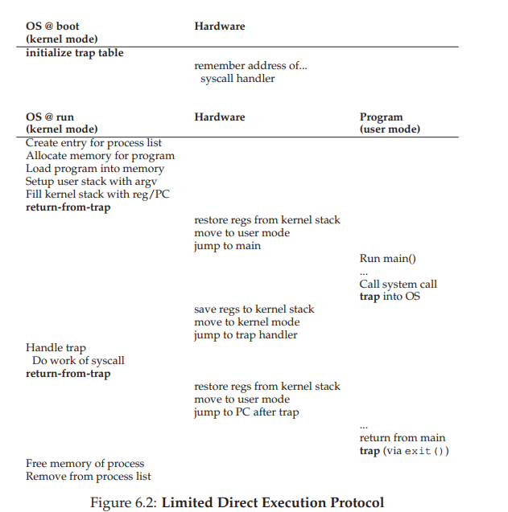


timer interrupt:


context switch(process A to process B):

> Handle trap
> Call switch() routine
> 	save kernel-regs(A) to proc-struct(A)
> 	restore kernel-regs(B) from proc-struct(B)
> switch to kernel-stack(B)
> return-from-trap (into B)


## 3. System call

Examples of system call:

- getpid
- read/write
- sbrk
- mmap: another approach for creating shared memory regions
- shmget(): System call to allocate a shared memory segment
- shmat(): map a shared memory segment to a local address
- fork
- ptrace
- syscall(syscall_no, arg1, arg2, arg3, ...)
- exit

Flow of function call:

> 1. Save current state of regs.
> 2. Move args to regs
> 3. call groundhog
> 4. Set up stack, regs to execute function
> 5. Set regs up for return.
> 6. ret (retq on 64 bit)
> 7. Move return value into ‘result’
> 8. Restore registers


Flow of systemCall:

> 1. Load system call number and arguments into registers
> 2. User process runs syscall instruction(Execute SYSENTER instruction) to trap to kernel
> 3. Switches mode and invokes system call handler
> 4. Lookup system call function in syscall table
> 5. Kernel invokes corresponding function
> 6. Kernel returns by running iret (interrupt return)

How does system call verify parameter:

> 1. A fixed number of arguments can be passed in registers
> 2. Say user passes a buffer pointer, Kernel must copy data from user space into its own buffers. This is done through 2  safe functions to access user pointers: copy_from_user(), copy_to_user()

## 4. process API

execute

fork

exit


## 5. Interrupt

process of interruption happens:

> 1. OS fills in Interrupt Table (at boot time), sets IDTR
> 2. CPU execution loop:
>    1. Fetch instruction at PC
>    2. Decode instruction
>    3. Execute instruction
> 3. Interrupt occurs (signal from hardware)
> 4. CPU changes mode, disables interrupts
> 5. Interrupted PC value is saved
> 6. IDTR + interrupt number is used to set PC to start of interrupt handler
> 7. Execution continues (saves additional state as first step)

# Multi-thread system

Textbook: Ch26, 27, 28, 29, 30, 31, 32.1-32.3, 7, 8, 9

Slide: L3 - L9

A multi-thread system is composed of the following:

- scheduler
- different threads
- ready queue
- wait queue(condition variable)
- lock
- zombie queue

## 1. Thread vs process

Comparing with a process, a thread is much smaller.  A process can contain multiple threads

Each process has an indendent:

- address space: code, heap, multiple stacks for different threads in this process and the stack pointer
- program counter
- OS resources: open file table


While a thread has independent:

- stack and its stack pointer
- program counter
- registers


## 2. Thread API

The standardized C language threads programming API is called **POSIX Thread**. This is just an abstract interface, which is known as pthread. The implementation of this interface includes:

- kernel level thread
  - requires system calls, which makes it less cheaper and faster than user level thread
  - monitored and scheduled by OS
- User level thread:
  - cheap and fast. Users implement user-level threads by themselves
  - not scheduled by OS, which lead to poor decision


### APIs:

- `int pthread_create(pthread_t *p, const pthread_attr_t *x, void* (*fp)(void*), void* args)`: 

  - create a new thread that will run the function pointed by `fp` and its arguments pointed by `args`; 
  - make `p` pointed to this new thread; 
  - x can be initialized through `pthread_attr_init()`, or pass`NULL`; 
  - mark its status as ready and put itself in the ready queue

- `void pthread_exit()`: 

  - clean the threads' stack or allocated memory in zombie queue
  - mark itself as exited and put itself in the zombie queue
  - shift to the first thread in ready queue(not yield)

- `int pthread_yield(int tid)`:

- `void pthread_kill(int tid)`:

- `int pthread_mutex_lock(pthread_mutex_t *mutex)`: add lock to a thread

- `int pthread_mutex_unlock(pthread_mutex_t *mutex)`:  unlock the lock to a thread

- `int pthread_mutex_init(pthread_mutex_t *mutex, void *attr)`: initialize mutex object

- `int pthread_mutex_destroy()`

- `int pthread_cond_wait(pthread_cond_t *cond, pthread_mutex_t *mutex)`: put the threads into condition variable queue to sleep

- `int pthread_join(pthread_t *p, void **value_ptr)`: Put the current thread(the thread that calls `pthread_join`) into a wait queue till the thread `p` returns; if the function run by thread `p` returns a value, then `*value_ptr` can store the address of that return value(usually the address of the return value is in the heap allocated by `malloc`)

- `int pthread_cond_signal(pthread_cond_t *cond)`: wake a sleeping thread waiting on the condition variable.

  


**lifecycle of a thread/process:**


## 3.  scheduler

What is scheduler:

> Schedulers schedule which threads to run according to schedule policy. Schedule policy determines which threads to run next. Good schedulers reduce I/O and wait time. In multi-threaded system, 3 things control the switch of thread: scheduler, lock, condition variable(where wait/signal operation happens)


**Concept:**

- context switch
- dispatch
- CPU burst
- I/O burst
- CPU bound
- I/O bound


**Scheduler**

- **type** of scheduling
  - **Non-preemptive scheduling:** once the CPU has been allocated to a thread, it keeps the CPU until it terminates or blocks
  - **preemptive:** CPU can be taken from a running thread and allocated to another
- **when** to schedule
  - When a thread enters Ready state
    - I/O interrupts (e.g., “I/O operation completed”)
    - Signals (e.g., SIGCONT)
    - Thread creation (or admission in batch systems)
  - When the running thread blocks (or exits)
    - Operating system calls (e.g., start I/O operation)
    - Signals (e.g., SIGSTOP)
  - When the running thread voluntarily yields
  - At fixed intervals
    - Timer interrupts
  
- **scheduling policy**
  - first-come-first-served(FCFS)
  - shortest-job-first(sjf)
  - round robin

### 3.1 How to evaluate scheduling

- fairness: each task can be eventually picked to run and get equal share of CPU(pre-emptive)

- **turn around time:** job completes time minus job arrival time to system

- **response time:** the first time a job scheduled to execute minus job arrival time to system. In reality, 

  it makes a system feel responsive to interactive users (i.e., users sitting and staring at the screen, waiting for a process to finish)  

### 3.2 Scheduling policy

How we program this problem:

> We are given a list of tasks : [A, B, C, ...] and each element has two fields, say `A.arrival` reprsents the arrival time of the task A and `A.service` represents the service time length of task A. Based on the scheduling policy, we want to return an ordered list of task that shows the order of the task that is scheduled. Within the ordered list, we want each task have two extra fields, say `A.scheduled_time` amd `A.endTime`. These 2 fields are 2 lists of same length, which shows at when the task is scheduled and finished running. For non-preemptive scheduling policy, these 2 lists length is 1, while for pre-emptive, the length may be more than 1.

#### 3.2.1 FCFS

- non-preemptive
- At any timestamp a task finishes, choose(pop) the thread at the head of the FIFO queue of ready threads; If at this timestamp, a new task arrives, we select, then put the thread at the tail of rq
- drawback: high average **turn around time**
  - **turn around time:** job completes time minus job arrival time to system
  - **convoy effect**: Suppose job A, B, C arrives in system simultaneously(i.e: $T_{arrival} = 0$) and FCFS scheduler schedules to run job A which takes 100ms, then job B that takes 10 s, then job C takes 10s, then avergage turn around time = (100-0 + 110-0 + 110-0) / 3; a number of relatively-short potential consumers of a resource get queued behind a heavyweight resource consumer  

```python
for each time unit t:
	if queue not empty:
		if new task A arrive at time t:
			add A to the tail of the queue
		if current task curr expires and is not finished at t:
			pop the head of the queue
	else:
		if new task A arrives at time t:
			if no task is running:
				run A
			else:
				put A to the tail of the queue
		else:
			run the current task
```


#### 3.2.2 SJF

- non-preemptive
- Know the length of each job before we run the job, we then select the job with the shortest length at each arrival time(unrealistic, similar to the Belady algorithm in 5.4 in memory management chapter)
- advantage: optimizes turn around time


#### 3.2.4 Round Robin

slide: L9-Scheduling p19~32

- pre-emptive
- advantage: reduce response time
- algorithm:

```pseudocode
for each time unit t:
	if queue not empty:
		if new task A arrive at time t:
			add A to the tail of the queue
		if current task curr expires and is not finished at t:
			add curr to the tail of the queue
			pop the head of the queue
	else:
		if new task A arrives at time t:
			if no task is running:
				run A
			else:
				put A to the tail of the queue
		else:
			run the current task
	
```


#### 3.2.5 multi-level feedback queue(MLFQ)

- Each thread has a priority
- highest priority job is selected from Ready queue
- Can be preemptive or non-preemptive

Single-level implementation:

> Prepare 1 global ready queue
>
> if readyqueue is sorted:
>
> ​	

MLQ:

- Have multiple ready queues, one per priority level. Each task is only in 1 queue
- Processes are permanently assigned to a queue(this will change in feedback queue)
- Top-level scheduler picks queues in priority order
- Each queue can have its own scheduling algorithm

Basic rules:

> Suppose A and B are processes, then:
>
> 1. If Priority(A) > Priority(B), A runs (B does not).
> 2. If Priority(A) = Priority(B),A and B run in round-robin fashion using the time slice (quantum length) of the given queue
>
> 3. If pre-emptive, high priority task could preempt low priority task


MLFQ:

- Rather than giving a fixed priority to each job in MLQ, MLFQ varies the priority of a job based on its observed behavior.

Rules of varying priority

>The allotment is the amount of time a job can spend at a given priority level before the scheduler reduces its priority. For simplicity, at first, we will assume the allotment is equal to a single time slice
>
>3. When a job enters the system, it is placed at the highest priority (the topmost queue)
>4. prority reduction:
>   1.  If a job uses up its allotment while running, its priority is reduced (i.e., it moves down one queue).
>   2. If a job gives up the CPU (for example, by performing an I/O operation) before the allotment is up, it stays at the same priority level (i.e., its allotment is reset).
>5. After some time period S, move all the jobs in the system to the topmost queue


Limit of MLQ:

- **priority inversion:**  a low priority thread holds a lock and is preempted. A high priority thread
  that wants the lock cannot make progress until the low priority thread runs again. In this case, low p thread prevents high p thread from running
  - solution(**Priority inheritance**):  Priority of task holding the mutex (semaphore) inherits the priority of a higher priority task when the higher priority task requests the semaphore.
- starvation

#### 3.2.6 Proportional-Share Scheduling

> Add a num_tickets field to PCB
> At scheduling time:
> Generate a random ticket number winner
> Loop over processes, keep a counter, for each process, we add the num_tickets of the process to the counter
> • If counter > winner then pick that process


### 3.3 Example scheduler

#### 3.3.1 Unix scheduler

> Unix scheduler uses MLFQ and RR,
>
> CALCULATION of priority(based on history):
>
> 


#### 3.3.2 Unix scheduler(2.4)


## 4. synchronization action

synchronization

### 4.1  lock

**Background:** Race condition can happen for multi-thread program. When one thread has not finished manipulating the shared resource, another thread may emit interrupt signal and start to manipulate the shared resource. This causes **race condition**. Thus, we want to implement **mutual exclusion**. The solution to this is lock. This s the basis of `pthread_mutex_lock` and `pthread_mutex_unlock`

**Concept:**

- **race condition:** When multiple concurrent threads manipulate the shared resource without synchronization, outcome depends on the order in which accesses take place. This phenomenon is called race conditions

- **critical section:** The segment of code when a set of threads access the shared variables

- **mutual exclusion:** To implement this, we need:

  - Only one thread at a time can execute in the **critical section**
  - all other theads are forced to wait on **entry**(**entry** and **exit** are illustrated in below screenshot)
  - When a thread leaves the **entry**, another can enter

  

- **lock:** The lock is the data structure to implement mutual exclusion. It contains the status variable to indicate locked or unlocked, may contain owner thread(Thread ID), list of threads to acquire the lock.


**Evaluate of the lock implementation:** To evaluate the implementation of lock, we need to assess whether the lock satisfy the following:

- **Minimal requirement:** does it implement mutual exclusion
- **fairness:(need queue to maintain)**
  - When **CS** is free, does each thread have a fair chance to enter it
  - At the end, are all threads eventually be able to execute CS
- **Performance:** The cost of entering and exiting CS is small


#### 4.1.1 Analysis of lock and bad lock:

1. check mutual exclusion(case 1: suppose context switch does not happen in `lock`):

   1. Suppose for a code snippet as following. Imagine thread A and thread B, first runs the `lock()` using thread A and suppose there is no context switch interruption when running `lock()` in thread A and keep track of the lock variable values

      ```python
      lock()
      ...
      # critical section
      ...
      unlock()
      ```

   2. After keeping track of the lock variables, now suppose thread B is running `lock()` and see if the lock variable values can keep thread B not running out of `lock()`

   3. Turn to thread A, run `unlock()` and keep track of lock variable values again. Switch to thread B and see if the new lock variables can let thread B run out of `lock()` and enter critical section

2. check thread switch for each line of code in `lock()`

   1. after executing the first line in thread A, divide into cases: Suppose the next line is executed in thread A or the next line is executed
   2. For the rest of each line, do as above
   3. Check if there is a case with two threads not escaping the lock or two threads both escaping out from the lock and enter the CS region. If there is, the lock fails. O.W, it succeeds


We use the above flow to analyze the implementation:

>  step 1 is checked

> we then consider the case when context switch happens in lock. The first line is definitely executed by thread A. Suppose context switch happens and thread B starts to execute the first line(comparison) and execute the second line(change the flag). Now thread B escapes out of lock and context switch to thread A. Since flag is set by thread B and it stucks in lock. In this way, we initially want to lock for thread A, but thread B gets the lock. The implementation fails


**Some bad examples of lock implementation:**

- ex1:

```c
typedef struct __lock_t { int flag; } lock_t;

void init(lock_t *mutex) {
mutex->flag = 0; // 0 -> lock is available, 1 -> held
}

void lock(lock_t *mutex) {
while (mutex->flag == 1) // TEST the flag
; // spin-wait (do nothing)
mutex->flag = 1; // now SET it!
}

void unlock(lock_t *mutex) {
mutex->flag = 0;
}
```


  (explanation: suppose thread A and thread B calls lock before manipulate shared variable.  The following order will have both threads entering lock: 

  A executes 6 -> A is going to execute line 8 -> context switch -> B executes line 6 -> B executes line 8 and comes out of the lock ->B executes code in CS -> context switch -> A executes line 8 and comes out of the lock())


#### 4.1.2 good Lock implementation

##### 4.1.2.1 interrupt

```c
lock(){
    disable_interrupts()
}

unlock(){
    enable_interrupts()
}
```


**Evaluation:**

- **mutual exlusive:** It achieves mutual exclusive on uniprocessor sytem since it won't let other threads send interrupt signal. However, it does not achieve mutual exclusive on multi-processor system
- not very cheap and slow
- other(security): 
  - It performs a **privileged** operation(turing interrupt off). The facility is unsafe when it's under abuse and the interrupt is off
  - lead to serious system problems when interrupts are lost for long time.(ex:  CPU may miss a read request due to not being able to receive signal)


##### 4.1.2.2  mannually implement

There are variations of this lock implementation. We give one implementation example

Peterson's algorithm(for only 2 threads):


Peterson's algorithm(for n threads)


##### 4.1.2.3 spin lock

The characteristic of spin lock is that there is a while loop inside the lock function that causes the second thread into an infinite loop to block thread 2 when thread 1 is executing the critical section. For spin lock, we have 4 implementations:

- test-and-set
- compared-and-swap
- loadlinked and StoreConditional(not going to cover)
- fetch-and-add(not going to cover)

**test-and-set:**

The spin lock is based on the first bad lock example we see in 4.1.1. We modify it and add TestAndSet instruction because context switch can happen between checking the unlocked lock and lock it. We have an atomic hardware instruction called test-and-set:

```c
int TestAndSet(int *old_ptr, int new){
    int old = *old_ptr;
    *old_ptr = new;
    return old;
}
```

How we use test-and-set in `lock` :

```c
typedef struct __lock_t {int flag;} lock_t;

void init(lock_t *lock){
    // 0 indicates that lock is available, 1 that is held
    lock->flag = 0;
}

void lock(lock_t *lock){
    while (TestAndSet(&lock -> flag, 1) == 1)
        ; // spin-wait (do nothing)
}

void unlock(lock_t *lock){
    unlock -> flag =0;
}
```


**compare-and-swap:**

atomic hardware instruction  *compare-and-swap*:

```c
int CompareAndSwap(int *ptr, int expected, int new){
    int actual = *ptr;
    if(actual == expected)
        *ptr = new;
    return actual;
}
```

How we use test-and-set in `lock`:

```c
typedef struct __lock_t {int flag;} lock_t;

void init(lock_t *lock){
    // 0 indicates that lock is available, 1 that is held
    lock->flag = 0;
}

void lock(lock_t *lock){
    while (CompareAndSwap(&lock -> flag, 0, 1) == 1)
        ; // spin-wait (do nothing)
}

void unlock(lock_t *lock){
    unlock -> flag =0;
}
```


##### 4.1.2.4 sleep lock

The sleep lock makes the thread yield, which is similar to thread_wait that also puts thread into sleep(change the thread state to blocked and put in block queue). The sleep lock requires the function of `park` and `unpark`:

- `park()`: shifts the thread that calls `park` to another thread
- `setpark()`: It indicates it is about to park
- `unpark(ThreadID)`: shift to thread denoted by ThreadID and wake the thread

One implementation:

```c
typedef struct __lock_t {
    int flag;
    int guard;
    queue_t *q;
} lock_t;

void lock_init(lock_t *m) {
    m -> flag = 0;
    m -> guard = 0;
    queue_init(m->q);
}

void lock(lock_t *m) {
    while(TestAndSet(&m->guard, 1) == 1)
        ;
    if(m->flag == 0){
        m->flag = 1;
        m->guard = 0;
    } else{
        queue_add(m->q, gettid());
        setPark();
        m->guard = 0;
        park();
    }
}

void unlock(lock_t *m) {
    while(TestAndSet(&m->guard, 1) == 1)
        ;
    if(queue_empty(m->q))
        m->flag = 0;
    else
        unpark(queue_remove(m->q));
    m->guard = 0;
}
```


##### 4.1.2.5 Semaphore

Semaphore can be found in 4.3. Semaphore can be used to implement sleep lock by initializing the counter to be 1:

```c
#include <semaphore.h>
typedef struct __lock_t {sem_t m} lock_t;
sem_t m;
sem_init(&m, 0, 1);
// 0 tells al threads to share m; initializes the counter of m to be 1 and cv to be an empty queue
lock_t lock;
lock.m = m;

void lock(lock_t *lock){
    sem_wait(&lock->m);
    // decrement the counter of semaphore s by 1
    // wait in semaphore's wait queue if (s->counter < 0)
}

void unlock(lock_t *lock){
    sem_post(&lock->m);
    // increment the counter of semaphore s by 1
    // if there is one or more thread in wait queue, wake the first thread and the first thread will execute code in CS no matter the m.counter is less than 0(when multiple threads call sem_wait and m.counter becomes a very small negative value)
}
```


### 4.2 condition variable

We want to make sure some threads are executed before certain threads. The solution to this is condition variable. This is the basis of methods: `thread_join`, `thread_exit`, `thread_wait`, `thread_signal`, `thread_broadcast`

what is **condition variable**:

> It's a queue plus a lock that threads put themselves on when some state of execution (i.e some conditions) is not desired. Some other thread, when it changes said state, can then wake one (or more) of those waiting threads and thus allow them to continue (by signaling on the condition)  


**Implementation:**

```c
pthread_mutex_t m = PTHREAD_MUTEX_INITIALIZER; // mutex also has a queue
pthread_cond_t c = PTHREAD_COND_INITIALIZER;  // c is basically a queue
int ready = 0;

// when multiple threads wait for thread A, other threads call this function
void pthread_join(){
    pthread_mutex_lock(&m);
    while(ready == 0)
        pthread_cond_wait(&c, &m);
    
    pthread_mutex_unlock(&m);
}

// when the thread A has terminated, thread A calls this function
void thread_release() {
    pthread_mutex_lock(&m);
    dosomething();
    ready = 1;    
    // dosomething change he condition in pthread_join
    pthread_cond_signal(&c);
    pthread_mutex_unlock(&m);
}

void pthread_cond_wait(pthread_cond_t *c, pthread_mutex_t *m){
    // this makes the thread sleep or wake up from this call when signalled
    // step1: release the lock
    pthread_mutex_unlock(m);
    int shifted = 0;
    getContext(&curr_thread.context);
    // step 2: determine if we execution is to put the thread to sleep or this thread 
    //         is signaled by other and wakes up
    if(shifted == 0){
        // this case means we want to put this thread to sleep      
        shifted = 1;
        // step 3 & 4: put curr_thread in c and shift to an thread in ready_queue 
        // atomically; make the above set of shifted atomical as well; 
        //atomicity can be done by disabling interrupt
    } else{
        // this case means this thread is signaled and wake up
        pthread_mutex_lock(m);
    }
}

void pthread_cond_signal(pthread_cond_t *c){
    // step1: pop one blocked thread from conditional variable `c`
    // step2: change the blocked thread status to ready
    // step 3: put the thread in the ready queue(don't shift the current thread context)
}

void pthread_cond_broadcast(pthread_cond_t *c){
    // step1: pop all blocked thread from conditional variable `c`
    // step2: change all blocked thread status to ready
    // step 3: put all threads in the ready queue(don't shift the current thread context)
}
```


### 4.3 Semaphore

What is Semaphore:

> Semaphore is a data structure that can be used to implement the function of both lock and condition variable. (Actually, the implementation of semaphore is also compose of lock and condition variable). The data structure includes:
>
> - internal property
>
>   - an integer counter variable modified by its 2 atomic operations
>   - a queue of waiting thread
>
> - Atomic operations:
>
>   - `sem_wait`: 
>
>   - `sem_post`: 
>
>     ```c
>     typedef struct sem_t {
>         int counter;
>         Queue cv;
>     }sem_t;
>                                                                                                                                                     
>     sem_t m;
>     sem_init(&m, 0, x);  // 0 tells al threads to share m; initializes the counter of m to be x and cv to be an empty queue
>                                                                                                                                                     
>     int sem_wait(sem_t *s){
>         // decrement the counter of semaphore s by 1
>         // wait if (s->counter < 0)
>     }
>                                                                                                                                                     
>     int sem_post(sem_t *s){
>         // increment the counter of semaphore s by 1
>         // if there is one or more thread in wait queue, wake the first thread
>     }
>     ```
>
>     


**how to use semaphore to implement lock:**

we initialize the counter to be 1:

```c
#include <semaphore.h>
typedef struct __lock_t {sem_t m} lock_t;
sem_t m;
sem_init(&m, 0, 1);
lock_t lock;
lock.m = m;

void lock(lock_t *lock){
    sem_wait(&lock->m);
}

void unlock(lock_t *lock){
    sem_post(&lock->m);
}
```


**how to use semaphore to implement condition variable:**

```c
#include <semaphore.h>
typedef struct __lock_t {sem_t m} lock_t;
int N; // N > 1, which represents Max number of threads that can pass the semaphore
sem_t m;
sem_init(&m, 0, N);
lock_t lock;
lock.m = m;

void lock(lock_t *lock){
    sem_wait(&lock->m);
}

void unlock(lock_t *lock){
    sem_post(&lock->m);
}
```


### 4.4 Bounded buffer problem

#### 4.4.1 use pcond_wait

**broken soln 1(one condition variable and use if check instead of while check to read 1 byte at a time):**

problem: (if there are more than 2 consumers, this fails. Suppose 2 consumers and 1 producer, consider the case consumer1 -> producer -> consumer2 -> consumer1, even the buf is empty, the consumer2 still gets garbage data from buffer and change buffer size, this works when there is only one producer and one consumer)

```c
#define MAX 10
typedef struct buf_s {
	int data[MAX]; /* buffer storage */
	int in_pos; /* producer inserts here */
	int out_pos; /* consumer removes from here */
	int num_elements; /* # items in buffer */
	pthread_mutex_t buflock; /* access to buffer */
	pthread_cond_t one_cond; /* for producers to wait*/
} buf_t;
buf_t buffer;

int producer(buf_t *b, int value){
    pthread_mutex_lock(&b->buflock);
	if(b->num_elements == MAX) {
		/* buffer b is full, wait */
		pthread_cond_wait(&b->one_cond, &b->buflock);
	}
	b->data[b->in_pos] = value;
	b->in_pos = (b->in_pos + 1) % MAX;
	b->num_elements++;
	/* buffer b is not empty, signal consumer */
	pthread_cond_signal(&b->one_cond);
	pthread_mutex_unlock(&b->buflock);
}

int consumer(buf_t * b){
    int val;
	pthread_mutex_lock(&b->buflock);
	if (b->num_elements == 0) {
		/* buffer b is empty, wait */
		pthread_cond_wait(&b->one_cond, &b->buflock);
	}
	val = b->data[b->out_pos];
	b->out_pos = (b->out_pos + 1) % MAX;
	b->num_elements--;
	pthread_cond_signal(&b->one_cond);
	pthread_mutex_unlock(&b->buflock);
	return val;
}
```


**broken soln 1(one condition variable with while loop to read one byte at a time):**

(consumer: if the buf length is more than 1, suppose there are 2 consumers and 1 producer, the sequence is c1 -> c2 -> p -> p-> c1 -> c1 -> c2, then at the end, this will reesult a deadlock that both consumers and producer sleep at the end,  at the 2<sup>nd</sup> p, producer sleeps, then first c1suppose consume all data, wakesup c2, annd sleep at the scond c1, finally c2 goes to sleep; however, this soln still work when there is only 1 consumer and 1 producer because wakeup producer when there is last one awake consumer is guranteed )

```c
#define MAX 10
typedef struct buf_s {
	int data[MAX]; /* buffer storage */
	int in_pos; /* producer inserts here */
	int out_pos; /* consumer removes from here */
	int num_elements; /* # items in buffer */
	pthread_mutex_t buflock; /* access to buffer */
	pthread_cond_t one_cond; /* for producers to wait*/
} buf_t;
buf_t buffer;

int producer(buf_t *b, int value){
    pthread_mutex_lock(&b->buflock);
	while(b->num_elements == MAX) {
		/* buffer b is full, wait */
		pthread_cond_wait(&b->one_cond, &b->buflock);
	}
	b->data[b->in_pos] = value;
	b->in_pos = (b->in_pos + 1) % MAX;
	b->num_elements++;
	/* buffer b is not empty, signal consumer */
	pthread_cond_signal(&b->one_cond);
	pthread_mutex_unlock(&b->buflock);
}

int consumer(buf_t * b){
    int val;
	pthread_mutex_lock(&b->buflock);
	while (b->num_elements == 0) {
		/* buffer b is empty, wait */
		pthread_cond_wait(&b->one_cond, &b->buflock);
	}
	val = b->data[b->out_pos];
	b->out_pos = (b->out_pos + 1) % MAX;
	b->num_elements--;
	pthread_cond_signal(&b->one_cond);
	pthread_mutex_unlock(&b->buflock);
	return val;
}
```

Final soln:

```c
#define MAX 10
typedef struct buf_s {
	int data[MAX]; /* buffer storage */
	int in_pos; /* producer inserts here */
	int out_pos; /* consumer removes from here */
	int num_elements; /* # items in buffer */
	pthread_mutex_t buflock; /* access to buffer */
	pthread_cond_t not_full; /* for producers to wait*/
    pthread_cond_t not_empty;
} buf_t;
buf_t buffer;

int producer(buf_t *b, int value){
    pthread_mutex_lock(&b->buflock);
	while(b->num_elements == MAX) {
		/* buffer b is full, wait */
		pthread_cond_wait(&b->not_full, &b->buflock);
	}
	b->data[b->in_pos] = value;
	b->in_pos = (b->in_pos + 1) % MAX;
	b->num_elements++;
	/* buffer b is not empty, signal consumer */
	pthread_cond_signal(&b->not_empty);
	pthread_mutex_unlock(&b->buflock);
}

int consumer(buf_t * b){
    int val;
	pthread_mutex_lock(&b->buflock);
	while (b->num_elements == 0) {
		/* buffer b is empty, wait */
		pthread_cond_wait(&b->not_empty, &b->buflock);
	}
	val = b->data[b->out_pos];
	b->out_pos = (b->out_pos + 1) % MAX;
	b->num_elements--;
	pthread_cond_signal(&b->not_full);
	pthread_mutex_unlock(&b->buflock);
	return val;
}
```


#### 4.4.2 Use semaphore

**Soln 1:(no binary semaphore as lock)**

(problem: there is no mutual exclusion, can only work if the buffer length is 1 with 1 or more producer and consumer)

```c
#define N 1
Sem empty = sem_init(0);
Sem full = sem_init(N);
int buffer[MAX];

void producer(){
    sem_wait(full);
    add_to_buffer(buffer);
    sem_signal(empty);
}

void consumer(){
    sem_wait(empty);
    remove_from_buffer(buffer);
    sem_signal(full);
}

```


Soln 2: (add deadlock)

(problem: the mutex is acquired before sem_wait for full or empty, in this case, if the buffer is empty, consumer first acquires lock and waits for producer to sem_post on empty, producer cannot acquire lock from consumer)

```c
#define N 10
Sem empty = sem_init(0);
Sem full = sem_init(N);
Sem mutex = sem_init(1);
int buffer[MAX];

void producer(){
    sem_wait(mutex);
    sem_wait(full);
    add_to_buffer(buffer);
    sem_signal(empty);
    sem_post(mutex);
}

void consumer(){
    sem_wait(mutex);
    sem_wait(empty);
    remove_from_buffer(buffer);
    sem_signal(full);
    sem_post(mutex);
}
```


Soln3(working soln):

```c
#define N 10
Sem empty = sem_init(0);
Sem full = sem_init(N);
Sem mutex = sem_init(1);
int buffer[MAX];

void producer(){
    sem_wait(full);
    sem_wait(mutex);
    add_to_buffer(buffer);
    sem_post(mutex);
    sem_signal(empty);
}

void consumer(){
    sem_wait(empty);
    sem_wait(mutex);
    remove_from_buffer(buffer);
    sem_post(mutex);
    sem_signal(full);
}
```


## 5. Concurrency problem

### 5.1 All threads go to sleep

### 5.2 atomicity violation

What is atomicity violation:

> The formal defn is the desired serializability among multiple memory accesses is violated. (i.e: a code region is intended to be atomic, but the atomicity is not enforced during execution). The solution to this is often add lock to wrap the critical region.

Serializability:

> Guarantees outcome of concurrent operations will be equivalent to some sequential execution of the same operations


### 5.3 order violation bugs

What is order violation:

> The desired order between two (groups of) memory accesses is flipped (i.e., A should always be executed before B, but the order is not enforced during execution) . The solution to this is often deadlock


### 5.4 deadlock


**Finding deadlock in the code:**

- **deadlock example1:**

  first executes consumer in thread A, then executes producer in thread B leads to deadlock

  (Notes: even only one lock can lead to deadlock)

```c
sem_t empty;
sem_t full;
sem_t mutex;

sem_init(&empty, 0, MAX); // MAX buffers are empty to begin with...
sem_init(&full, 0, 0); // ... and 0 are full
sem_init(&mutex, 0, 1);

void *producer(void *arg){
    sem_wait(&mutex);
    sem_wait(&empty);
    put(i);  //write to buffer
    sem_post(&full);
    sem_post(&mutex);
}

void *consumer(void *arg){
    sem_wait(&mutex);
    sem_wait(&full);
    int tmp = get();
    sem_post(&empty);
    sem_post(&mutex);
}
```


- **deadlock example 2:**

```c
void do_something(mutex_t *m1, mutex_t * m2){
    lock(m1);
      ...
    lock(m2);
}
// thread A: do_something(l1, l2);

// thread B: do_something(l2, l1)
```


**How to prevent deadlock:**

> Since the condition for deadlock to happen is due to:
>
> - **circular wait:** a closed chain of processes exists  such that each process holds at least one
>   resource needed by the next process in the chain
> - **hold-and-wait:** A process may hold allocated resources while awaiting assignment of others
> - **no-preemption:** No resource can be forcibly removed from a process
> - **mutual exclusion:** Only one process may use a resource at a time
>
> If we can break any of these conditions, we can avoid deadlock

- **breaking circular wait:**
  - total ordering: To break circular wait, suppose there are multiple locks in the system, we can strictly order the sequence of the each lock being locked by each thread. 
  - partial ordering:
  
- **breakin hold-and-wait:**
  1. we acquire all locks atomically at very start before other threads compete the lock
  
  - ex: Suppose we have locks `L1` and `L2` in the system, we can have a global lock `prevention` to ensure all locks are held atomically as below. In this way, when other threads try to hold `L1` and `L2` in different order, it will locked out by `prevention`
  
  2. Use `trylock()` to acquire the second lock instead of calling `lock()`
  
     trylock implementation:
  
     ```c
     int trylock(L){
         //grab the lock (if it is available) or return -1 indicating that the
     	//lock is held right now
     }
     
     top:
     	lock(L1);
     	if(trylock(L2) == -1){
             unlock(L1);
             goto top;
         }
     ```
  
     
  
- **breaking no-preemption:**

  Not feasible

- **breaking mutual exclusion:**

  Use CAS to replace lock


## 6. Summary problem

- look at the code without using lock that leads to race condition & think of different situations from the race condition
- Determine if the lock achieves the goal
  - give u a lock that fails
  - give u a lock that succeeds

# Memory Management

https://student.cs.uwaterloo.ca/~cs350/F06/slides/cs350_E

## 1.  Overview: 

**Virtual address(VA), Physical address(PA) vs PTE:**

- VA: it's the address of the variables inside the program, not the real address in hardware
  - Converting to binary string, the leftmost few bits are VPN and the rightmost few bits are offset
  - Converting to a decimal number say a, VA = a represents the a<sup>th</sup> byte in the memory
- PA: it's real address of variables in hardware
  - Convering to binary string, the leftmost few bits are PFN and the rightmost few bits are offset
- PTE: the entry in the page table. It contains the PFN. The OS uses VPN to index the position of PTE in the table and translate the VPN to PFN using the PFN at the PTE


**Basic information of memory system:**

- the number of bits in the address space
- the size of the page
- the size of PTE


**address binding:**

> Binding (or connecting) variable names to physical locations


When are addresses bounded:

| Compile time                        | Load time                                 | Execution                                 |
| ----------------------------------- | ----------------------------------------- | ----------------------------------------- |
| - Relocation impossible             | cannot relocate after loading into memory | can                                       |
| - Cannot run more than one instance | can                                       | can                                       |
|                                     |                                           | require relocation register(base & limit) |

partition

- fixed: Divide memory into regions with fixed boundaries(can be equal or unequal)
- dynamic: Partitions vary in length and number over time

|                        | dynamic                          | fixed                                   |
| ---------------------- | -------------------------------- | --------------------------------------- |
| internal fragmentation | no                               | yes                                     |
| external fragmentation | yes(require relocatable process) | no                                      |
|                        |                                  | number of partition determine processes |


**What can be infered from basic info:**

Given:

- the 32-bit address space   (1)
- page size: 4096 bytes         (2)
- PTE size: 4 bytes                  (3)

We know:

- (1): 
  - the virtual address space is 32 bits, thus, (# of bits in virtual address) = 32
  - the size of the RAM = 2<sup>32</sup> bytes = 4 GB
  - number of virtual pages = 2<sup>32</sup> / 4096 = 2<sup>20</sup>, thus, VPN bits number is 20. The VPN can be used as linear or multi-level tables

- (2):
  - the offset bits $$log_2(4096) = 12$$
- (3):
  - the number of bits in each PTE: 4 * 8 = 32 bits
  - number of PTEs in a single page(important to determine the levels in multi-level table): 4096 bytes / 4 bytes = 1024, thus, number of bits in each level is 10


## 2. Complete memory access flow

**memory access flow:**

- simple page table:

```pseudocode
VPN = (VirtualAddress & VPN_MASK) >> SHIFT
(Success, TlbEntry) = TLB_Lookup(VPN)
if (Success == True) // TLB Hit
	if (CanAccess(TlbEntry.ProtectBits) == True)
		Offset = VirtualAddress & OFFSET_MASK
		PhysAddr = (TlbEntry.PFN << SHIFT) | Offset
		Register = AccessMemory(PhysAddr)
	else
		RaiseException(PROTECTION_FAULT)
else // TLB Miss
	PTEAddr = PTBR + (VPN * sizeof(PTE))
	PTE = AccessMemory(PTEAddr)
	if (PTE.Valid == False)
		RaiseException(SEGMENTATION_FAULT)
	else
		if (CanAccess(PTE.ProtectBits) == False)
			RaiseException(PROTECTION_FAULT)
		else if (PTE.Present == True)
		// assuming hardware-managed TLB
			TLB_Insert(VPN, PTE.PFN, PTE.ProtectBits)
			RetryInstruction()
		// if we adopt software-managed TLB, the line would be following:
		// RaiseException(TLB_MISS)
		else if (PTE.Present == False)
			RaiseException(PAGE_FAULT)
```

- double page table:

```pseudocode
  VPN = (VirtualAddress & VPN_MASK) >> SHIFT
  (Success, TlbEntry) = TLB_Lookup(VPN)
  if (Success == True) // TLB Hit
  	if (CanAccess(TlbEntry.ProtectBits) == True)
  		Offset = VirtualAddress & OFFSET_MASK
  		PhysAddr = (TlbEntry.PFN << SHIFT) | Offset
  		Register = AccessMemory(PhysAddr)
  	else
  		RaiseException(PROTECTION_FAULT)
  else // TLB Miss
  	// before diving into page table
  	//look at the list of VMAs in the addressSpace
  	//for each VMA in addressSpace:
  	//	if VirtualAddress in VMA:
  	//		allocate memory for that VirualAdress
  	// Go to Page table: first, get page directory entry
  	PDIndex = (VPN & PD_MASK) >> PD_SHIFT
  	PDEAddr = PDBR + (PDIndex * sizeof(PDE))
  	PDE = AccessMemory(PDEAddr)
  	if (PDE.Valid == False)
  		RaiseException(SEGMENTATION_FAULT)
  	else
  	// PDE is valid: now fetch PTE from page table
  		PTIndex = (VPN & PT_MASK) >> PT_SHIFT
  		PTEAddr = (PDE.PFN << SHIFT) + (PTIndex * sizeof(PTE))
  		PTE = AccessMemory(PTEAddr)
  		if (PTE.Valid == False)
  			RaiseException(SEGMENTATION_FAULT)
  		else if (CanAccess(PTE.ProtectBits) == False)
  			RaiseException(PROTECTION_FAULT)
  		else
  			TLB_Insert(VPN, PTE.PFN, PTE.ProtectBits)
  			RetryInstruction()
```


**Page fault control flow:**

```pseudocode
PFN = FindFreePhysicalPage()
if (PFN == -1) // no free page found
	PFN = EvictPage() // run replacement algorithm
DiskRead(PTE.DiskAddr, pfn) // sleep (waiting for I/O)
PTE.present = True // update page table with present
PTE.PFN = PFN // bit and translation (PFN)
RetryInstruction() // retry instruction
```

1. check if the virtual address is valid in VMAs
2. Check TLB for minor page fault


**process of page eviction:**

```pseudocode
if PFN.dirty = 1:
	// writing the dirty bit to the disk is called cleaning step
	// the cleaning step may be performed at other times
	// or it can be performed when evicting this page as shown in the pseudocode
	DiskWrite(PTE.DiskAddrm PFN)
PFN.Valid = False
```


**when does page eviction happens(page buffering):**

1. The OS has some kind of value called **high watermark(HW)** and **low watermark(LW)** and keeps a list of free pages
2. periodically, when OS notices there are fewer than LW free pages, the background thread, called **page daemon**, evicts pages till there are HW free pages
3. On page fault, grab a frame from the free list


**Page fault:**

> OS tries to access pages that are not in physical memory but are written to the disk


**TLB**

> Caches for quick mapping from virual page # to physical page # in each process. There are hardware-loaded TLB and software-loaded TLB


**TLB miss** or **TLB fault**

## 3 Paging vs Partition

If the OS uses paging to manage memory, then the memory is composed of multiple pages(usually 4096 bytes).  For each process, some pages will be allocated for that process. Among these pages, OS will allocate some for page tables for address translation for each process.  Paging uses TLB to accelerate performance. With paging, we can write pages to disk through page placement policy. Compared with partition, paging is the solution for the modern operating system.

Important topics within each paging include:

- different implementations of page tables:
  - Simple linear page table
  - dynamically extend page table
  - page table per segment
  - multi-level page table
  - hashed page tables
  - Inverted page tables

- TLB
- page placement policies.


**Fragmentation problem:**

- **internal fragmentation**: The allocated continuous memory area for a process is way larger than the amount of area the process really needs. This causes waste of memory area
- **external fragmentation**: The continuous memory areas in the memory are quite small because the memory areas for other processes scatter. This leads to the consequence that when we try to allocate memory for a new process, there is no continuous memory area that is large enough for that new process.


Partition solution suffers really from either internal or external fragmentation, but paging solution reduces those problems(not entirely eliminate). Because paging allows process to have memory area that does not have to be continuous. 


Paging arranges memory into small units smaller than partition. Paging solution has two components: Page size and page table. The implementation of paging varies according to the difference of page tables.

The following will focus on implementations of paging

### 3.1 implementations of page table

The implementations of page tables include:

- Simple linear page table
- dynamically extend page table
- page table per segment
- multi-level page table
- hashed page tables
- Inverted page tables

Page tables contain important information in its special bits, such as valid bits, present bits, dirty bits and so on. The implementations of page tables vary in its **PFN** bits.

After knowing the individual implementation, we also need to understand:

- How does the OS locate page table in memory
- how to do address translation through page table(reason for needing page table)


**How does OS find page table**

- Simple linear page:
  1. The OS stores the physical address of the starting location of the paging table in **page-table base register**
  2. Then the OS calculates number of page tables in memory by pulling out the left few bits of **FullVirtualAddress** (i.e: NumberOfPTE = (FullVirtualAddress & VPN_MASK) >> SHIFT)
  3. The OS calculates the end address of page table(i.e: EndAddress = PageTableBaseRegister + (NumberOfPTE * sizeof(PTE)))


**how to do address translation through page table**


- Simple linear page:
  1. Split the virtual address binary into 2 parts: the leftmost few bits are the virtual page number(**VPN**), the rightmost few bits are the offset bits
  2. Convert the leftmost few bits into number and index on paging table to find the physical frame number(**PFN**) in the paging table entries
  3. Replace the **VPN** binary string with the **PFN** binary string in the virtual address to get physical address


#### 3.1.1 Simple linear page

Suppose the memory is a 32-bit address space(the size of space would be 2<sup>32</sup> bytes = 4 GB and the length of physical address is 32 bits for each i<sup>th</sup> byte) and the size of each page is 4kB(2<sup>12</sup> bytes = 4096 bytes),


Then the OS allocates some memory for the simple linear page table in that process and the simple linear page table will be an array of entries with each entry 4 bytes(32 bits):

- The leftmost 20 bits are for PFN. (because there are 2<sup>32</sup> / 2 <sup>12</sup> = 2<sup>20</sup> pages). If the **VPN** is i in decimal digits, then the PFN for the VPN is the i<sup>th</sup> entry is page table. The address of the page is at the (PFN >> 12)<sup>th</sup> byte. Also, the leftmost 20 bits determine the length of page tables, where the length is 2<sup>20</sup> bytes. If the page size is larger, then the number of bits for PFN is smaller and page table size dereases
- 1 bit for validity: whether the VPN of this page still matches its PFN
- 1 bit for modify(also called dirty bit): whether the page has been modified after it was brought into the memory. The dirty bit is set to 1 when change happens. The dirty bit is set to 0when the [processor](https://en.wikipedia.org/wiki/Central_processing_unit) writes to (modifies) this memory. It is used to indicate a page has been modified but its change has not been written to swap file.
- 3 bits for protection: whether the page could be read from, written to and execute
- 1 bit for presence: whether the page is in physical memory or on the disk
- 1 bit for reference: whether access to the page occurs. set to 1 when a read or write to the page occurs.


**Drawback of simple linear page table:**

- Since each process keeps a page table for all of the pages in the memory, however, a process may not need all of the pages in memory and cause some entries in linear page tables to be invalid, thus waste space. A linear table occupies 2<sup>20</sup> * 4 bytes = 4MB. If 100 processes in OS, 400MB for the page tables


#### 3.1.2 page table per segment

> What is a segment:
>
> A segment is a continuous chunk of memory where most of the variables lie in

Suppose the address space is a 32-bit virtual address space and the page size is 4KB:

- Instead of allocating a single page for the entire address space, we allocate one page table for each used segment by the process

- the virtual address will allocate some bits for the segment number, VPN and offset(In the screenshot below, the process has 4 segments)

  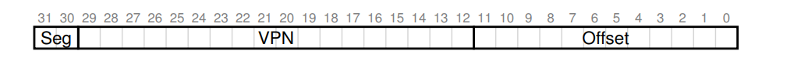

- For each segment, we assign a pair of base register and limit register. The base register will store the start address of the page table of each segment instead of the start address of the segment. The limit will store the number of entries in the page table from the start entry to the last entry

- When the program gets the virtual address and wants to do address translation, this is the procedure:

  ```pseudocode
  SN = (VirtualAddress & SEG_MASK) >> SN_SHIFT
  VPN = (VirtualAddress & VPN_MASK) >> VPN_SHIFT
  PhysicalAddress = Base[SN] + (VPN * sizeof(PTE))
  ```


**Drawback of this method:**

- There is fewer  page table waste than linear page table. However, there are still page table waste when each segment is very large and sparsely used
- External fragmentation for page tables. Since each page table can grow, finding free space for them is complicated


#### 3.1.3 multi-level page table

**structure of multi-level page table & virtual address:**

virtual address:

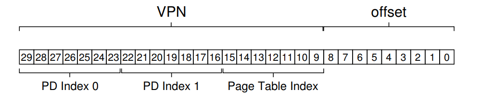

- The virtual address with multi-level page table is composed of VPN and offset bits. The VPN is composed of PD Index0, PD index1, PD Index2(Page Table Index in above screenshot), .... PD IndexN, if the number of levels is N + 1. The page table for the above virtual address is 3-level

pagetable:

- The OS will store one page table for PD Index 0 level. The number of entries in the table = 2 to the power of (number of bits in PD Index 0). Each entry in this table points to the physical address of page tables in PD Index 1 level. After we computes the decimal value in PD Index 0, we use the value to index in level-0 page table to find the physical address of level-1 page table
- The entries of level-i page table point to the physical address of level-(i+1) page table. Thus, after we computes the value at PD Index i, we use the value to index the physical address of level-(i+1) table in level-i table
- The entries of level-N page table points to the physical address of the page where the data lies in. After we computes the value at PD Index N, we use the value to index the physical page addrss of the data in level-N table
-  Suppose the number of bits for each PD Index i is n and all level page tables are full, then from PD Index 0 to N, we have 1 level-0 table, 2<sup>n</sup> level-1 tables, 2<sup>n</sup> * 2<sup>n</sup> = 2<sup>2n</sup> level-2 tables, ..., 2<sup>in</sup> level-i tables, ... 2<sup>Nn</sup> level-N tables. Thus, the number of level-N tables = number of entries in linear page table. The total  number of level-0 to level-(N-1) tables = 2<sup>Nn</sup> - 1. Both assume all level tables are full
- Due to the above complexity, we store 1 bit beside each PTE as the valid bit in level-0 tables to level-(N-1) tables. This bit indicates if the next level table pointed by the PTE contains a valid PTE that also points  to a valid next level table, until it points to a valid real data address. We initialize all of the valid bits as 0. When we allocate page for the process, we set the valid bits of the PTE to this page in level-N table as 1. We also set the valid bits of the PTE to this level-N table from level-0 table to level-(N-1) table as 1
- The multi-level page table saves more space than linear table when there are many pages are not used.  When many pages are not used, there are many empty invalid PTE in linear table and they waste space. However, we only allocate intermediate tables and the page tables when their valid bits are on. The total entries of these allocated tables are far more less than the whole linear table, since the size of each level table is far smaller than the linear table


**process of virtual address translation:**

Given:

- we have an N-level page table
- level ranges from 0 to N-1level and the i<sup>th</sup> level has k~i~ bits
- page size be 2<sup>M</sup> bytes
- a virtual address string with length $k_0 + k_1 + k_2 +... k_i + k_{N-1} + M$ bits

> 1. we first get the page table address from the page table register and get the level 0 mapping
> 2. We translate the first $k_0$ bits to decimal number $p_0$, we look at the $p_0$ position in level 0 table to find the physical address $PA_1$of level 1 page table. Now set i = 1
> 3. we pull out the level i mapping. We translation $k_i$ bits to decimal number $p_i$, we look at  the p~i~ position in level i table to find the physical address $PA_{i+1}$ of level (i+1) page table. We increment i and repeat step 3 till i = N-1 and the $PA_N$ is the physical frame number
> 4. We concatenate $PA_N$ and offset bits 


**how many levels should there be in multi-level page table:**

Given:

-  the address space is 32 bits, 
- the page size is 4KB(4096 bytes)
- 32 bits architecture

The steps to determine the number of levels and the bits for each level:

1. 32 bits architecture implies pte size is 32 bits(4 bytes) for each pte, 64 bits imply pte size is 8 bytes
2. We first determine the offset bits: $$log_2(4096) = 12$$ Thus, we allocate the rightmost 12 bits for offset and there are 32 - 12 = 20 bits for VPN, where the length of virtual address is 32 bits
3. We determine how many PTEs can be in a page: 
   - 4096 / 4 = 1024 
   -  $$log_2(1024) = 10$$. 
   - 20 // 10 = 2 thus, 2 levels
   - 20 % 10 = 0 (if the remainder great than 0, then the number of bits for PD Index 0 is the remainder; otherwise, it's log of the # of PTEs in a page)

#### 3.1.4 Hashed page tables

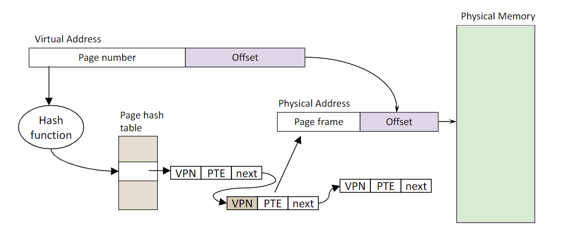

**structure of page table & virtual address:**


#### 3.1.5 Inverted page tables

**structure of page table & virtual address:**

- Keep one table for all processes instead of table for each process
- A hash table with the physical frame number as the key and list of tuples are the value. The tuple is composed of virtual number and process id of each process that uses this physical frame


## 4.  TLB

**TLB(Translation lookaside buffer):**

> TLB is a quick cache that records the mapping from VPN to PFN for each process. TLB is not shared among processes. The OS first search TLB for translation before accessing page table. A TLB entry looks like:
>
> VPN | PFN |valid bits | protection bits（read bits/write bits/execution bits) | other bits

TLB type:

-  software-loaded TLB(table must be in hardware-defined format) 
  - operations:
    - fault to OS, OS finds appropriate OTE, load in TLB
    - add entry
    - read entry
    - invalidate entry
    - invalidate all entries
- hardware-loaded TLB(table can be in any format)


**Spatial locality:**

> Suppose the program is accessing an array and all elements of the array live in the same page, then after the first TLB miss when accessing the first element, other elements are hit in TLB. Because the elements are packed tighly into pages(i.e: variables are close to one another in space). This is called spatial locality. Spatial locality refers to the use of data elements within relatively close storage locations


**Temporal locality:**

> After the program accesses an array, it re-accesses the same array and these accesses increase he hit rate of TLB in program(i.e: quick re-referencing memory items in time). This is called temporal locality.
>
> Temporal locality refers to the reuse of specific data and/or resources within a relatively small time duration


Management of TLB:

- When changing the bits of PTE(such as protection bits), we need to update the corresponding entry bits in TLB as well
- Reload TLB during process context switch
- TLB miss(TLB replacement policy)


page fault:

1. When it evicts a page, the OS sets the PTE as invalid and stores the location of the
   page in the swap file in the PTE
2.  When a process accesses the page, the invalid PTE will cause a trap (page fault)
3.  The trap will run the OS page fault handler
4.  Handler uses the invalid PTE to locate page in swap file
5.  Reads page into a physical frame, updates PTE to point to it
6.  Resume process

## 5. page movement policy

**sFetch Policy: when to fetch a page**

+ Demand Paging
+ Prepaging

**Placement Policy: where to put the page**

+ NUMA (non-uniform memory access) 
+ Cache performance

page replacement policy: what pages to evict


**page eviction：**

> This just means delete a page from the memory, may not need to write to the disk


**common problem of page replacement:**

- **thrashing:**  more time is spent by OS in paging data back and forth from disk than executing user programs
  - solution1: swap all pages of a process into disk and suspend it
  - soln2: buy more memory

Operation of page movement algorithm:

> - access: lookup and access the page in memory
>
> - insert: add the page to the memory frame when there is empty frame
>
> - replace: evict the page frame and insert the page to the evicted frame mapping when no memory frame is available

### 5.1 FIFO

- Maintain a list of pages in order in which they were paged in

- operation:

  - insert: add to the head of queue
  - replace: remove the page at the tail of the queue and insert the new page to the head of the queue

  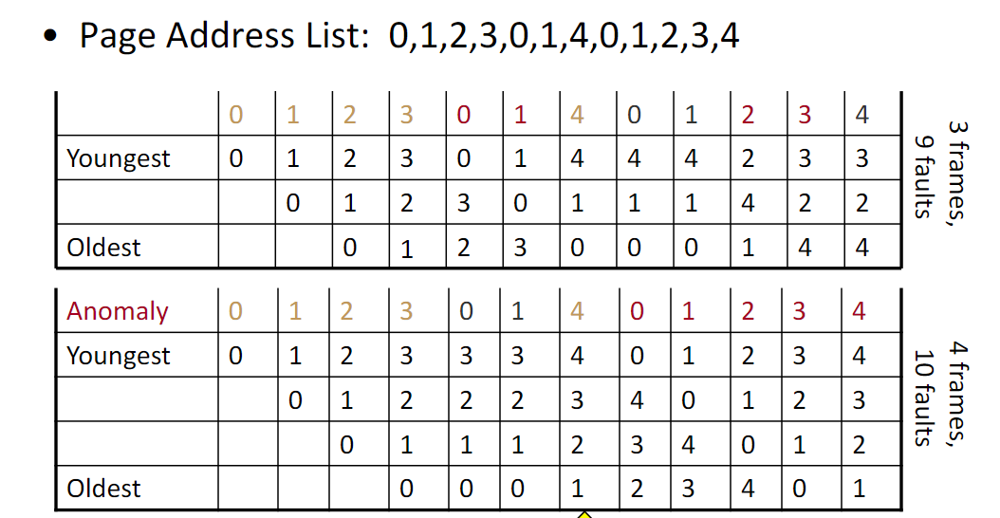

### 5.2 exact LRU:  

- use a doubly linked list to keep pages. We change the data structure in following:

  - when we insert: add page to the top
  - when we access a certain page: we traverse the linked list, find the page and move to the top
  - when we replace and the list is full: we evict remove the page at the bottom and then insert at the head
  


### 5.3 Additional Reference bit

Data structure: Initially, allocate R reference bits to each page. All of the R bits of each page are initially set to 0. We change the data structure at when:

- insert: When we insert the page, we find the page and set only the leftmost bit to 1.
- access: When we access the the page, we find the page and set only the leftmost bit to 1.
- periodically: at regular interval, treat the R reference bits as a binary string and right shift this binary string one bit to the right, for example, if reference bits is 1000, then it becomes 0100; if it's 0110, then it's 0011
- replace: for each page, decode its reference bits as a decimal digit and choose the page that has the smallest decimal digit to evict, and then replace with the new page, initialize the R reference bits all to 0, set the leftmost reference bits of the new page 1


### 5.4 Second chance algorithm(clock algorithm): 

**pseudo:**

> 1. Arrange the physical frame in a circular list like a clock and let the clock pointer points to the first frame
> 2. A new process is created and needs to be written to the frame
> 3. If the frame pointed by the clock pointer has not been occupied by a process:
>    1. if the process appears in the circular list, then do nothing
>    2. else:
>       1. store the new process in the frame pointer by the clock pointer
>       2. set the reference bit of the frame pointed by clock pointer to 1
>       3. increment clock pointer to point to the next frame
> 4. else:
>    1. if the process appears in the circular list 
>       1. if its reference bit is 1, then do nothing
>       2. else: set the process's frame reference bit to be 1(do not increment clock this time)
>    2. else: 
>       1. if the reference bit of the frame is 1:
>          1. set the reference bit to 0
>          2. increment the clock pointer to point to next frame
>          3. goto the step 2 in else block labeled in step 2
>       2. else:
>          1. evict the old process in the frame and write the new process to this frame
>          2. set the reference bit in the frame to 1
>          3. increment the clock pointer to point to next frame
> 5. A new process is created and re-execute step 2

**example:**


> We first create a circular list from the frame according to step 1: 0 -> 1 -> 2 -> 3 -> 0 and let clock points to frame 0
>
> AFC: Since frame 0 is empty and process AFC is not in the list, we put in frame 0 and increment clock to 1
>
> 008: same as above
>
> BC0: same as above
>
> AFC: Since frame 3 is empty and AFC is in the list, we do nothing
>
> 110: Since frame 3 is empty and 110 is not in list, we put in frame 3 and increment clock back to 0
>
> 008: Since frame 0 is not empty and 008 is in list and 008 reference bit is 1, do nothing
>
> AEE: Since frame 0 is not empty and AEE is not in list and ref bit in frame 0 is 1, we set ref bit off and increment clock till back to frame 0. Then we evict AFC, set ref bit on in frame 0 and increment clock to frame 1
>
> AFC: Since frame 1 not empty, AFC not in list and ref bit in frame 1is 0, we evict 008 at frame 1, set ref bit in frame 1 to 1 and increment clock to frame 2
>
> BC0: Since frame 2 not empty and BC0 in list and ref bit of BC0 is 0, we set its ref bit to 1
>
> 008: Since frame 2 not empty, 008 not in list and ref bit in frame 2 is 1, we set ref bit off and increment clock to frame 3. Thn we evict 110, set ref bit on in frame 3 and increment clock to frame 0


### 5.5 Belady's algorithm:

The algorithm assumes we know what pages will come out at any time in the future instead of having to wait till that moment the page comes out. For example, before any pages are loaded to the memory, we know beforehand the page sequence order is: `l` = [2, 3, 2, 1, 5, 2 , 4, 5, 3, 2, 5, 2].

To use Belady's algorithm, we need to be given the page sequence  `l` and total number of frames(say 3), after the frames are all filled with memory at `i`(say `i` > 3) and we want to evict a page in the frames and replace that page with `l[i]`, we:

1. Among all pages in the frame, check if there is a page that does not appear after `l[i]`. If so, we evict this page and replace with `l[i]`. If not, we proceed
2. For all the pages in the frame, we check their next presence after `l[i]`. We select the page with the largest index after `i` 

> Explanation:
>
> Suppose the frame is filled with 2, 3, 1 and the next page is 5(`i ` = 4):
>
> `i = 4`: the frame is 2, 3, 1. Since there is no presence of 1 after `l[4]` in the list of `l`, we evict page 1. The frame is now: 2, 3, 5
>
> `i = 5`: No need to evict, since `l[5] ` is 2 and it's in the frame
>
> `i = 6`: The frame is now: 2, 3, 5. Since the next presence of 2 is at l[9], the next presence of 3 is at l[8], the next presence of 5 is at l[7]. The index of 2(which is 9) is the largest, we evict page 2. Thus, the frame is: 4, 3, 5
>
> .......

### 5.6 Simple 2Q

We have 2 queues to store all pages: one called is A1 and the other is called Am. A page is in ether of the 2 queues. We change the data structure when:

- access/insert a page called p:

  > if p in Am queue:
  >
  > ​	move p to the top of Am
  >
  > elif p in A1 queue:
  >
  > ​	remove p from A1
  >
  > ​	put p at the top of Am
  >
  > else: # p is a new page and we insert p(not access)
  >
  > ​	put p at the top of A1

- Replace a page:

  > if A1’s size is above its threshold
  >
  > ​	evict oldest page from A1 (first-in)
  >
  > ​	put p in the freed frame
  >
  > else:
  >
  > ​	delete LRU page from Am
  >
  > ​	put p in the freed frame

### 5.8 LFU

### 5.9 MFU

### 5.10 Page Buffering


## 7. VMA

- what is VMA
- how is VMA managed


**What is VMA:**

> VMA is a virtually contiguous chunk of memory. It is different from segment in that the virtual address inside VMA is continuous, but the physical address of the pages inside the VMA may not be continous. The reason for virtually continuous is to allocate new area easily. The VMA for each process could be the code area, data area, stack area.


**how is VMA managed:**

- **creation:** 

  - For each process, some VMAs are initialized through `exec()` as stack, code space, data space
  - additional VMAs are created through `malloc()`, `mmap()`, `sbrk()`. Process of creation of VMA: ...

- **How is it being tracked:** As the screenshot below, task struct represents each process information. The mm struct represents memory management of each process. The vm_area struct represents each single VMA

  

## 8. how much memory to allocate for each process


+ Fixed space algorithm(Local replacement): Each process is given a fixed limit of pages to use
+ Variable space algorithm(Global replacement):  Process's set of frames can grow and shrink dynamically

## 9.  Working set model

**Defn:**

- WS(t, $$\Delta$$) = set of pages that are referenced in the time interval (t - $$\Delta$$, t]

- t = time, $$\Delta$$ = number of page references

**Ex:**

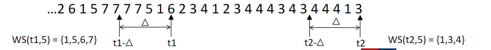

## 10.  Sharing

What sharing refers:

> shared memory to allow processes to share data using direct memory references


how to implement:

- Have PTEs in both tables map to same physical frame, **same** or different virtual page number in each process's address space map to the same physical frame number
  - different:  flexible(no address space conflicts), but pointers inside the shared memory segment are invalid if the pointer references an address outside the segment(if we decode a virtual address stored in the shared mmory segment, it will map to different physical frame number to each process and the dereference this pointer will give different results)
  - same: less flexible, but the pointers are valid
- Each PTE can have different protection values
- Must update both PTEs when page becomes invalid

## 11. copy on write

**Background(When do we need CoW)：**

> OS spends time in copying data. Two common occasions: One is copy happens in the movement of system call arguments between user and kernel space. The other one is the copy of the entire address space in fork() which is the most important case. CoW comes out to defer copy so that time can be saved in copying pages


**What is CoW(how is CoW implemented in fork):**

> It is a technique when a child process wants to copy parent pages:
>
> - Instead of copying pages, the child process create shared mapping to the parent physical pages in child process's page table in child process virtual address space
> - Shared pages are protected as read-only in child and write permission to the parent pages are removed for parent process as well(i.e: parent pages become read only to both parent and child)
> - When either parent process or child process(i.e: say child) wants to write to a particular frame pointed by a particular page:
>   1. The write generates protection fault and trap to OS
>   2. The OS allocates a new physical frame and copy the particular page to this new frame
>   3. The OS updates the page table in child process to map the page number to the new physical frame number
>   4. It adds the write permission of the page number back in the parent's page table

## 12. mapped files

What is mapped files:

> It is a technique to cache file data in memory for accessing instead of having to call read() and write(). This is faster than the two system calls. The mapped files can be achieved through the mmap() system call


The mechanism of `mmap()`:

- the `mmap()` creates a VMA for the file open by mmap as the last VMA in screenshot below:

  

This VMA has extra field called `ops` and `file`. `ops` is a function pointer that allows us to handle operations on different portions of the virtual address space in different ways, ex include page in function and page out function, etc. The file field indicates where Pagein/Pageout ops apply to and they will be page out to a named file instead of  a swapfile.


# File System

## 1. File Conceptual Operation

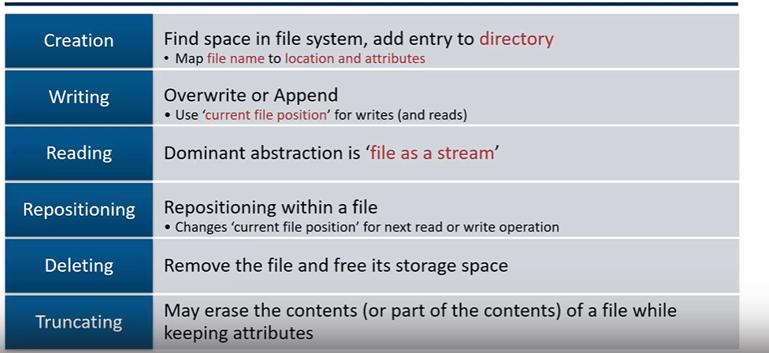


## 2. File access operation

+ General-purpose file system
  + Sequential access: read a byte at a time in orde(Unix, NT does)
  + Direct Access: random access given block/byte or number

+ DB
  + Record access
  + Indexed access

command:

- cat

System call:

- link
- unlink
- open
- read
- write
- rename
- mkdir
- rmdir
- rm
- truncate


## 3. File, Directory, link object structure

**block:** 

- Disk space is allocated in the granularity of blocks, must be a multiple of disk block size (e.g., typical size 4KB file system block size = 8 * 512 byte disk sector size)

**File**:

- File is a struct that contains filename, inode number, which is a unique identifier associated with File and other properties
- to simplify, just view it as a tuple of the (fileName, InodeNumber)
- how to allocate data blocks for a file:
  - Contiguous Allocation: applicable to read-only file system
  - Linked Allocation: each file data block has a disk pointer to the next data block
  - Indexed allocation: has inode for each file as the index to the data block of the file. The inode records each data block of the file
  - Extent Based Allocation: has inode for each file as the index to the data block of the file. The inode additionally records the start data block and the number of data blocks from the start data block to the end data block.


**Directory:**

- Directory contains name, inode number and a list of tuples of (name, inodeNumber) that represents the content of the directory


**How the file system data structure works**:


- The file system first remembers the Directory Struct of "/" directory. This struct contains the list of tuple of (name, inodeNumber) that represents the content of its sublevel. Then from each inodeNumber from the tuple of the list, it finds the Struct Directory or Struct File from the inodeNumber. This process then continues.


## 4. File system implementation

File system implementation has the following type:

- vsfs(very simple file system)
- Windows: NTFS
- Mac OSX: HFS+
- BSD, Solaris: UFS, ZFS
- Linux: EXT2, EXT3, EXT4, F2FS, XFS, BTRFS, etc.
- Check out: https://en.wikipedia.org/wiki/List_of_file_systems

---

### 4.1 VSFS

vsfs is a simplified version of Unix file system

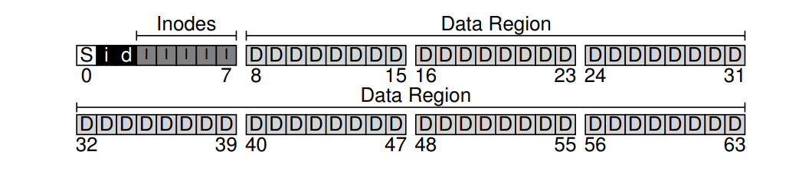

**VSFS:**

- A disk drive is consisted of block(4KB). Suppose the drive has 64 bytes as the pic above, then a vsfs consists of 
  - a superblock,  denoted as S in above pic
  - inode bitmap, denoted as i in above pic(made from 1 block), 
  - data bitmap, denoted as d in above pic(made from 1 block), 
  - Inodes table, denoted as I in above pic(made from some blocks, ex: 5 blocks in the pic)
  - Data region, denoted as D in above pic(made from rest of blocks, ex: 56 blocks in the pic)


**SuperBlock:**

- Always at a well-known disk location

- Record how many blocks for Inode tables and at which block does the Inode tables start, file system version

limit: we can have free inodes number larger than the free data block number


**variation #1: index-based** 

**Inode table:**

- A collection of Inode(Inode is the data struct for meta data of file)
- each Inode has the following important info:
  - Inode number(a unique identifier for the Inode in Inode table, this info can be used to calculate the address of location of the inode in the disk)
  - Finite direct pointer(typically 12 pointers,link the inode to the location of the file data in the Data region)
  - Indirect pointer
  - instead of pointer, inode can store extent


**Data Region**:

- data region  stores either the content of file, indirect blocks for files or directory structure
- File: stores the content of the file
- Director structure: stores a list of entries. Each entry contains the name of the file or sub-directory under that directory, the inode of that file or sub-directory, length of the name and record length


**variation #2: extent:**

What is extent:

> An extent == a disk pointer plus a length (in # of blocks). Instead of requiring a pointer to every block of a file, we just require a list of (start block, length) tuples


**Processes of the file system(how file system works):**

- **Create a file or directory**
  1. search through the inode bitmap for free inode number
  2. Allocate that inode for the file on that inode number
  3. Mark the inode number as used in inode bitmap. If the user writes sth, then:
     1. search through the data bitmap for free data block
     2.  Allocate the data block for the file and write contents to the data block
     3. Mark the data block as used in the data bitmap
     4. Modify the inode to point to the data block
  4. Add an entry for the file in its parent directory data block to link it
  5. Inode block is modified for parent directory
- **Read a file or directory:**
  1. The open() pulls out the inode of directory "/" from its well known inode number(typically 2)
  2. Read its data block to search the subdirectory entry name and inode number through "/" inode's direct pointer and traverse to the corresponding file
  3. The FS calls open() to read the file's inode into memory, check its permission,  allocates a file descriptor for this process in the per-process open-file table
  4. The read() call will find the data block of the file through inode's direct pointer or indirect pointer
  5. The close() will dellocate file descriptor 
- **append a file(direct I/O, quite complicate):**
  1. allocate a new data block on the dbmap
  2. write the content to the new data block
  3. update the file's inode block to point to the new data block
- **delete a file or directory:**
- **cached**
- **static partitioning**
- **dynamic partitioning**


**Drawback & Problem:**

- 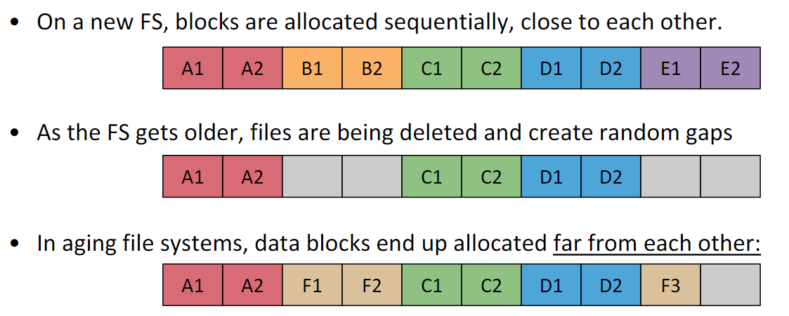

  As a result, file F is not continuous and gap from F2 to F3 might lead to **seeks** and **positioning**

- Since Inodes allocated far from blocks, when we traverse the file path, directories need to go back and forth from inode tables to data region and increases a lot of seeks(**seek** refers to the movement from one track to the other on an HDD hard disk)

- Inefficient for transfer of block data


---

### 4.2 FFS: disk-aware FS

Background: Since vsfs has lots of seeks, FFS arise to reduce the number of seeks. FFS is the core idea of ext2, ext3 file system

**Concepts need to know beforehand:**


- **sector:** A small segment of the ring in the screenshot
- **track:** Each ring at different height in the pic. There are 4 rings with 4 diff colors in the pic
- **Cylinders:** Tracks at same distance from center of drive at different heights
- **Cylinder groups:** Set of N consecutive cylinders 


**What is FFS**

>  FFS is mostly the same as VSFS, which is composed of superblock, inode bitmap, data bimap, inode tables, data region. The difference between FFS and VSFS is that:
>
> -  FFS divides the HDD hard drive into cylinder groups. Each cylinder group has superblock, inode bitmap, data bimap, inode tables, data region, 
> - while there is only one group of superblock, inode bitmap, data bimap, inode tables, data region, where we don't care cylinder group, in vsfs


**Behaviour difference**:  Read is the same as vsfs. Compared with VSFS, ffs has complex **allocation strategy** when writing to disk:

- **Goal**:
  - Closeness:
    - reduce seek times by putting related things in one cylinder group as much as possible or putting things in close cylinder group
  - Amortization:
    - Amortize each positioning delay by grabbing lots of useful data
- **Policy:**
  - Data blocks in same file allocated in same cylinder group
  - **Files:** Files in same directory allocated in same cylinder group
  - **Files & directory:** Inodes for files allocated in same cylinder group as file data blocks
  - When allocating a large file, break it into large chunks and allocate from different
    cylinder groups, so it does not fill up one cylinder group
  - If preferred cylinder group is full, allocate from a “nearby” group

**Advantage over VSFS:**

- Although fragmentation may still exist in aging FFS, since data blocks of the same file are in cylinder group in most cases, seeks reduce
- Since inode tables and data blocks of the same file are in cylinder group in most cases, movements from inode to data are greatly reduced


---

### 4.3 NTFS

https://recoverit.wondershare.com/file-system/ntfs-file-system.html

Like vsfs, which is composed of superblock, 2 bitmaps, inode tables and data region.

The NTFS is composed of: 

- partition Boot sector
- Master File table
- system files
- User files

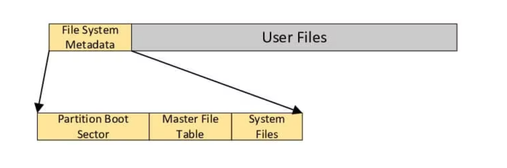


**MFT:**

- A table that contains several records for files & directories

- Each MFT record is a sequence of variable length (attribute header, value) pairs

  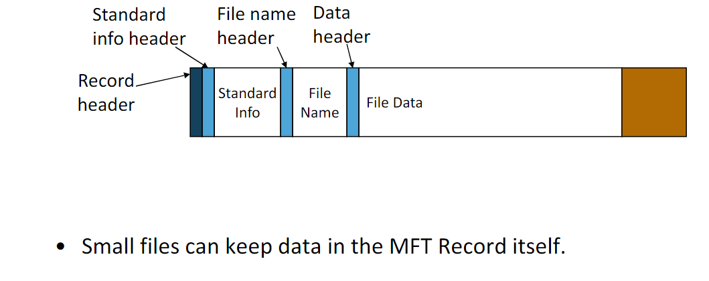

- 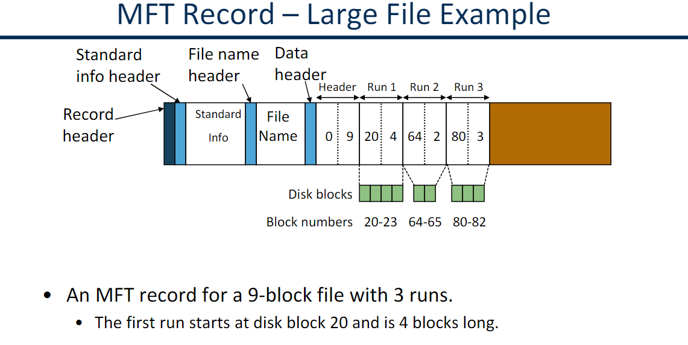
- 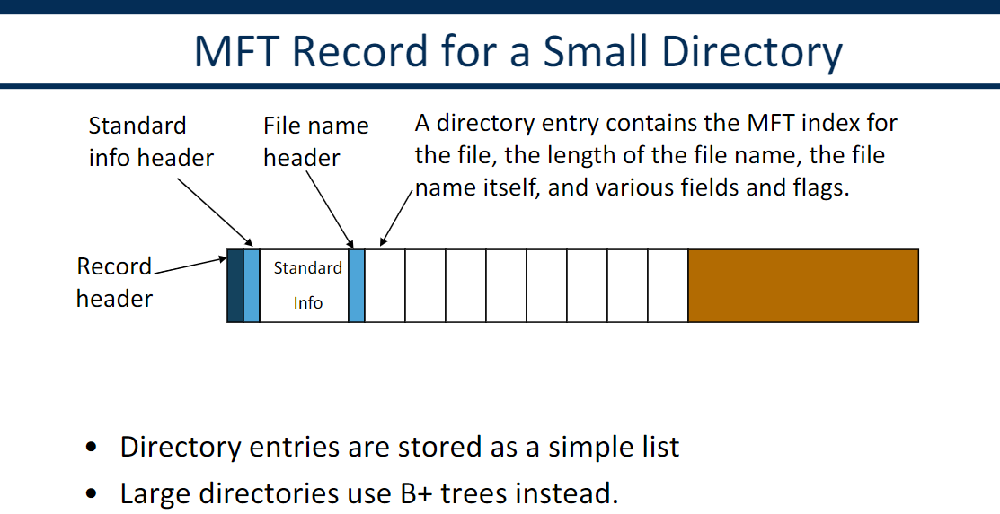

---

### 4.4 VFS


### 4.5 LFS

This is the basis of the F2FS file system. The disk layout of LFS is composed of **CR** and multiple**segments**:

- checkpoint region(CR): This is a fixed and known position in disk that stores the address to the latest imap. CR region is updated periodically.
- segments: Each segment is composed of data blocks of a file and updated inode block of that file next to the data block and the one imap in memor when the segment is written to the disk
  - imap: This is an array with 4 bytes(disk pointer) per entry. Since the inode block is scattered in segments of the disk, the imap stores the address of the inode block. The i<sup>th</sup> position of the imap stores the i<sup>th</sup> inode address. Each segment has a different version of imap

**How does LFS work**

> Unlike the above fs, which will write the inode blocks, bitmap blocks and data blocks for each a file at a fixed and discrete position in disk, the LFS actually writes a large and continuous chunk from the buffer once the buffer is full. This chunk is called segment and it is composed of updated data block, inode blocks and imap of multiple files and their parent directories. The below screenshot describes the layout of a segment when the segment is written to the disk. The file and its parent directory blocks lie in the segment
>
> 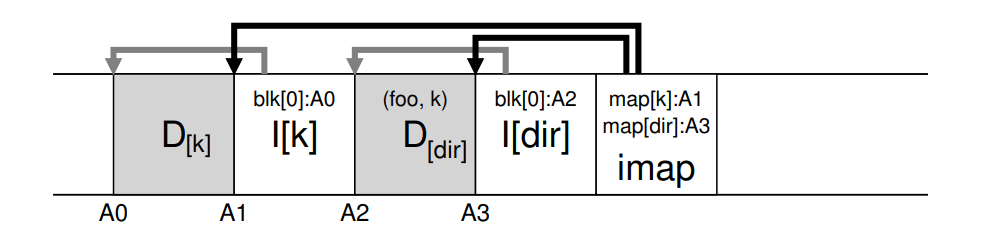
>
> Therefore, the inode blocks and data blocks are not in a separate region as the inode table regions and data regions in FFS or other fs. The reason for writing the inode block and data block in one segment chunk on disk is to make advantage of sequential write of hard disk. In addition, when there is another new update of the file in the screenshot, LFS will not overwrite the location of the above segment. Instead, it will write a new segment of the file at a different location. Thus, we say the location of the data block and inode block of a file is not fixed in LFS. Periodically, the LFS will do garbage collection to clean the previous segment on disk


**Different processes of LFS:**

- **How does LFS write a new file to disk or append a data block to a file:**

  1. To create a new file or allocate new data block to a file, we will need to create new data block, new inode block to point  to the data block for the file. We also need to create new data blocks for its parent directories to include the new file entry and the inode block for the parent directory to point to the data block.  The LFS will first update the 4 writes in the buffer and change the address of the inodes location in the imap in memory

  2. Once buffer is full, it will write the data blocks and inode block of the same file next to each other in the segment, as the below screenshot. Then it will write out the imap in memory to the disk to record the newest location of the inodes

     

  3. After a while, LFS will update CR region to point to this latest imap location periodically
  4. After some while, **LFS** will do **garbage collection** periodically in the case of appending a data block to a file. (ie: since **LFS** write a new inode block to point to two data blocks at new locations but do not erase the old inode block for that file in the below screenshot, the LFS has to do **garbage collection**)

- **How does LFS modify the file's data block:**

  1. To modify the data block of a file, we actuall creates a new data block for that file instead of writing to the old data block. We also create new inode block to point to that data block. The LFS also change the address of the inodes location in the imap in memory

  2. Once buffer is full, the LFS will write the the new data block and new inode block to the segment in disk. The disk layout will be like screenshot below. At the end, it will append the imap to the segment

     

  3. After a while, LFS will update CR region to point to this latest imap location periodically
  4. After some while, LFS will do garbage collection periodially to clean both garbage


- **How does LFS read a file:**
  1. Suppose the imap is not in the memory, it will first read the checkpoint to read the imap into memory
  2. During the process of directory traversal and file read, it will find the inode location in the imap


- **Process of Garbage collection:**

  Periodically, LFS will do the following in order:

  1. LFS take M old(partially-used) segment and determine the live data blocks in these M segments one segment by segment(**how to determine live blocks below:**)
     1. For data block D located at address A, look into the **segment summary block(stores the inode number and offset for each data block)** to find inode number N and offset T
     2. Look in the N<sup>th</sup> entry of imap to find the inode
     3. Read the inode and check the T<sup>th</sup> data block pointer in the inode. If the block pointer points to address A, the block is live. Otherwise, it's dead
  2. LFS write the live blocks into N(N < M) new segments(**which segments to choose: cold then the hot**)
  3. LFS then freed the M old segments

  

**Advantage of LFS:**

- make use of sequential write well on HDD; since the data block and inode block are next to each other in segments, it also makes use of sequential read on HDD

### 4.6 FAT-32 file system

## 5. Crash-consistency problem & Sln

**What is the problem:**

> When the file system tries to update the persistency(ex: append data block to a file, create a file), which requires update of two meta data structures A and B to complete the operation, suppose power loss or system crashes after one write of A completes, the other data structure B will be left in an inconsistent state. This problem is called crash consistency problem


**Soln to the problem:**

- Uninterruptible power supply (UPS)(Doesn’t help if failure is due to system crash)
- fsck(file system checker)
- journaling(important focus)

**Example(in-consistency problem):**

Suppose the fs tries to append a data block to an existing file. The fs will update its inode pointer to point to the new data block, update the data block in data bitmap and content of data block. Thus, there are three writes and the order is random.

If only **one write** is successful, crash scenario:

| scenario                  | severity                                                     |
| ------------------------- | ------------------------------------------------------------ |
| Only data block is writen | This is as if the write never happens and **No  crash-inconsistency problem** |
| only updates Inode        | - read **garbage data**   <br/>- multiple inodes may eventually point to the same data blocks<br/>- data bitmap shows not allocated, while inode shows it is, leading **file system crash inconsistency** |
| Only updates data bitmap  | - bitmap shows block used, leading to **space leak**<br/>- data bitmap shows allocated, while inode shows it is not, leading **file system crash inconsistency** |


If two writes successful, crash scenarios:

| scenario                                               | severity                                                     |
| ------------------------------------------------------ | ------------------------------------------------------------ |
| Only inode (I[v2]) and bitmap (B[v2]) are written      | file points to garbage data                                  |
| Only inode (I[v2]) and the data block (Db) are written | - file points to garbage data<br/>- Multiple inodes may eventually point to the same data block |
| Only bitmap (B[v2]) and data block (Db) are written    | Data leak (data block is lost for any future use)            |


### 5.1 FSCK

What is FSCK:

> It is a program that scans the entire file system and checks any inconsistency problems by checking the following:
>
> 1. Superblock: sanity checks
> 2. Free blocks: scan inodes (including all indirect blocks), build in-memory bitmap
> 3. Inode state: check inode fields for possible corruption
> 4. Inode links: verify links count for each inode
> 5. Duplicates: check if two different inodes refer to the same block
> 6. Bad blocks: bad pointers (outside of valid range)
> 7. Directory checks: integrity of directory structure


limit:

- only verify metadata is consistent and does not check corruption at data block
- scan the file system makes it slow

### 5.2 Journaling

**What is journaling & How does it help:**


> The file system also allocates a section of blocks for journal purpose as well as the section of superblock, inodetables, bitmap. Before the file system updates multiple meta data structures, the file system firsts backup the content of what the file system is going to write to the data structure and wraps up the content in a **transaction** in the journal section of the disk. Then it updates the file system meta data. Then the system crash may happen during the updates of journal section or meta data. This approach will have different effects(either recover data or skip) based on which of the previous two situations to make the file system structure consistent.
>
> 
>
> For journaling, we have following different type of journaling:
>
> - data journaling
> - metadata journaling
>


**What is data journaling:**

If the file system adopts data journaling and is going to write to the disk(ex: create a new file, append data block to a file), the fs will have the following operations:

1. Journal write: Write the contents of the transaction (including TxB, metadata, and data) to the log; wait for these writes to complete.

2. Journal commit: Write the transaction commit block (containing TxE) to the log; wait for write to complete; transaction is said to be committed.

3. Checkpoint: Write the contents of the update (metadata and data) to their final on-disk locations

4. Free: Some time later, mark the transaction free in the journal by updating the journal superblock  

     


- **Why do we need a separate step 2:**

  > Suppose we don't separate step 2 and combine step 2 with step 1, then it is possible that the user data is the last write in journal write, since the order of TxB, metadata, data and TxE is not controlled. If system crash happens before the write of data write and TxB, metadata and TxE are completed in the journal, then during the checkpoint recovery step, garbage may be written to the data blocks

- **How data journaling reacts with system crash scenario:**

  | scenario                                            | how data journal react                                       |
  | --------------------------------------------------- | ------------------------------------------------------------ |
  | crash during journal write                          | Nothing will be recovered and file system data not updated   |
  | crash after journal write and before journal commit | Nothing will be recovered and file system data not updated   |
  | crash during journal commit                         | Impossible to happen, since any 512-byte write is guranteed to be atomic in disk |
  | crash after journal commit                          | Transactions in journal will be replayed and file system recovery will happen |


**What is metadata journaling:**

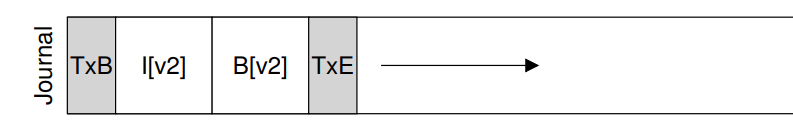

If the file system adopts metadata journaling and is going to write to the disk(ex: create a new file, append data block to a file), the fs will have the following operations:

1. Data write: Write data to final location; wait for completion (the wait is optional; see below for details).

2. Journal metadata write: Write the begin block and metadata to the log; wait for writes to complete.

   (Note: if we are changing the content of the directory that lies in the data region of the disk, the content of the drectory is also counted as metadata)

3. Journal commit: Write the transaction commit block (containing
   TxE) to the log; wait for the write to complete; the transaction (including data) is now committed.

4. Checkpoint metadata: Write the contents of the metadata update
   to their final locations within the file system.

5. Free: Later, mark the transaction free in journal superblock  


- Why is Data write the first step or can be the second step:

  > Suppose Data write does not happen in the first step and happen after journal commit step, assume system crashes right after Journal commit step and before data write, then data write does not succeed and the data is not in the journal. During the step of checkpoint, the inode in journal metadata will point to garbage data

- advantage over data journaling

  > Comparing with data journaling, metadata journaling does not have to write data in journal section, which may reduce lots of disk traffic(since user data may be large)


**How Journal section manages transactions:**

Each journal log is wrapped in the data structure of **transaction**. The journal section records each journal in **circular log**:

​	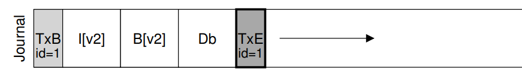

- transaction: The transaction is composed of 3 parts. The first part is the transaction start block(**TxB**), which contains **transaction identifier(TID)**, the addresses of the inode table block, bitmap block and data block. The middle part contains the updates of the file system metadata and user data. The last part contains transaction end block(**TxE**)

  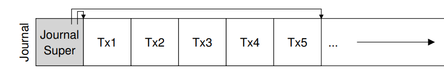

- circular log: In the journal section, we mark the oldest and newest non-checkpointed txns in the log as journal superblock. When we free the txn in journal section, we just mark the txn free in journal by updating the journal superblock.


Why does journal writing break sequential write?

> Jump back-and-forth between writes to journal and writes to main region


**Corner case of journaling and soln**

- Situation: Suppose fs uses metadata journaling. Suppose user A creates a file in directory foo and the location of foo directory data block is 1000. Thus, an entry is added to the directory foo and a write to block 1000 will happen. The user A completes the step of journal commit, the inode of foo directory and data of foo directory will be in journal. The user B deletes foo directory in another process, thus freeing block 1000. Then he creates another file foobar, which by accident reuses block 1000. At this time, user B completes his step of journal commit, the inode of foobar directory will be in journal. The journal will be in the screenshot below

  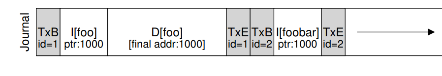

  Now suppose system crashes after both steps of journal commit. When we replay the two transactions above and recover the data, the order of recovery using user A's journal transaction or B's journal transaction lead to different consequences)

- Reason for this: Deleting free up the disk block, leading to the oppotunity for two different processes using the same block at the same time

- Solution:

  - never reuse blocks until the delete of said blocks is checkpointed
    out of the journal  
  - add a new type of record to the journal, known as a revoke record.  Deleting the directory would cause a revoke record to be written to the journal. When replaying the journal, the system first scans for such revoke records; any such revoked data is never replayed  


# SSD

SSD is composed of the following:

- non-persistent memory(eg: SRAM): cache and buffer data as well as for mapping tables
- flash translation layer(FTL controller): converts read and write request to read, erase and program operations in SSD
- flash chips


Each flash chip is composed of 

- **block**(ex: 128KB or 256KB): erase units
  - Each block is composed of **page**(ex: 4KB)


## 1. SSD algorithm

- read


SSD has invariation in page write algorithm. We have:

- naive way
- optimized way
  - Page-based FTL mapping
  - block-based FTL mapping
  - hybrid

The following sections will be algorithm with different sections


### 1.1 Naive write

- **write a page(naive approach):**
  1. Find the block containing the target page
  2. if the page is erased:   // write new contents to this page
     1. write the page directly
  3. else:   // this page is valid and we need to update this page
     1. Read all active pages in the block into controller memory
     2. Update target page with new data in controller memory
     3. Erase the block (high voltage to set all bits to 1)
     4. Write entire block(the updated target pages + other unupdated active pages) to drive


### 1.2 optimized write with page-based

- **write a page(optimized approach):**

  1. Prepare a mapping from logical page number to physical page number in memory

  2. Treat the physical pages as a sequence of page or log or array. 

     When we are given a logical page number to write

  3. look through the mapping and check if it exists in mapping.

     if not:

     1. allocate a physical page at the end of the log(if this block has not been erased, erase it)
     2. write contents to the physical page
     3. add the logical page number and this physical block to the mapping

  4. else:   // this page is valid and we need to update this page

     1. allocate a physical page at the end of the log(if this block has not been erased, erase it)
     2. write contents to the physical page(No need to erase and write the valid page back comparing with the naive approach)
     3. update the mapping of the logical page number to point to this physical page number

- **GC:**
  1. Periodically, it trims some garbage pages by checking if the logical page number associated with this physical page number is consistent with the mapping in FTL. It periodically chooses the blocks that has the most trimmed pages.
  2. GC reads the live pages out from the block
  3. write out those live pages to the end of the log and update FTL mapping
  4. erase the entire block

### 1.3 optimized write with block-based

- **write a page(optimized approach):**

  1. Prepare an FTL mapping from logical block number to physical block number instead

  2. Given a logical page number, we calculate its logical block number(i.e: logical page number / number of pages in a block) and check its mapping.

     if not in mapping:

     1. allocate a new physical block at the end of the log(if this block has not been erased, erase it)
     2. write to the first page in the block
     3. add the logical block number, physical block number to mapping

  3. else:

     1. allocate a new physical block at the end of the log
     2. write the updated page to the page of the new block
     3. migrate other valid pages in the old block to the new pages
     4. update the logical block number to point to this physical block number


pro:

- we now use mapping to map block number to block number, which reduces the memory size ofFTL mapping

cons:

- when we update an existing physical page, we need to migrate other valid pages in the same physical block to the new block in order to make their logical block number point to the new physical block in mappin. This increase the write amplifications to the naive approach, which is really bad.


### 1.4 optimized write with hybrid mapping

- **write a page(optimized approach, complicated assumed not to be on final):**

  1. Prepare 2 FTL mappings:

     one is a small set of per-page mappings in what we’ll call the log table

     the other one is a larger set of per-block mappings in the data table

  2. Given a logical page number, we calculate its logical block number(i.e: virtual address / number of pages in a block)

  3. we then check log table to see if it has logical page number and data table to see if it has logical block number.

     1. if not in log table and not in data table:
        1. allocate new physical page at the end of the log
        2. write content to the new page
        3. add the logical block, physical block to data table
     2. if not in log table but in data table:
        1. calculate its offset in block
        2. check if it is occupied. If so:
           1. allocate new physical page at the end of the log
           2. write content to new page
           3. add the logical page number, physical page number to log table
     3. if in 


What is over-provisioning:

> FTL makes a logical page space that is smaller than the physical page space. By keeping extra, “hidden” pages around, the FTL tries to defer GC to a background task (thus removing GC from critical path of a write)


Drawback issues of SSD:

- **wear out**
- High complexity of write to ssd due to **erase** operation
- **program disturbance**


How to boost performance of SSD(performance goal):

- reduce **write amplication**
- **wear leveling**
- squential-programing to minimize **program disturbance**


2 main costs of this organization:

- garbage collection(GC)
- Mapping table size

# *. Reference

csc369: https://q.utoronto.ca/courses/250638

csc469: https://q.utoronto.ca/courses/234302/modules

https://www.cs.toronto.edu/dcs/ugdocs/course-outlines/2021/Fall/CSC469H1-Fall2021.pdf


https://www.artsci.utoronto.ca/future/ready-apply/admission-requirements/second-degree-applicants

https://www.artsci.utoronto.ca/current/academics/attendance-status

https://internationalexperience.utoronto.ca/international-student-services/immigration/resources/connecting-with-isias/

https://www.artsci.utoronto.ca/faculty-registrar/fees

https://studentaccount.utoronto.ca/wp-content/uploads/2023/07/23-24-FAS-Woodsworth-INT_.pdf
